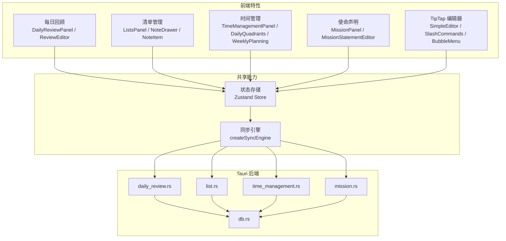
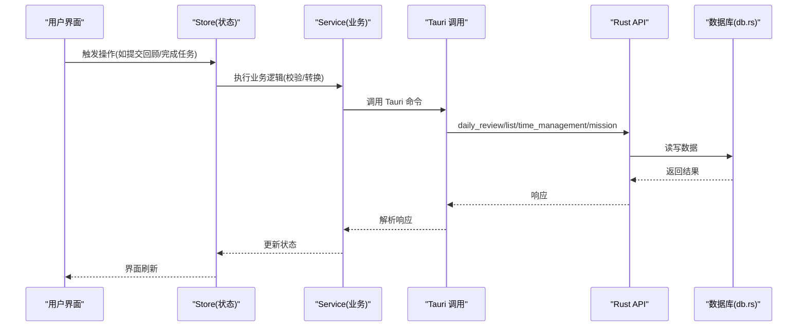
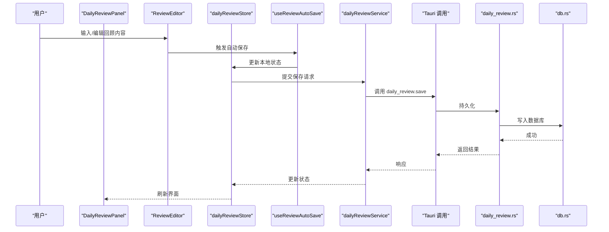
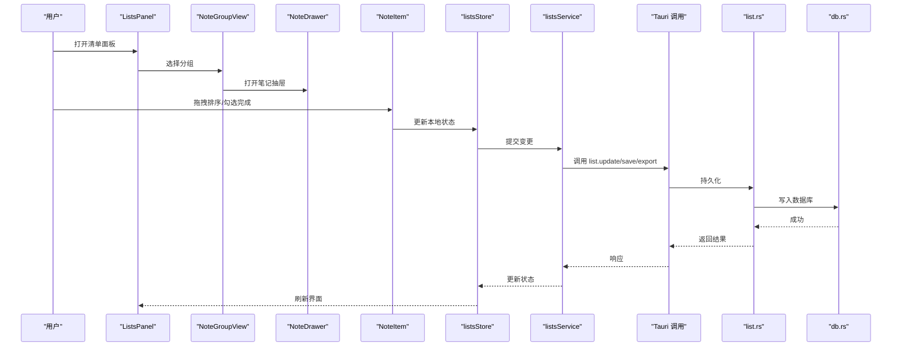
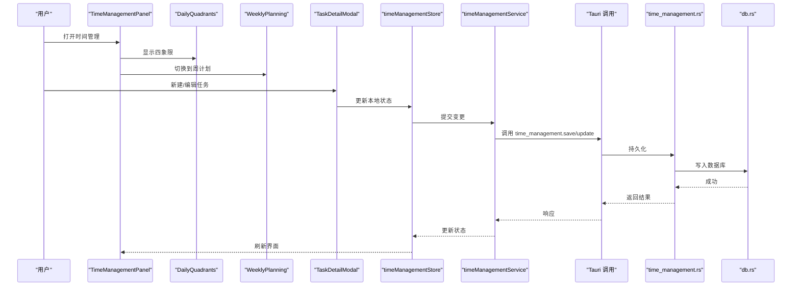
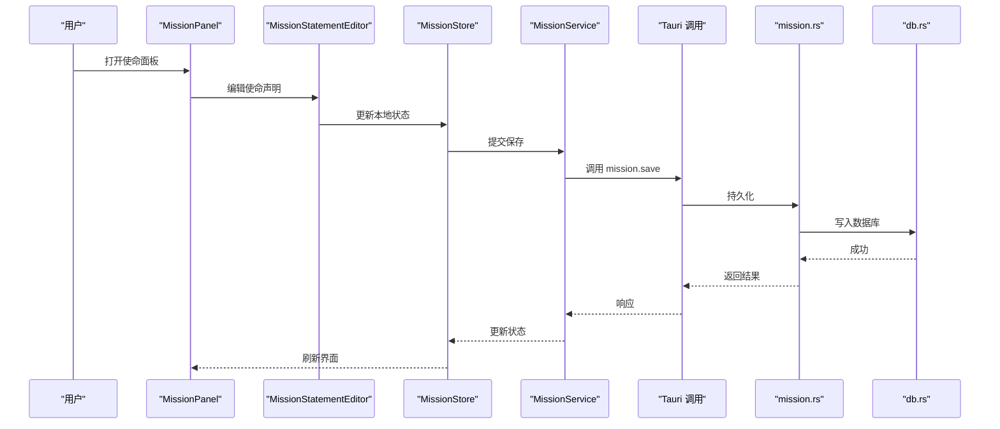
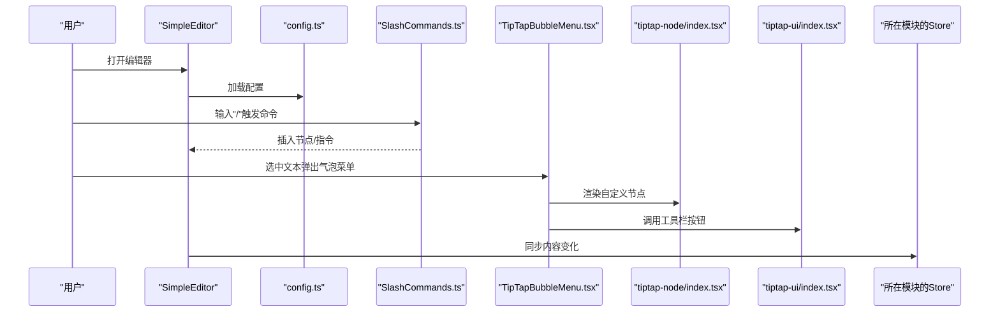
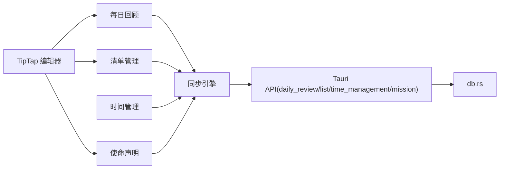

# 核心功能概览

<cite>
**本文引用的文件**   
- [src/features/daily-review/DailyReviewPanel.tsx](file://src/features/daily-review/DailyReviewPanel.tsx)
- [src/features/daily-review/ReviewEditor.tsx](file://src/features/daily-review/ReviewEditor.tsx)
- [src/features/daily-review/dailyReviewStore.ts](file://src/features/daily-review/dailyReviewStore.ts)
- [src/features/daily-review/dailyReviewService.ts](file://src/features/daily-review/dailyReviewService.ts)
- [src/features/daily-review/useReviewAutoSave.ts](file://src/features/daily-review/useReviewAutoSave.ts)
- [src/features/lists/ListsPanel.tsx](file://src/features/lists/ListsPanel.tsx)
- [src/features/lists/NoteDrawer.tsx](file://src/features/lists/NoteDrawer.tsx)
- [src/features/lists/NoteItem.tsx](file://src/features/lists/NoteItem.tsx)
- [src/features/lists/NoteGroupView.tsx](file://src/features/lists/NoteGroupView.tsx)
- [src/features/lists/listsStore.ts](file://src/features/lists/listsStore.ts)
- [src/features/lists/listsService.ts](file://src/features/lists/listsService.ts)
- [src/features/time-management/TimeManagementPanel.tsx](file://src/features/time-management/TimeManagementPanel.tsx)
- [src/features/time-management/DailyQuadrants.tsx](file://src/features/time-management/DailyQuadrants.tsx)
- [src/features/time-management/WeeklyPlanning.tsx](file://src/features/time-management/WeeklyPlanning.tsx)
- [src/features/time-management/TaskDetailModal.tsx](file://src/features/time-management/TaskDetailModal.tsx)
- [src/features/time-management/timeManagementStore.ts](file://src/features/time-management/timeManagementStore.ts)
- [src/features/time-management/timeManagementService.ts](file://src/features/time-management/timeManagementService.ts)
- [src/features/mission/MissionPanel.tsx](file://src/features/mission/MissionPanel.tsx)
- [src/features/mission/MissionStatementEditor.tsx](file://src/features/mission/MissionStatementEditor.tsx)
- [src/features/mission/MissionStore.ts](file://src/features/mission/MissionStore.ts)
- [src/features/mission/MissionService.ts](file://src/features/mission/MissionService.ts)
- [src/features/tiptap/SimpleEditor.tsx](file://src/features/tiptap/SimpleEditor.tsx)
- [src/features/tiptap/config.ts](file://src/features/tiptap/config.ts)
- [src/features/tiptap/SlashCommands.ts](file://src/features/tiptap/SlashCommands.ts)
- [src/features/tiptap/TipTapBubbleMenu.tsx](file://src/features/tiptap/TipTapBubbleMenu.tsx)
- [src/components/tiptap-node/index.tsx](file://src/components/tiptap-node/index.tsx)
- [src/components/tiptap-ui/index.tsx](file://src/components/tiptap-ui/index.tsx)
- [src/lib/createSyncEngine.ts](file://src/lib/createSyncEngine.ts)
- [src-tauri/src/db.rs](file://src-tauri/src/db.rs)
- [src-tauri/src/daily_review.rs](file://src-tauri/src/daily_review.rs)
- [src-tauri/src/list.rs](file://src-tauri/src/list.rs)
- [src-tauri/src/mission.rs](file://src-tauri/src/mission.rs)
- [src-tauri/src/time_management.rs](file://src-tauri/src/time_management.rs)
- [src/main.tsx](file://src/main.tsx)
</cite>

## 更新摘要
**所做更改**   
- 移除了习惯追踪模块，反映当前应用范围聚焦于四大核心功能
- 更新了项目结构图，移除习惯追踪相关组件和后端接口
- 调整了核心组件概述，专注于每日回顾、清单管理、时间管理和使命声明
- 更新了架构总览和依赖关系分析，移除习惯追踪相关依赖
- 简化了详细组件分析，删除习惯追踪章节
- 更新了结论和附录导航，反映当前功能范围

## 目录
1. [简介](#简介)
2. [项目结构](#项目结构)
3. [核心组件](#核心组件)
4. [架构总览](#架构总览)
5. [详细组件分析](#详细组件分析)
6. [依赖关系分析](#依赖关系分析)
7. [性能考量](#性能考量)
8. [故障排查指南](#故障排查指南)
9. [结论](#结论)
10. [附录](#附录)

## 简介
FishWorker 是一款面向个人效能的桌面应用，围绕"回顾—清单—时间—使命"四大核心能力构建。本概览文档聚焦以下模块：
- 每日回顾系统：结构化复盘与自动保存，沉淀成长轨迹
- 清单管理：分组、拖拽排序、批量导出，提升执行效率
- 时间管理：四象限任务与周计划，聚焦要事
- 使命声明：角色—目标—行动对齐，明确方向
- TipTap 编辑器：富文本编辑、斜杠命令与气泡菜单，承载内容创作

通过用户故事与实际使用案例，帮助读者快速理解各模块价值与协作方式，并为后续深入文档提供导航。

## 项目结构
前端采用按特性（feature）划分的模块化组织，每个特性包含 UI 组件、状态存储与服务层；后端基于 Tauri + Rust 暴露持久化接口，统一由数据库层管理。

图表来源
- [src/features/daily-review/DailyReviewPanel.tsx](file://src/features/daily-review/DailyReviewPanel.tsx)
- [src/features/lists/ListsPanel.tsx](file://src/features/lists/ListsPanel.tsx)
- [src/features/time-management/TimeManagementPanel.tsx](file://src/features/time-management/TimeManagementPanel.tsx)
- [src/features/mission/MissionPanel.tsx](file://src/features/mission/MissionPanel.tsx)
- [src/features/tiptap/SimpleEditor.tsx](file://src/features/tiptap/SimpleEditor.tsx)
- [src/lib/createSyncEngine.ts](file://src/lib/createSyncEngine.ts)
- [src-tauri/src/daily_review.rs](file://src-tauri/src/daily_review.rs)
- [src-tauri/src/list.rs](file://src-tauri/src/list.rs)
- [src-tauri/src/time_management.rs](file://src-tauri/src/time_management.rs)
- [src-tauri/src/mission.rs](file://src-tauri/src/mission.rs)
- [src-tauri/src/db.rs](file://src-tauri/src/db.rs)

章节来源
- [src/features/daily-review/DailyReviewPanel.tsx](file://src/features/daily-review/DailyReviewPanel.tsx)
- [src/features/lists/ListsPanel.tsx](file://src/features/lists/ListsPanel.tsx)
- [src/features/time-management/TimeManagementPanel.tsx](file://src/features/time-management/TimeManagementPanel.tsx)
- [src/features/mission/MissionPanel.tsx](file://src/features/mission/MissionPanel.tsx)
- [src/features/tiptap/SimpleEditor.tsx](file://src/features/tiptap/SimpleEditor.tsx)
- [src/lib/createSyncEngine.ts](file://src/lib/createSyncEngine.ts)
- [src-tauri/src/daily_review.rs](file://src-tauri/src/daily_review.rs)
- [src-tauri/src/list.rs](file://src-tauri/src/list.rs)
- [src-tauri/src/time_management.rs](file://src-tauri/src/time_management.rs)
- [src-tauri/src/mission.rs](file://src-tauri/src/mission.rs)
- [src-tauri/src/db.rs](file://src-tauri/src/db.rs)

## 核心组件
本节概述五大模块的职责边界与关键交互点，便于快速定位深入文档入口。

- 每日回顾系统
  - 职责：记录每日反思、情绪与要点，支持自动保存与聚合统计
  - 关键文件：[DailyReviewPanel.tsx](file://src/features/daily-review/DailyReviewPanel.tsx)、[ReviewEditor.tsx](file://src/features/daily-review/ReviewEditor.tsx)、[dailyReviewStore.ts](file://src/features/daily-review/dailyReviewStore.ts)、[dailyReviewService.ts](file://src/features/daily-review/dailyReviewService.ts)、[useReviewAutoSave.ts](file://src/features/daily-review/useReviewAutoSave.ts)
  - 关联：可引用清单中的条目作为素材；为时间管理提供复盘输入

- 清单管理
  - 职责：分组、拖拽排序、批量导出、笔记抽屉
  - 关键文件：[ListsPanel.tsx](file://src/features/lists/ListsPanel.tsx)、[NoteDrawer.tsx](file://src/features/lists/NoteDrawer.tsx)、[NoteItem.tsx](file://src/features/lists/NoteItem.tsx)、[NoteGroupView.tsx](file://src/features/lists/NoteGroupView.tsx)、[listsStore.ts](file://src/features/lists/listsStore.ts)、[listsService.ts](file://src/features/lists/listsService.ts)
  - 关联：可作为时间管理的任务来源；在每日回顾中引用

- 时间管理
  - 职责：四象限任务视图、周计划编排、任务详情编辑
  - 关键文件：[TimeManagementPanel.tsx](file://src/features/time-management/TimeManagementPanel.tsx)、[DailyQuadrants.tsx](file://src/features/time-management/DailyQuadrants.tsx)、[WeeklyPlanning.tsx](file://src/features/time-management/WeeklyPlanning.tsx)、[TaskDetailModal.tsx](file://src/features/time-management/TaskDetailModal.tsx)、[timeManagementStore.ts](file://src/features/time-management/timeManagementStore.ts)、[timeManagementService.ts](file://src/features/time-management/timeManagementService.ts)
  - 关联：承接清单任务；输出到每日回顾进行复盘

- 使命声明
  - 职责：定义角色、目标与行动计划，支撑长期方向
  - 关键文件：[MissionPanel.tsx](file://src/features/mission/MissionPanel.tsx)、[MissionStatementEditor.tsx](file://src/features/mission/MissionStatementEditor.tsx)、[MissionStore.ts](file://src/features/mission/MissionStore.ts)、[MissionService.ts](file://src/features/mission/MissionService.ts)
  - 关联：指导清单优先级；为时间管理提供策略依据

- TipTap 编辑器
  - 职责：富文本编辑、斜杠命令、气泡菜单、节点扩展
  - 关键文件：[SimpleEditor.tsx](file://src/features/tiptap/SimpleEditor.tsx)、[config.ts](file://src/features/tiptap/config.ts)、[SlashCommands.ts](file://src/features/tiptap/SlashCommands.ts)、[TipTapBubbleMenu.tsx](file://src/features/tiptap/TipTapBubbleMenu.tsx)、[index.tsx](file://src/components/tiptap-node/index.tsx)、[index.tsx](file://src/components/tiptap-ui/index.tsx)
  - 关联：被每日回顾、清单笔记、使命声明等模块复用

章节来源
- [src/features/daily-review/DailyReviewPanel.tsx](file://src/features/daily-review/DailyReviewPanel.tsx)
- [src/features/daily-review/ReviewEditor.tsx](file://src/features/daily-review/ReviewEditor.tsx)
- [src/features/daily-review/dailyReviewStore.ts](file://src/features/daily-review/dailyReviewStore.ts)
- [src/features/daily-review/dailyReviewService.ts](file://src/features/daily-review/dailyReviewService.ts)
- [src/features/daily-review/useReviewAutoSave.ts](file://src/features/daily-review/useReviewAutoSave.ts)
- [src/features/lists/ListsPanel.tsx](file://src/features/lists/ListsPanel.tsx)
- [src/features/lists/NoteDrawer.tsx](file://src/features/lists/NoteDrawer.tsx)
- [src/features/lists/NoteItem.tsx](file://src/features/lists/NoteItem.tsx)
- [src/features/lists/NoteGroupView.tsx](file://src/features/lists/NoteGroupView.tsx)
- [src/features/lists/listsStore.ts](file://src/features/lists/listsStore.ts)
- [src/features/lists/listsService.ts](file://src/features/lists/listsService.ts)
- [src/features/time-management/TimeManagementPanel.tsx](file://src/features/time-management/TimeManagementPanel.tsx)
- [src/features/time-management/DailyQuadrants.tsx](file://src/features/time-management/DailyQuadrants.tsx)
- [src/features/time-management/WeeklyPlanning.tsx](file://src/features/time-management/WeeklyPlanning.tsx)
- [src/features/time-management/TaskDetailModal.tsx](file://src/features/time-management/TaskDetailModal.tsx)
- [src/features/time-management/timeManagementStore.ts](file://src/features/time-management/timeManagementStore.ts)
- [src/features/time-management/timeManagementService.ts](file://src/features/time-management/timeManagementService.ts)
- [src/features/mission/MissionPanel.tsx](file://src/features/mission/MissionPanel.tsx)
- [src/features/mission/MissionStatementEditor.tsx](file://src/features/mission/MissionStatementEditor.tsx)
- [src/features/mission/MissionStore.ts](file://src/features/mission/MissionStore.ts)
- [src/features/mission/MissionService.ts](file://src/features/mission/MissionService.ts)
- [src/features/tiptap/SimpleEditor.tsx](file://src/features/tiptap/SimpleEditor.tsx)
- [src/features/tiptap/config.ts](file://src/features/tiptap/config.ts)
- [src/features/tiptap/SlashCommands.ts](file://src/features/tiptap/SlashCommands.ts)
- [src/features/tiptap/TipTapBubbleMenu.tsx](file://src/features/tiptap/TipTapBubbleMenu.tsx)
- [src/components/tiptap-node/index.tsx](file://src/components/tiptap-node/index.tsx)
- [src/components/tiptap-ui/index.tsx](file://src/components/tiptap-ui/index.tsx)

## 架构总览
数据流遵循"UI → Store → Service → Tauri API → 数据库"的分层模式，并通过同步引擎协调前后端一致性。

图表来源
- [src/lib/createSyncEngine.ts](file://src/lib/createSyncEngine.ts)
- [src-tauri/src/daily_review.rs](file://src-tauri/src/daily_review.rs)
- [src-tauri/src/list.rs](file://src-tauri/src/list.rs)
- [src-tauri/src/time_management.rs](file://src-tauri/src/time_management.rs)
- [src-tauri/src/mission.rs](file://src-tauri/src/mission.rs)
- [src-tauri/src/db.rs](file://src-tauri/src/db.rs)

## 详细组件分析

### 每日回顾系统
- 功能描述：以结构化表单与富文本编辑器记录每日反思，支持自动保存与聚合展示
- 使用场景：
  - 用户故事：下班后花 5 分钟回顾今日得失，系统自动保存，次日可查看历史趋势
  - 实际案例：将未完成的任务链接到清单条目，便于跨日追踪
- 价值说明：沉淀经验、减少重复错误、提升自我认知
- 关键流程（序列图）：

图表来源
- [src/features/daily-review/DailyReviewPanel.tsx](file://src/features/daily-review/DailyReviewPanel.tsx)
- [src/features/daily-review/ReviewEditor.tsx](file://src/features/daily-review/ReviewEditor.tsx)
- [src/features/daily-review/useReviewAutoSave.ts](file://src/features/daily-review/useReviewAutoSave.ts)
- [src/features/daily-review/dailyReviewStore.ts](file://src/features/daily-review/dailyReviewStore.ts)
- [src/features/daily-review/dailyReviewService.ts](file://src/features/daily-review/dailyReviewService.ts)
- [src-tauri/src/daily_review.rs](file://src-tauri/src/daily_review.rs)
- [src-tauri/src/db.rs](file://src-tauri/src/db.rs)

章节来源
- [src/features/daily-review/DailyReviewPanel.tsx](file://src/features/daily-review/DailyReviewPanel.tsx)
- [src/features/daily-review/ReviewEditor.tsx](file://src/features/daily-review/ReviewEditor.tsx)
- [src/features/daily-review/dailyReviewStore.ts](file://src/features/daily-review/dailyReviewStore.ts)
- [src/features/daily-review/dailyReviewService.ts](file://src/features/daily-review/dailyReviewService.ts)
- [src/features/daily-review/useReviewAutoSave.ts](file://src/features/daily-review/useReviewAutoSave.ts)
- [src-tauri/src/daily_review.rs](file://src-tauri/src/daily_review.rs)
- [src-tauri/src/db.rs](file://src-tauri/src/db.rs)

### 清单管理
- 功能描述：分组、拖拽排序、批量导出、笔记抽屉与组内视图
- 使用场景：
  - 用户故事：将会议待办放入"工作"分组，拖拽调整优先级，周末批量导出为报告
  - 实际案例：从时间管理"重要不紧急"区批量导入下周清单
- 价值说明：让任务清晰有序，减少遗漏与上下文切换成本
- 关键流程（序列图）：

图表来源
- [src/features/lists/ListsPanel.tsx](file://src/features/lists/ListsPanel.tsx)
- [src/features/lists/NoteGroupView.tsx](file://src/features/lists/NoteGroupView.tsx)
- [src/features/lists/NoteDrawer.tsx](file://src/features/lists/NoteDrawer.tsx)
- [src/features/lists/NoteItem.tsx](file://src/features/lists/NoteItem.tsx)
- [src/features/lists/listsStore.ts](file://src/features/lists/listsStore.ts)
- [src/features/lists/listsService.ts](file://src/features/lists/listsService.ts)
- [src-tauri/src/list.rs](file://src-tauri/src/list.rs)
- [src-tauri/src/db.rs](file://src-tauri/src/db.rs)

章节来源
- [src/features/lists/ListsPanel.tsx](file://src/features/lists/ListsPanel.tsx)
- [src/features/lists/NoteGroupView.tsx](file://src/features/lists/NoteGroupView.tsx)
- [src/features/lists/NoteDrawer.tsx](file://src/features/lists/NoteDrawer.tsx)
- [src/features/lists/NoteItem.tsx](file://src/features/lists/NoteItem.tsx)
- [src/features/lists/listsStore.ts](file://src/features/lists/listsStore.ts)
- [src/features/lists/listsService.ts](file://src/features/lists/listsService.ts)
- [src-tauri/src/list.rs](file://src-tauri/src/list.rs)
- [src-tauri/src/db.rs](file://src-tauri/src/db.rs)

### 时间管理
- 功能描述：四象限任务视图、周计划编排、任务详情编辑
- 使用场景：
  - 用户故事：周一制定周计划，将任务分配到四象限，每日聚焦"重要且紧急"
  - 实际案例：从清单导入任务，设置截止时间与提醒
- 价值说明：聚焦要事，避免忙而无功
- 关键流程（序列图）：

图表来源
- [src/features/time-management/TimeManagementPanel.tsx](file://src/features/time-management/TimeManagementPanel.tsx)
- [src/features/time-management/DailyQuadrants.tsx](file://src/features/time-management/DailyQuadrants.tsx)
- [src/features/time-management/WeeklyPlanning.tsx](file://src/features/time-management/WeeklyPlanning.tsx)
- [src/features/time-management/TaskDetailModal.tsx](file://src/features/time-management/TaskDetailModal.tsx)
- [src/features/time-management/timeManagementStore.ts](file://src/features/time-management/timeManagementStore.ts)
- [src/features/time-management/timeManagementService.ts](file://src/features/time-management/timeManagementService.ts)
- [src-tauri/src/time_management.rs](file://src-tauri/src/time_management.rs)
- [src-tauri/src/db.rs](file://src-tauri/src/db.rs)

章节来源
- [src/features/time-management/TimeManagementPanel.tsx](file://src/features/time-management/TimeManagementPanel.tsx)
- [src/features/time-management/DailyQuadrants.tsx](file://src/features/time-management/DailyQuadrants.tsx)
- [src/features/time-management/WeeklyPlanning.tsx](file://src/features/time-management/WeeklyPlanning.tsx)
- [src/features/time-management/TaskDetailModal.tsx](file://src/features/time-management/TaskDetailModal.tsx)
- [src/features/time-management/timeManagementStore.ts](file://src/features/time-management/timeManagementStore.ts)
- [src/features/time-management/timeManagementService.ts](file://src/features/time-management/timeManagementService.ts)
- [src-tauri/src/time_management.rs](file://src-tauri/src/time_management.rs)
- [src-tauri/src/db.rs](file://src-tauri/src/db.rs)

### 使命声明
- 功能描述：定义角色、目标与行动计划，形成方向感与决策依据
- 使用场景：
  - 用户故事：写下"成为高效能工程师"的角色与年度目标，拆解为季度里程碑
  - 实际案例：将"提升技术深度"目标转化为每周学习清单
- 价值说明：让短期行动与长期愿景保持一致，减少偏离
- 关键流程（序列图）：

图表来源
- [src/features/mission/MissionPanel.tsx](file://src/features/mission/MissionPanel.tsx)
- [src/features/mission/MissionStatementEditor.tsx](file://src/features/mission/MissionStatementEditor.tsx)
- [src/features/mission/MissionStore.ts](file://src/features/mission/MissionStore.ts)
- [src/features/mission/MissionService.ts](file://src/features/mission/MissionService.ts)
- [src-tauri/src/mission.rs](file://src-tauri/src/mission.rs)
- [src-tauri/src/db.rs](file://src-tauri/src/db.rs)

章节来源
- [src/features/mission/MissionPanel.tsx](file://src/features/mission/MissionPanel.tsx)
- [src/features/mission/MissionStatementEditor.tsx](file://src/features/mission/MissionStatementEditor.tsx)
- [src/features/mission/MissionStore.ts](file://src/features/mission/MissionStore.ts)
- [src/features/mission/MissionService.ts](file://src/features/mission/MissionService.ts)
- [src-tauri/src/mission.rs](file://src-tauri/src/mission.rs)
- [src-tauri/src/db.rs](file://src-tauri/src/db.rs)

### TipTap 编辑器
- 功能描述：富文本编辑、斜杠命令、气泡菜单、节点扩展与主题切换
- 使用场景：
  - 用户故事：在回顾或清单笔记中使用斜杠命令插入表格/代码块，提升表达效率
  - 实际案例：在使命声明中插入流程图或高亮重点段落
- 价值说明：统一的编辑体验，降低内容创作门槛
- 关键流程（序列图）：

图表来源
- [src/features/tiptap/SimpleEditor.tsx](file://src/features/tiptap/SimpleEditor.tsx)
- [src/features/tiptap/config.ts](file://src/features/tiptap/config.ts)
- [src/features/tiptap/SlashCommands.ts](file://src/features/tiptap/SlashCommands.ts)
- [src/features/tiptap/TipTapBubbleMenu.tsx](file://src/features/tiptap/TipTapBubbleMenu.tsx)
- [src/components/tiptap-node/index.tsx](file://src/components/tiptap-node/index.tsx)
- [src/components/tiptap-ui/index.tsx](file://src/components/tiptap-ui/index.tsx)

章节来源
- [src/features/tiptap/SimpleEditor.tsx](file://src/features/tiptap/SimpleEditor.tsx)
- [src/features/tiptap/config.ts](file://src/features/tiptap/config.ts)
- [src/features/tiptap/SlashCommands.ts](file://src/features/tiptap/SlashCommands.ts)
- [src/features/tiptap/TipTapBubbleMenu.tsx](file://src/features/tiptap/TipTapBubbleMenu.tsx)
- [src/components/tiptap-node/index.tsx](file://src/components/tiptap-node/index.tsx)
- [src/components/tiptap-ui/index.tsx](file://src/components/tiptap-ui/index.tsx)

## 依赖关系分析
- 耦合与内聚
  - 各特性模块内部高内聚（UI/Store/Service 分层清晰），对外仅通过 Tauri API 与数据库交互
  - TipTap 编辑器作为通用能力被多模块复用，降低重复实现
- 直接/间接依赖
  - 前端 Store 依赖 Service，Service 依赖 Tauri 调用，Tauri 依赖 db.rs
  - 每日回顾与清单、时间管理存在业务层面的间接依赖（引用与联动）
- 外部集成点
  - Tauri 后端统一封装 SQL 访问，屏蔽底层差异
- 循环依赖风险
  - 当前按特性隔离，未见明显循环依赖；建议保持 Store 与 Service 单向依赖

图表来源
- [src/lib/createSyncEngine.ts](file://src/lib/createSyncEngine.ts)
- [src-tauri/src/daily_review.rs](file://src-tauri/src/daily_review.rs)
- [src-tauri/src/list.rs](file://src-tauri/src/list.rs)
- [src-tauri/src/time_management.rs](file://src-tauri/src/time_management.rs)
- [src-tauri/src/mission.rs](file://src-tauri/src/mission.rs)
- [src-tauri/src/db.rs](file://src-tauri/src/db.rs)

章节来源
- [src/lib/createSyncEngine.ts](file://src/lib/createSyncEngine.ts)
- [src-tauri/src/daily_review.rs](file://src-tauri/src/daily_review.rs)
- [src-tauri/src/list.rs](file://src-tauri/src/list.rs)
- [src-tauri/src/time_management.rs](file://src-tauri/src/time_management.rs)
- [src-tauri/src/mission.rs](file://src-tauri/src/mission.rs)
- [src-tauri/src/db.rs](file://src-tauri/src/db.rs)

## 性能考量
- 自动保存节流：每日回顾的自动保存应结合节流/防抖策略，避免频繁写入
- 批量操作优化：清单批量导出与拖拽排序应在服务端合并变更，减少往返
- 懒加载与分页：清单数据量大时，按需加载与分页可提升首屏速度
- 编辑器增量同步：TipTap 内容变更尽量增量同步，避免全量覆盖
- 缓存策略：对只读统计类数据增加短期缓存

## 故障排查指南
- 常见问题
  - 自动保存失败：检查 useReviewAutoSave 触发时机与网络/磁盘异常处理
  - 清单拖拽顺序不同步：确认 listsStore 与 listsService 的状态一致性与冲突解决
  - 时间管理任务未落库：核对 timeManagementService 参数与 Tauri 命令映射
  - 编辑器内容丢失：检查 SimpleEditor 的 content 受控与 undo/redo 栈
- 定位步骤
  - 在前端 Store 打印变更日志，确认状态是否更新
  - 在 Service 层捕获并记录错误信息
  - 在 Tauri 后端日志中检索对应命令的执行结果
  - 在 db.rs 层核查 SQL 执行与事务回滚情况

章节来源
- [src/features/daily-review/useReviewAutoSave.ts](file://src/features/daily-review/useReviewAutoSave.ts)
- [src/features/lists/listsStore.ts](file://src/features/lists/listsStore.ts)
- [src/features/lists/listsService.ts](file://src/features/lists/listsService.ts)
- [src/features/time-management/timeManagementStore.ts](file://src/features/time-management/timeManagementStore.ts)
- [src/features/time-management/timeManagementService.ts](file://src/features/time-management/timeManagementService.ts)
- [src/features/tiptap/SimpleEditor.tsx](file://src/features/tiptap/SimpleEditor.tsx)
- [src-tauri/src/db.rs](file://src-tauri/src/db.rs)

## 结论
FishWorker 以清晰的特性划分与分层架构，将"回顾—清单—时间—使命"串联成完整的个人效能闭环。TipTap 编辑器作为通用能力提升了内容创作效率；Tauri + Rust 后端保障数据安全与性能。建议在后续迭代中持续完善数据模型与跨模块联动，进一步提升用户体验与可维护性。

## 附录
- 进一步阅读导航
  - 每日回顾：[DailyReviewPanel.tsx](file://src/features/daily-review/DailyReviewPanel.tsx)、[useReviewAutoSave.ts](file://src/features/daily-review/useReviewAutoSave.ts)
  - 清单管理：[ListsPanel.tsx](file://src/features/lists/ListsPanel.tsx)、[listsStore.ts](file://src/features/lists/listsStore.ts)
  - 时间管理：[TimeManagementPanel.tsx](file://src/features/time-management/TimeManagementPanel.tsx)、[DailyQuadrants.tsx](file://src/features/time-management/DailyQuadrants.tsx)
  - 使命声明：[MissionPanel.tsx](file://src/features/mission/MissionPanel.tsx)、[MissionStore.ts](file://src/features/mission/MissionStore.ts)
  - TipTap 编辑器：[SimpleEditor.tsx](file://src/features/tiptap/SimpleEditor.tsx)、[SlashCommands.ts](file://src/features/tiptap/SlashCommands.ts)