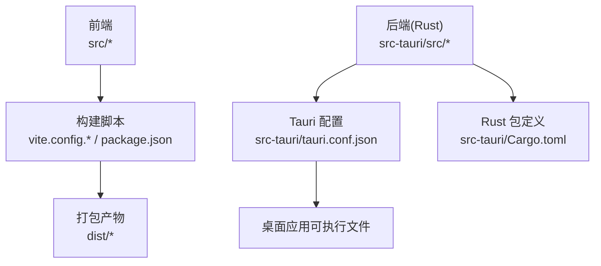
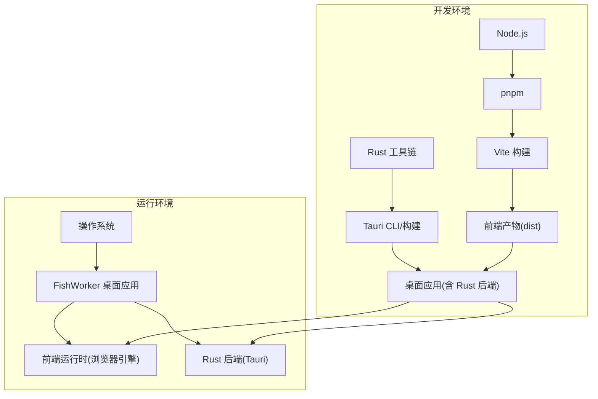
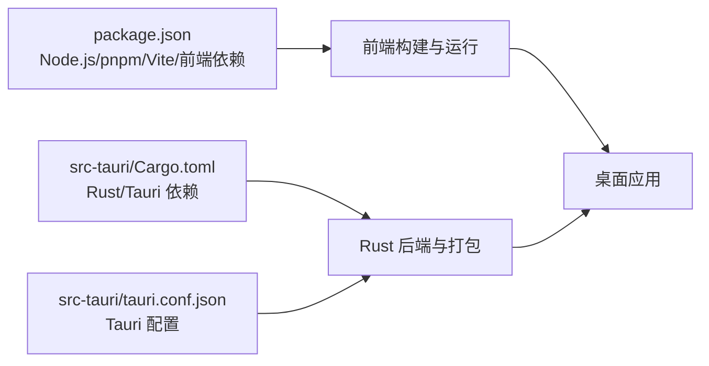

# 系统要求

<cite>
**本文引用的文件**   
- [package.json](file://package.json)
- [Cargo.toml](file://src-tauri/Cargo.toml)
- [tauri.conf.json](file://src-tauri/tauri.conf.json)
- [README.md](file://README.md)
</cite>

## 目录
1. [简介](#简介)
2. [项目结构](#项目结构)
3. [核心组件](#核心组件)
4. [架构总览](#架构总览)
5. [详细组件分析](#详细组件分析)
6. [依赖分析](#依赖分析)
7. [性能考虑](#性能考虑)
8. [故障排查指南](#故障排查指南)
9. [结论](#结论)
10. [附录](#附录)

## 简介
本文件为 FishWorker 项目的“系统要求与兼容性”说明，聚焦于：
- 操作系统支持与最低/推荐版本
- 硬件要求（CPU、内存、磁盘）
- 软件依赖及最低版本（Node.js、pnpm、Rust 工具链等）
- 平台特殊要求（macOS 代码签名、Linux 系统库等）
- 浏览器兼容性与移动端适配情况
- 版本兼容性矩阵与升级迁移建议

FishWorker 基于 Tauri 构建桌面应用，前端使用 Vite + React 技术栈，后端 Rust 通过 Tauri 暴露能力。因此其运行环境同时包含 Node.js 生态与 Rust 工具链。

## 项目结构
仓库采用前后端分离的 Tauri 工程组织方式：
- 前端资源位于 src 目录，构建配置在根目录 vite.config.* 与 package.json
- 后端 Rust 源码位于 src-tauri，Tauri 配置位于 src-tauri/tauri.conf.json，Rust 包定义位于 src-tauri/Cargo.toml
- 文档与说明位于 docx 目录与 README.md

[本节为概念性结构说明，不直接分析具体文件]

## 核心组件
- 前端运行时：由 Node.js 提供，Vite 负责开发与构建，React 作为 UI 框架
- 桌面运行时：由 Tauri 提供，将 Rust 后端能力桥接到前端
- 构建与打包：pnpm 管理依赖与脚本；Rust 工具链编译后端并生成平台可执行文件

本节用于定位后续“软件依赖与版本要求”的来源位置，详见“依赖分析”。

**章节来源**
- [package.json](file://package.json)
- [tauri.conf.json](file://src-tauri/tauri.conf.json)
- [Cargo.toml](file://src-tauri/Cargo.toml)

## 架构总览
下图展示了开发环境与运行环境的依赖关系，以及各组件之间的交互。

[本图为概念性架构图，未映射到具体源文件，故无图表来源]

## 详细组件分析

### 操作系统支持
- Windows
  - 支持范围：Windows 10 及以上（x64）
  - 说明：Tauri 官方对 Windows 10+ 提供稳定支持；若需 ARM64 支持，请确认 Rust 目标与 Tauri 二进制是否已发布对应架构
- macOS
  - 支持范围：macOS 10.15 (Catalina) 及以上（x64/ARM64）
  - 说明：Apple Silicon 原生支持需要 Apple 开发者证书进行代码签名与公证；未签名应用在较新系统中可能被拦截
- Linux
  - 支持范围：主流发行版（Ubuntu 20.04+/Debian 11+/Fedora 36+ 等），x64/ARM64
  - 说明：需安装 Tauri 所需的系统库（GTK/WebKit/GIO 等），不同发行版名称略有差异

注意：以上为通用桌面应用与 Tauri 的典型支持范围。如需精确到某发行版或内核版本，请以实际打包产物与测试报告为准。

**章节来源**
- [tauri.conf.json](file://src-tauri/tauri.conf.json)

### 硬件要求
- CPU
  - 最低：双核 x64 处理器
  - 推荐：四核及以上，支持现代指令集（AVX2/NEON）以获得更佳性能
- 内存
  - 最低：4 GB RAM
  - 推荐：8 GB RAM 或以上，以提升编辑器与多任务体验
- 存储空间
  - 最低：约 1–2 GB 可用空间（含运行时与缓存）
  - 推荐：5 GB 以上，便于更新与日志留存
- GPU
  - 集成显卡即可满足日常使用；如启用大量富文本渲染或动画，建议使用独立显卡

[本节为通用指导，不直接分析具体文件]

### 软件依赖与最低版本
- Node.js
  - 最低版本：参见 package.json 中 engines.node 字段
  - 说明：确保与 Vite 和插件生态兼容
- pnpm
  - 最低版本：参见 package.json 中 engines.pnpm 字段
  - 说明：建议使用最新稳定版以获得最佳稳定性
- Rust 工具链
  - rustc：参见 src-tauri/Cargo.toml 中的 rust-version 字段
  - cargo：随 rustc 安装
  - 说明：Tauri 对 Rust 版本有明确要求，需严格匹配
- Tauri
  - 版本：参见 src-tauri/Cargo.toml 中 tauri 依赖版本
  - 说明：Tauri 版本决定了对操作系统、系统库与打包能力的支持范围

上述信息均以仓库内声明为准，请在本地安装时以这些声明为基准。

**章节来源**
- [package.json](file://package.json)
- [Cargo.toml](file://src-tauri/Cargo.toml)

### 平台特殊要求与注意事项
- macOS
  - 代码签名与公证：分发前需配置 Apple 开发者证书并进行签名与公证，否则用户可能遇到安全拦截
  - 权限与沙盒：根据功能需求在 Tauri 配置中声明所需权限
- Linux
  - 系统库依赖：需安装 GTK、WebKitGTK、GIO、GDK-Pixbuf 等基础库（发行版包名可能不同）
  - 字体与输入法：建议安装常用中文字体与输入法框架以保证编辑体验
- Windows
  - 驱动与图形栈：建议使用较新的显卡驱动以获得稳定的渲染表现
  - 杀毒软件：首次启动可能被误报，可将应用加入白名单

**章节来源**
- [tauri.conf.json](file://src-tauri/tauri.conf.json)

### 浏览器兼容性与移动端适配
- 浏览器兼容性
  - 本项目为桌面应用，非 Web 站点，不直接面向浏览器
  - 但前端仍基于现代 Web 标准，建议在使用内置调试或远程调试场景时，使用较新的 Chromium 内核
- 移动端适配
  - 当前为桌面端应用，不提供移动端（iOS/Android）版本
  - 若未来扩展至移动端，需评估 Tauri 移动后端与平台限制

[本节为概念性说明，不直接分析具体文件]

### 版本兼容性矩阵（示例模板）
以下为“版本兼容性矩阵”的填写模板，请将仓库中实际声明的版本填入对应单元格。该表格用于帮助用户了解不同版本的系统要求变化。

| 应用版本 | Node.js 最低版本 | pnpm 最低版本 | Rust(rustc) 最低版本 | Tauri 版本 | 支持的操作系统 |
| --- | --- | --- | --- | --- | --- |
| v1.x.x | 从 package.json 获取 | 从 package.json 获取 | 从 Cargo.toml 获取 | 从 Cargo.toml 获取 | Windows 10+, macOS 10.15+, 主流 Linux 发行版 |
| v2.x.x | 待补充 | 待补充 | 待补充 | 待补充 | 待补充 |

说明：
- 请将上表中“从 xxx 获取”替换为仓库中相应字段的实际值
- 若存在多个主版本分支，请按分支分别维护一行

**章节来源**
- [package.json](file://package.json)
- [Cargo.toml](file://src-tauri/Cargo.toml)

### 升级路径与迁移指南
- 升级 Node.js/pnpm
  - 步骤：先升级 Node.js，再升级 pnpm，最后重新安装依赖
  - 注意：确保与 Vite 及插件生态兼容
- 升级 Rust/Tauri
  - 步骤：升级 rustup 与 rustc，按 Cargo.toml 指定版本安装工具链，清理并重建
  - 注意：Tauri 大版本升级可能引入构建脚本或配置变更，需对照变更日志逐项调整
- 平台相关
  - macOS：更新证书与配置文件，必要时重新签名与公证
  - Linux：检查系统库是否满足新版本 Tauri 的要求
- 数据与配置
  - 升级前备份用户数据与应用配置目录
  - 升级后验证数据库与偏好设置是否正常加载

[本节为通用操作建议，不直接分析具体文件]

## 依赖分析
下图展示关键依赖来源及其作用：

**图表来源**
- [package.json](file://package.json)
- [Cargo.toml](file://src-tauri/Cargo.toml)
- [tauri.conf.json](file://src-tauri/tauri.conf.json)

**章节来源**
- [package.json](file://package.json)
- [Cargo.toml](file://src-tauri/Cargo.toml)
- [tauri.conf.json](file://src-tauri/tauri.conf.json)

## 性能考虑
- 合理分配内存：避免同时开启过多大型文档与后台进程
- 使用 SSD：显著提升应用启动与索引速度
- 关闭不必要的特效：在低配设备上可降低渲染压力
- 定期清理缓存：保持磁盘空间充足，避免写入抖动

[本节为通用指导，不直接分析具体文件]

## 故障排查指南
- 无法安装依赖
  - 检查 Node.js 与 pnpm 版本是否与 package.json 中 engines 字段一致
  - 网络问题：切换镜像源或使用代理
- 构建失败（Rust/Tauri）
  - 确认 rustc 版本与 Cargo.toml 中 rust-version 一致
  - 缺少系统库（Linux）：安装 GTK/WebKit/GIO 等依赖
  - 证书问题（macOS）：检查签名与公证配置
- 运行时崩溃或黑屏
  - 更新显卡驱动
  - 尝试禁用硬件加速（如适用）
  - 查看日志输出定位错误

**章节来源**
- [README.md](file://README.md)

## 结论
FishWorker 的系统要求围绕 Tauri 桌面应用与 Node.js 生态展开。为确保顺利开发与运行，请严格遵循仓库中 package.json 与 Cargo.toml 的依赖与版本声明，并根据目标平台准备相应的系统库与签名配置。建议在升级前备份数据并按迁移指南逐步推进。

[本节为总结性内容，不直接分析具体文件]

## 附录
- 快速自检清单
  - Node.js 与 pnpm 版本符合 package.json 声明
  - Rust 工具链版本符合 Cargo.toml 声明
  - Tauri 配置与目标平台一致
  - 系统库与字体/输入法就绪（Linux/macOS）
  - 磁盘空间与内存满足最低要求

[本节为补充信息，不直接分析具体文件]