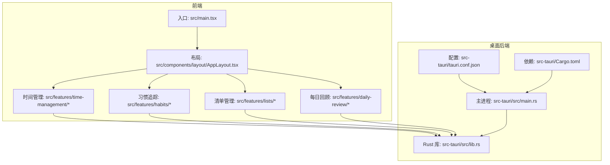
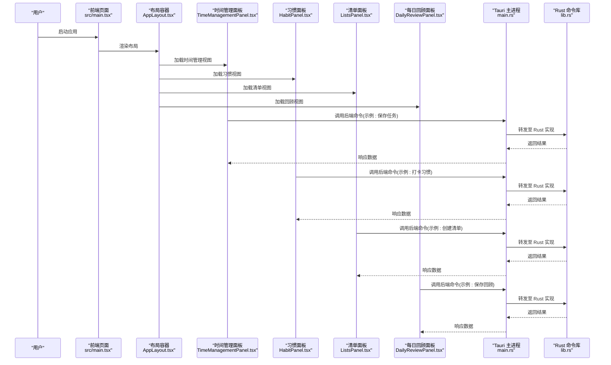
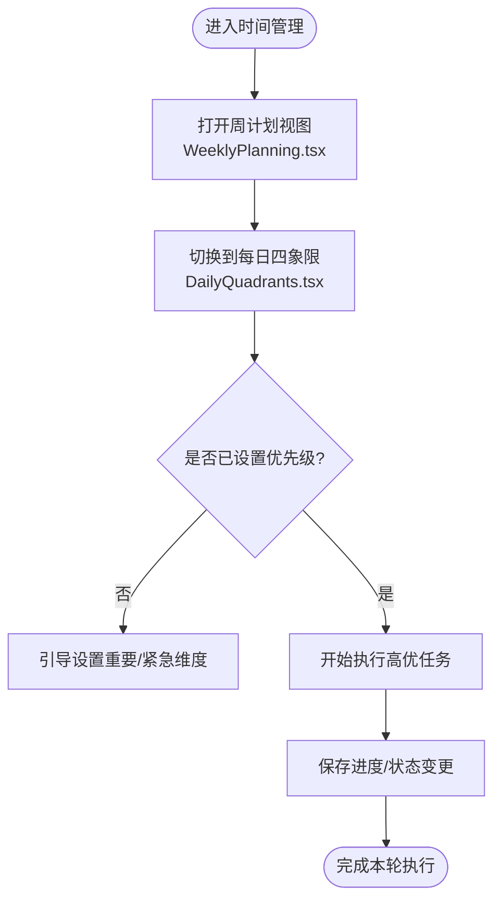
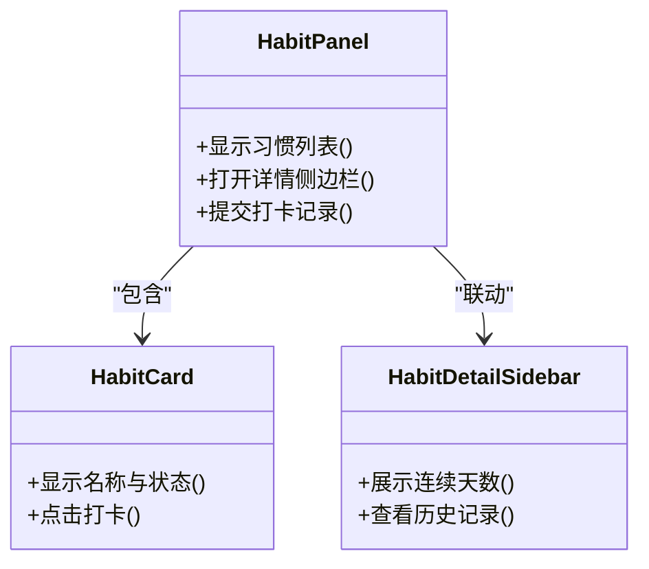
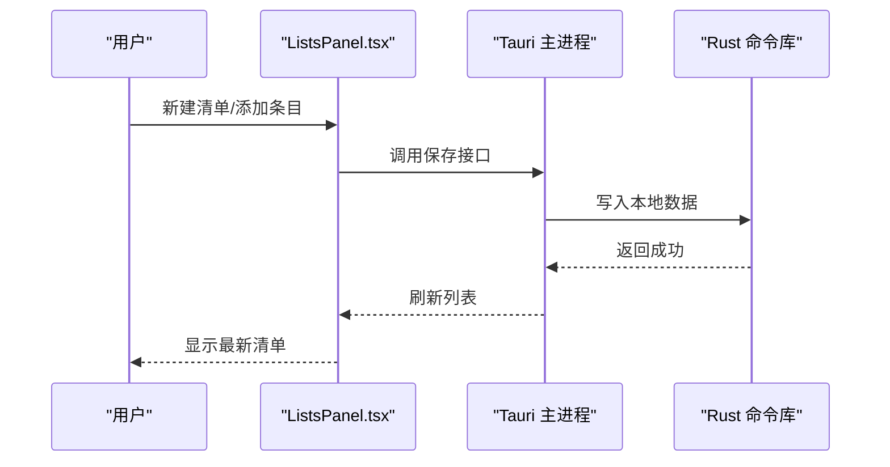
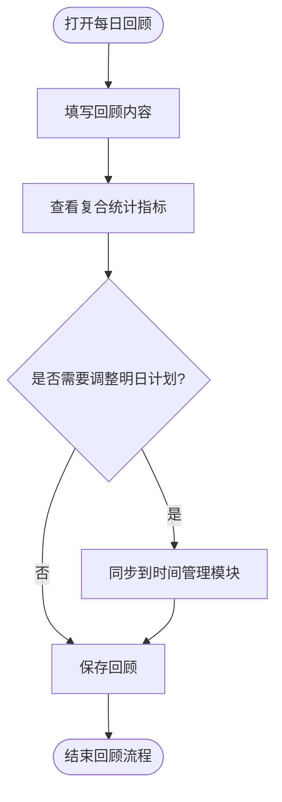
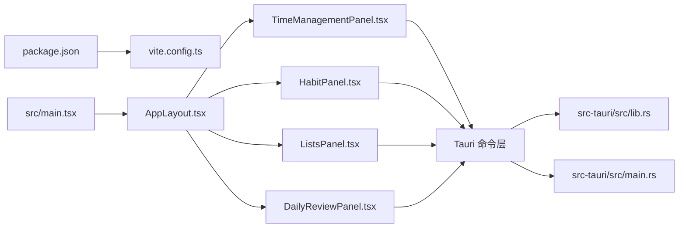

# 项目介绍

<cite>
**本文引用的文件**   
- [README.md](file://README.md)
- [package.json](file://package.json)
- [vite.config.ts](file://vite.config.ts)
- [src/main.tsx](file://src/main.tsx)
- [src/components/layout/AppLayout.tsx](file://src/components/layout/AppLayout.tsx)
- [src/features/time-management/TimeManagementPanel.tsx](file://src/features/time-management/TimeManagementPanel.tsx)
- [src/features/time-management/DailyQuadrants.tsx](file://src/features/time-management/DailyQuadrants.tsx)
- [src/features/time-management/WeeklyPlanning.tsx](file://src/features/time-management/WeeklyPlanning.tsx)
- [src/features/habits/HabitPanel.tsx](file://src/features/habits/HabitPanel.tsx)
- [src/features/lists/ListsPanel.tsx](file://src/features/lists/ListsPanel.tsx)
- [src/features/daily-review/DailyReviewPanel.tsx](file://src/features/daily-review/DailyReviewPanel.tsx)
- [src-tauri/src/lib.rs](file://src-tauri/src/lib.rs)
- [src-tauri/src/main.rs](file://src-tauri/src/main.rs)
- [src-tauri/Cargo.toml](file://src-tauri/Cargo.toml)
- [src-tauri/tauri.conf.json](file://src-tauri/tauri.conf.json)
</cite>

## 目录
1. [简介](#简介)
2. [项目结构](#项目结构)
3. [核心组件](#核心组件)
4. [架构总览](#架构总览)
5. [详细组件分析](#详细组件分析)
6. [依赖分析](#依赖分析)
7. [性能考虑](#性能考虑)
8. [故障排查指南](#故障排查指南)
9. [结论](#结论)
10. [附录](#附录)

## 简介
FishWorker 是一款面向现代工作流的桌面应用，聚焦“时间管理、习惯追踪、清单管理与每日回顾”的一体化体验。它通过周计划规划与每日四象限任务管理帮助你将目标拆解为可执行动作；以习惯养成追踪强化长期行为改变；借助笔记清单管理沉淀思考与待办；并以每日回顾闭环复盘，持续优化个人效率系统。

核心价值主张：
- 高效工作流：从周计划到日执行再到复盘的完整闭环，减少上下文切换成本。
- 数据本地化：优先本地存储，保障隐私与离线可用。
- 跨平台支持：基于 Tauri 构建，覆盖主流桌面操作系统。
- 开箱即用：界面直观、操作简洁，适合初学者快速上手。

适用场景：
- 学生与职场人士的日常计划与复盘
- 自由职业者的多项目管理与习惯打卡
- 需要稳定、隐私友好的本地化工具的用户

## 项目结构
仓库采用前端（React + Vite）+ 后端（Tauri/Rust）的分层组织方式，功能按特性域划分在 src/features 下，UI 基础组件位于 src/components，桌面能力由 src-tauri 提供。

图表来源
- [src/main.tsx](file://src/main.tsx)
- [src/components/layout/AppLayout.tsx](file://src/components/layout/AppLayout.tsx)
- [src/features/time-management/TimeManagementPanel.tsx](file://src/features/time-management/TimeManagementPanel.tsx)
- [src/features/habits/HabitPanel.tsx](file://src/features/habits/HabitPanel.tsx)
- [src/features/lists/ListsPanel.tsx](file://src/features/lists/ListsPanel.tsx)
- [src/features/daily-review/DailyReviewPanel.tsx](file://src/features/daily-review/DailyReviewPanel.tsx)
- [src-tauri/src/lib.rs](file://src-tauri/src/lib.rs)
- [src-tauri/src/main.rs](file://src-tauri/src/main.rs)
- [src-tauri/tauri.conf.json](file://src-tauri/tauri.conf.json)
- [src-tauri/Cargo.toml](file://src-tauri/Cargo.toml)

章节来源
- [README.md](file://README.md)
- [package.json](file://package.json)
- [vite.config.ts](file://vite.config.ts)
- [src/main.tsx](file://src/main.tsx)
- [src/components/layout/AppLayout.tsx](file://src/components/layout/AppLayout.tsx)
- [src-tauri/src/lib.rs](file://src-tauri/src/lib.rs)
- [src-tauri/src/main.rs](file://src-tauri/src/main.rs)
- [src-tauri/tauri.conf.json](file://src-tauri/tauri.conf.json)
- [src-tauri/Cargo.toml](file://src-tauri/Cargo.toml)

## 核心组件
- 时间管理模块
  - 周计划规划：将目标分解到每周，明确优先级与里程碑。
  - 每日四象限：按重要性与紧急性对任务分类，聚焦高价值事项。
  - 关键文件：[TimeManagementPanel.tsx](file://src/features/time-management/TimeManagementPanel.tsx)、[DailyQuadrants.tsx](file://src/features/time-management/DailyQuadrants.tsx)、[WeeklyPlanning.tsx](file://src/features/time-management/WeeklyPlanning.tsx)
- 习惯追踪模块
  - 习惯卡片与详情面板：记录完成状态、查看连续天数与统计。
  - 关键文件：[HabitPanel.tsx](file://src/features/habits/HabitPanel.tsx)
- 清单管理模块
  - 列表与分组：支持文件夹式组织、批量导出与模板复用。
  - 关键文件：[ListsPanel.tsx](file://src/features/lists/ListsPanel.tsx)
- 每日回顾模块
  - 结构化回顾编辑器与复合统计：沉淀经验、量化改进点。
  - 关键文件：[DailyReviewPanel.tsx](file://src/features/daily-review/DailyReviewPanel.tsx)

章节来源
- [src/features/time-management/TimeManagementPanel.tsx](file://src/features/time-management/TimeManagementPanel.tsx)
- [src/features/time-management/DailyQuadrants.tsx](file://src/features/time-management/DailyQuadrants.tsx)
- [src/features/time-management/WeeklyPlanning.tsx](file://src/features/time-management/WeeklyPlanning.tsx)
- [src/features/habits/HabitPanel.tsx](file://src/features/habits/HabitPanel.tsx)
- [src/features/lists/ListsPanel.tsx](file://src/features/lists/ListsPanel.tsx)
- [src/features/daily-review/DailyReviewPanel.tsx](file://src/features/daily-review/DailyReviewPanel.tsx)

## 架构总览
FishWorker 采用“前端 UI + Tauri 后端”的混合架构。前端负责交互与展示，后端通过 Rust 暴露命令接口，统一处理数据持久化与系统级能力。

图表来源
- [src/main.tsx](file://src/main.tsx)
- [src/components/layout/AppLayout.tsx](file://src/components/layout/AppLayout.tsx)
- [src/features/time-management/TimeManagementPanel.tsx](file://src/features/time-management/TimeManagementPanel.tsx)
- [src/features/habits/HabitPanel.tsx](file://src/features/habits/HabitPanel.tsx)
- [src/features/lists/ListsPanel.tsx](file://src/features/lists/ListsPanel.tsx)
- [src/features/daily-review/DailyReviewPanel.tsx](file://src/features/daily-review/DailyReviewPanel.tsx)
- [src-tauri/src/main.rs](file://src-tauri/src/main.rs)
- [src-tauri/src/lib.rs](file://src-tauri/src/lib.rs)

## 详细组件分析

### 时间管理模块
- 作用与关系
  - 周计划作为上层目标框架，驱动每日四象限的任务拆分与优先级排序。
  - 四象限视图聚焦当日执行，强调“重要且紧急”的事项优先推进。
- 关键文件
  - [TimeManagementPanel.tsx](file://src/features/time-management/TimeManagementPanel.tsx)
  - [DailyQuadrants.tsx](file://src/features/time-management/DailyQuadrants.tsx)
  - [WeeklyPlanning.tsx](file://src/features/time-management/WeeklyPlanning.tsx)

图表来源
- [src/features/time-management/WeeklyPlanning.tsx](file://src/features/time-management/WeeklyPlanning.tsx)
- [src/features/time-management/DailyQuadrants.tsx](file://src/features/time-management/DailyQuadrants.tsx)
- [src/features/time-management/TimeManagementPanel.tsx](file://src/features/time-management/TimeManagementPanel.tsx)

章节来源
- [src/features/time-management/TimeManagementPanel.tsx](file://src/features/time-management/TimeManagementPanel.tsx)
- [src/features/time-management/DailyQuadrants.tsx](file://src/features/time-management/DailyQuadrants.tsx)
- [src/features/time-management/WeeklyPlanning.tsx](file://src/features/time-management/WeeklyPlanning.tsx)

### 习惯追踪模块
- 作用与关系
  - 通过习惯卡片快速打卡，侧边栏展示详情与趋势，形成正向反馈循环。
- 关键文件
  - [HabitPanel.tsx](file://src/features/habits/HabitPanel.tsx)

图表来源
- [src/features/habits/HabitPanel.tsx](file://src/features/habits/HabitPanel.tsx)

章节来源
- [src/features/habits/HabitPanel.tsx](file://src/features/habits/HabitPanel.tsx)

### 清单管理模块
- 作用与关系
  - 提供文件夹式组织、拖拽排序、批量导出与模板复用，满足多样化记录需求。
- 关键文件
  - [ListsPanel.tsx](file://src/features/lists/ListsPanel.tsx)

图表来源
- [src/features/lists/ListsPanel.tsx](file://src/features/lists/ListsPanel.tsx)
- [src-tauri/src/main.rs](file://src-tauri/src/main.rs)
- [src-tauri/src/lib.rs](file://src-tauri/src/lib.rs)

章节来源
- [src/features/lists/ListsPanel.tsx](file://src/features/lists/ListsPanel.tsx)

### 每日回顾模块
- 作用与关系
  - 提供结构化回顾编辑器与复合统计，帮助用户总结当天得失并制定改进策略。
- 关键文件
  - [DailyReviewPanel.tsx](file://src/features/daily-review/DailyReviewPanel.tsx)

图表来源
- [src/features/daily-review/DailyReviewPanel.tsx](file://src/features/daily-review/DailyReviewPanel.tsx)

章节来源
- [src/features/daily-review/DailyReviewPanel.tsx](file://src/features/daily-review/DailyReviewPanel.tsx)

## 依赖分析
- 前端依赖
  - 构建工具：Vite（配置文件见 [vite.config.ts](file://vite.config.ts)）
  - 包管理：pnpm（见 [package.json](file://package.json)）
- 桌面后端依赖
  - 运行时：Tauri（配置见 [src-tauri/tauri.conf.json](file://src-tauri/tauri.conf.json)）
  - 语言与工具链：Rust（依赖声明见 [src-tauri/Cargo.toml](file://src-tauri/Cargo.toml)）
- 模块耦合
  - 各功能面板通过统一的布局容器进行路由与挂载，降低耦合度。
  - 所有数据访问经由 Tauri 命令层，保证前后端职责清晰。

图表来源
- [package.json](file://package.json)
- [vite.config.ts](file://vite.config.ts)
- [src/main.tsx](file://src/main.tsx)
- [src/components/layout/AppLayout.tsx](file://src/components/layout/AppLayout.tsx)
- [src/features/time-management/TimeManagementPanel.tsx](file://src/features/time-management/TimeManagementPanel.tsx)
- [src/features/habits/HabitPanel.tsx](file://src/features/habits/HabitPanel.tsx)
- [src/features/lists/ListsPanel.tsx](file://src/features/lists/ListsPanel.tsx)
- [src/features/daily-review/DailyReviewPanel.tsx](file://src/features/daily-review/DailyReviewPanel.tsx)
- [src-tauri/src/lib.rs](file://src-tauri/src/lib.rs)
- [src-tauri/src/main.rs](file://src-tauri/src/main.rs)

章节来源
- [package.json](file://package.json)
- [vite.config.ts](file://vite.config.ts)
- [src-tauri/Cargo.toml](file://src-tauri/Cargo.toml)
- [src-tauri/tauri.conf.json](file://src-tauri/tauri.conf.json)

## 性能考虑
- 首屏加载
  - 使用 Vite 按需构建与资源压缩，缩短冷启动时间。
- 数据读写
  - 通过 Tauri 命令集中处理 I/O，避免频繁跨进程通信开销。
- 渲染优化
  - 面板级懒加载与条件渲染，减少不必要的重绘。
- 扩展建议
  - 引入增量更新与缓存策略，提升大数据量下的交互流畅度。

## 故障排查指南
- 常见问题定位
  - 若界面无法加载，检查前端入口与布局是否正确挂载：[src/main.tsx](file://src/main.tsx)、[src/components/layout/AppLayout.tsx](file://src/components/layout/AppLayout.tsx)
  - 若数据未保存或读取失败，检查 Tauri 命令注册与实现：[src-tauri/src/main.rs](file://src-tauri/src/main.rs)、[src-tauri/src/lib.rs](file://src-tauri/src/lib.rs)
  - 若打包或运行异常，核对 Tauri 配置与依赖版本：[src-tauri/tauri.conf.json](file://src-tauri/tauri.conf.json)、[src-tauri/Cargo.toml](file://src-tauri/Cargo.toml)
- 日志与调试
  - 在前端控制台查看错误堆栈，在后端输出中定位具体命令失败原因。
- 回滚与恢复
  - 清理构建缓存后重试；必要时回退最近一次依赖或配置变更。

章节来源
- [src/main.tsx](file://src/main.tsx)
- [src/components/layout/AppLayout.tsx](file://src/components/layout/AppLayout.tsx)
- [src-tauri/src/main.rs](file://src-tauri/src/main.rs)
- [src-tauri/src/lib.rs](file://src-tauri/src/lib.rs)
- [src-tauri/tauri.conf.json](file://src-tauri/tauri.conf.json)
- [src-tauri/Cargo.toml](file://src-tauri/Cargo.toml)

## 结论
FishWorker 以“计划—执行—复盘”的闭环为核心，结合习惯追踪与清单管理，打造一体化的高效桌面工作流。其本地化存储与跨平台能力，兼顾隐私与可用性，适合追求稳定与专注的个人用户与团队。

## 附录
- 快速开始
  - 安装依赖并启动开发环境（参考 [package.json](file://package.json) 脚本）
  - 构建桌面应用（参考 [src-tauri/tauri.conf.json](file://src-tauri/tauri.conf.json) 与 [src-tauri/Cargo.toml](file://src-tauri/Cargo.toml)）
- 术语说明
  - 四象限：按重要性与紧急性划分的任务优先级矩阵
  - 习惯追踪：对重复性行为进行记录与统计的工具方法
  - 每日回顾：对当天工作进行结构化反思与总结的流程