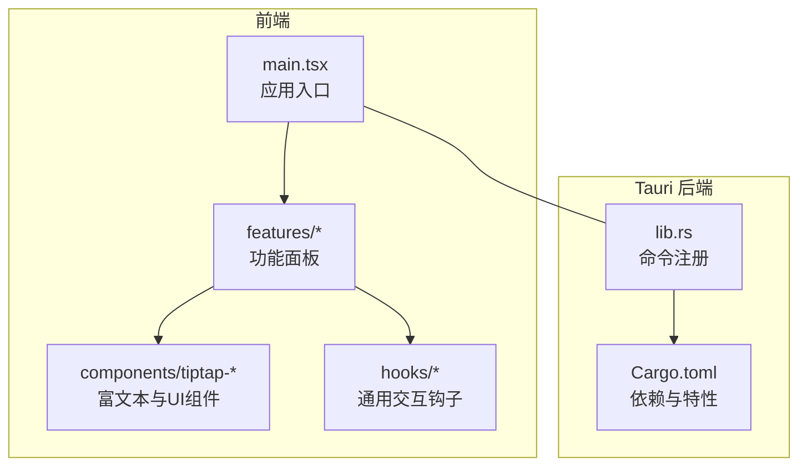
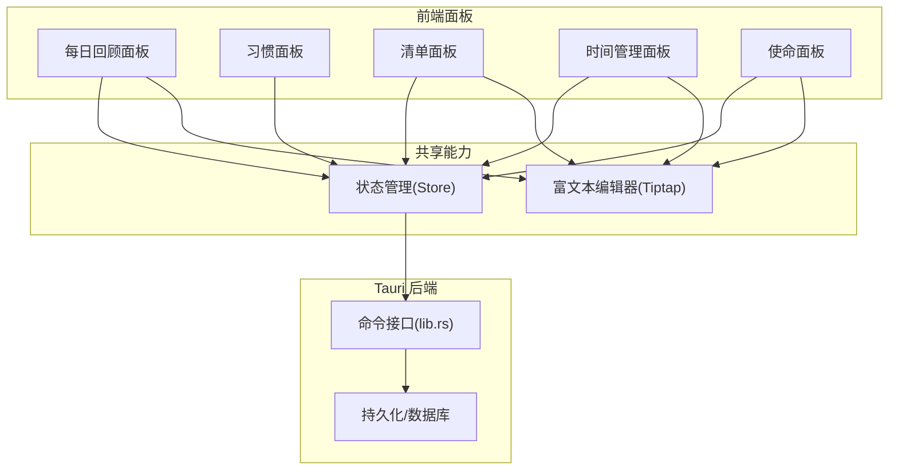
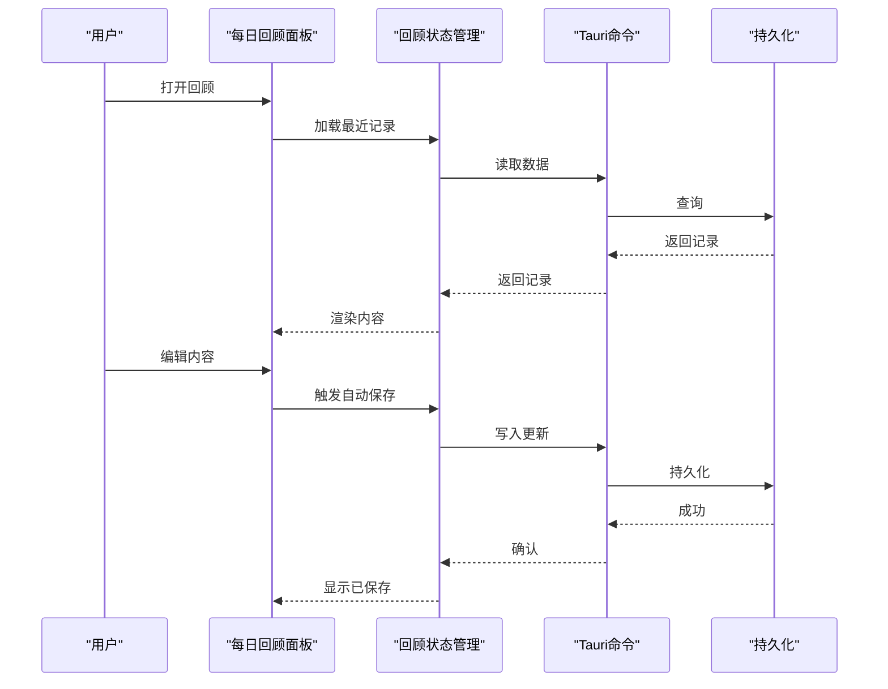
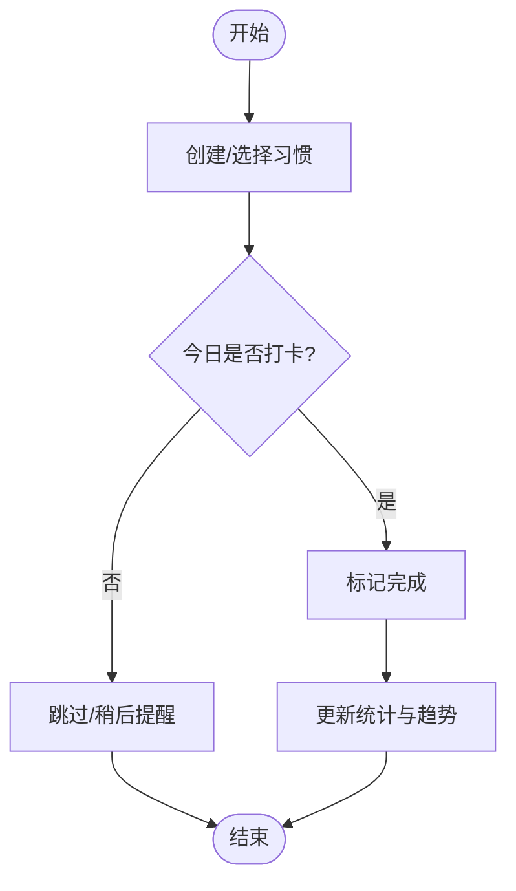
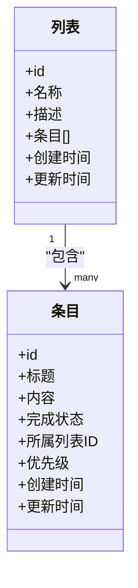
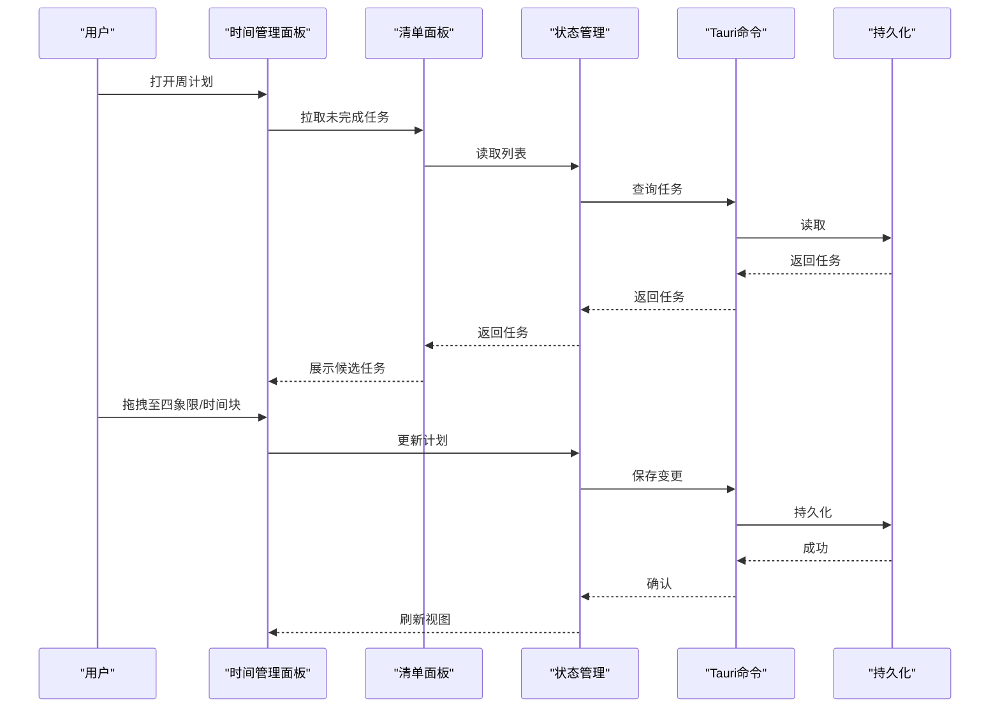
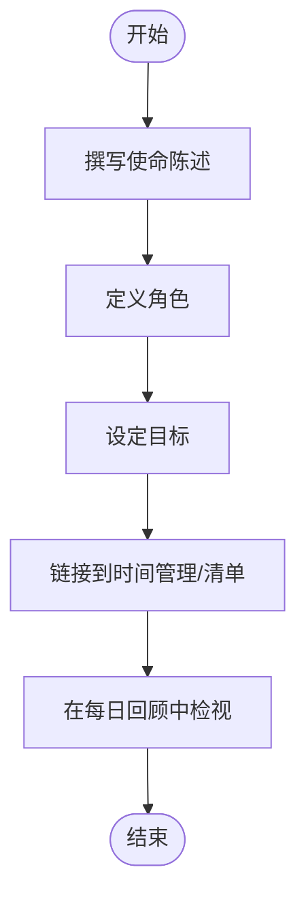

# 项目介绍

<cite>
**本文引用的文件**   
- [README.md](file://README.md)
- [package.json](file://package.json)
- [vite.config.ts](file://vite.config.ts)
- [src/main.tsx](file://src/main.tsx)
- [src/features/daily-review/DailyReviewPanel.tsx](file://src/features/daily-review/DailyReviewPanel.tsx)
- [src/features/daily-review/dailyReviewStore.ts](file://src/features/daily-review/dailyReviewStore.ts)
- [src/features/habits/HabitPanel.tsx](file://src/features/habits/HabitPanel.tsx)
- [src/features/lists/ListsPanel.tsx](file://src/features/lists/ListsPanel.tsx)
- [src/features/time-management/TimeManagementPanel.tsx](file://src/features/time-management/TimeManagementPanel.tsx)
- [src/features/mission/MissionPanel.tsx](file://src/features/mission/MissionPanel.tsx)
- [src-tauri/src/lib.rs](file://src-tauri/src/lib.rs)
- [src-tauri/Cargo.toml](file://src-tauri/Cargo.toml)
</cite>

## 目录
1. [简介](#简介)
2. [项目结构](#项目结构)
3. [核心组件](#核心组件)
4. [架构总览](#架构总览)
5. [详细组件分析](#详细组件分析)
6. [依赖分析](#依赖分析)
7. [性能考量](#性能考量)
8. [故障排查指南](#故障排查指南)
9. [结论](#结论)
10. [附录](#附录)

## 简介
FishWorker 是一款面向个人与团队的桌面生产力应用，围绕“目标驱动的日常执行”这一核心价值主张构建。它通过每日回顾、习惯追踪、清单管理、时间管理与使命声明五大模块，帮助用户将长期愿景拆解为可执行的日常行动，并在本地安全地沉淀数据。

- 核心价值主张
  - 以使命与目标为锚点，让每一天都有方向感
  - 用轻量但强大的工具链串联“计划—执行—复盘”的闭环
  - 本地优先的数据存储，兼顾隐私与可用性
- 目标用户群体
  - 追求高效与自我管理的个人用户
  - 希望统一工作流的小团队
  - 需要结构化记录与复盘的知识工作者
- 典型使用场景
  - 每天早晨设定当日重点事项与时间块
  - 在任务推进中快速记录想法与要点
  - 晚间进行简短回顾，沉淀经验并调整次日计划
  - 持续追踪关键习惯，形成正向反馈循环
  - 定期审视使命与角色目标，校准长期方向

## 项目结构
FishWorker 采用前端 React + Vite 与后端 Tauri（Rust）的分层架构：
- 前端（src）
  - 按功能域组织 features（daily-review、habits、lists、time-management、mission）
  - 公共 UI 与编辑器能力集中在 components/tiptap-* 与 hooks
  - 入口 main.tsx 负责应用初始化与路由挂载
- 后端（src-tauri）
  - Rust 实现持久化与系统级能力，通过 Tauri 暴露给前端
  - Cargo.toml 定义依赖与构建配置
- 工程配置
  - package.json 管理前端依赖与脚本
  - vite.config.ts 提供开发/构建优化

图表来源
- [src/main.tsx](file://src/main.tsx)
- [src-tauri/src/lib.rs](file://src-tauri/src/lib.rs)
- [src-tauri/Cargo.toml](file://src-tauri/Cargo.toml)

章节来源
- [package.json](file://package.json)
- [vite.config.ts](file://vite.config.ts)
- [src/main.tsx](file://src/main.tsx)
- [src-tauri/Cargo.toml](file://src-tauri/Cargo.toml)

## 核心组件
FishWorker 的核心由五个功能面板组成，每个面板聚焦一个领域，并通过统一的布局与状态管理模式协作。

- 每日回顾
  - 提供结构化回顾模板与自动保存体验，帮助沉淀反思与洞察
  - 相关实现参考：[DailyReviewPanel.tsx](file://src/features/daily-review/DailyReviewPanel.tsx)、[dailyReviewStore.ts](file://src/features/daily-review/dailyReviewStore.ts)
- 习惯追踪
  - 支持创建、打卡与查看习惯进度，形成可视化反馈
  - 相关实现参考：[HabitPanel.tsx](file://src/features/habits/HabitPanel.tsx)
- 清单管理
  - 提供多列表、分组与拖拽排序等能力，满足多样化任务组织需求
  - 相关实现参考：[ListsPanel.tsx](file://src/features/lists/ListsPanel.tsx)
- 时间管理
  - 结合四象限与周计划视图，辅助优先级划分与日程规划
  - 相关实现参考：[TimeManagementPanel.tsx](file://src/features/time-management/TimeManagementPanel.tsx)
- 使命声明
  - 维护使命、角色与目标体系，作为一切计划的北极星
  - 相关实现参考：[MissionPanel.tsx](file://src/features/mission/MissionPanel.tsx)

章节来源
- [src/features/daily-review/DailyReviewPanel.tsx](file://src/features/daily-review/DailyReviewPanel.tsx)
- [src/features/daily-review/dailyReviewStore.ts](file://src/features/daily-review/dailyReviewStore.ts)
- [src/features/habits/HabitPanel.tsx](file://src/features/habits/HabitPanel.tsx)
- [src/features/lists/ListsPanel.tsx](file://src/features/lists/ListsPanel.tsx)
- [src/features/time-management/TimeManagementPanel.tsx](file://src/features/time-management/TimeManagementPanel.tsx)
- [src/features/mission/MissionPanel.tsx](file://src/features/mission/MissionPanel.tsx)

## 架构总览
FishWorker 采用“前端功能面板 + 后端持久化”的清晰分层：
- 前端负责交互、渲染与局部状态管理
- 后端通过 Tauri 命令暴露数据读写能力，确保数据安全与一致性
- 各功能面板遵循一致的 Store/Service 模式，便于扩展与维护

图表来源
- [src/features/daily-review/DailyReviewPanel.tsx](file://src/features/daily-review/DailyReviewPanel.tsx)
- [src/features/habits/HabitPanel.tsx](file://src/features/habits/HabitPanel.tsx)
- [src/features/lists/ListsPanel.tsx](file://src/features/lists/ListsPanel.tsx)
- [src/features/time-management/TimeManagementPanel.tsx](file://src/features/time-management/TimeManagementPanel.tsx)
- [src/features/mission/MissionPanel.tsx](file://src/features/mission/MissionPanel.tsx)
- [src-tauri/src/lib.rs](file://src-tauri/src/lib.rs)

## 详细组件分析

### 每日回顾
- 设计理念
  - 通过固定结构与自动保存降低记录门槛，鼓励高频复盘
  - 与时间管理、清单联动，形成“计划—执行—回顾”闭环
- 关键流程
  - 打开回顾面板 → 加载最近记录 → 编辑内容 → 自动保存 → 同步到后端
- 数据结构与复杂度
  - 回顾条目通常包含日期、标签、正文等字段；自动保存采用节流策略减少频繁写入
- 错误处理
  - 网络或磁盘异常时提供降级提示与重试机制
- 与其他模块的关系
  - 可从时间管理面板跳转到当日回顾，从清单面板关联待办完成度

图表来源
- [src/features/daily-review/DailyReviewPanel.tsx](file://src/features/daily-review/DailyReviewPanel.tsx)
- [src/features/daily-review/dailyReviewStore.ts](file://src/features/daily-review/dailyReviewStore.ts)
- [src-tauri/src/lib.rs](file://src-tauri/src/lib.rs)

章节来源
- [src/features/daily-review/DailyReviewPanel.tsx](file://src/features/daily-review/DailyReviewPanel.tsx)
- [src/features/daily-review/dailyReviewStore.ts](file://src/features/daily-review/dailyReviewStore.ts)

### 习惯追踪
- 设计理念
  - 以“小步快跑”的方式建立正向反馈，强调可见性与连续性
- 关键流程
  - 创建习惯 → 设置频率与提醒 → 每日打卡 → 查看趋势
- 数据结构与复杂度
  - 习惯项包含名称、周期、历史打卡记录；统计计算多为线性遍历
- 错误处理
  - 重复打卡、跨日边界等边界情况需明确提示
- 与其他模块的关系
  - 可与时间管理中的“重要不紧急”习惯对齐，纳入日程

图表来源
- [src/features/habits/HabitPanel.tsx](file://src/features/habits/HabitPanel.tsx)

章节来源
- [src/features/habits/HabitPanel.tsx](file://src/features/habits/HabitPanel.tsx)

### 清单管理
- 设计理念
  - 以“列表即容器”的思想组织任务，支持分组、排序与批量操作
- 关键流程
  - 新建列表 → 添加条目 → 拖拽排序 → 归档/删除
- 数据结构与复杂度
  - 列表与条目存在一对多关系；排序涉及数组重排，注意稳定排序
- 错误处理
  - 并发编辑冲突时采用乐观更新+回滚策略
- 与其他模块的关系
  - 可作为时间管理面板的任务来源，也可在每日回顾中引用

图表来源
- [src/features/lists/ListsPanel.tsx](file://src/features/lists/ListsPanel.tsx)

章节来源
- [src/features/lists/ListsPanel.tsx](file://src/features/lists/ListsPanel.tsx)

### 时间管理
- 设计理念
  - 基于四象限与周计划，帮助区分重要与紧急，提升决策质量
- 关键流程
  - 导入清单任务 → 分配至四象限 → 安排时间块 → 生成周计划
- 数据结构与复杂度
  - 任务与时间块存在映射关系；周视图聚合计算为 O(n)
- 错误处理
  - 时间冲突检测与提示，避免重叠安排
- 与其他模块的关系
  - 与每日回顾联动，用于评估计划达成率

图表来源
- [src/features/time-management/TimeManagementPanel.tsx](file://src/features/time-management/TimeManagementPanel.tsx)
- [src/features/lists/ListsPanel.tsx](file://src/features/lists/ListsPanel.tsx)
- [src-tauri/src/lib.rs](file://src-tauri/src/lib.rs)

章节来源
- [src/features/time-management/TimeManagementPanel.tsx](file://src/features/time-management/TimeManagementPanel.tsx)

### 使命声明
- 设计理念
  - 将使命、角色与目标结构化，作为所有行动的北极星
- 关键流程
  - 编写使命陈述 → 分解角色与目标 → 与时间管理/清单关联
- 数据结构与复杂度
  - 树形结构表达角色—目标—任务的层级关系
- 错误处理
  - 长文编辑的自动保存与恢复
- 与其他模块的关系
  - 为其他模块提供上下文与约束，指导优先级与取舍

图表来源
- [src/features/mission/MissionPanel.tsx](file://src/features/mission/MissionPanel.tsx)

章节来源
- [src/features/mission/MissionPanel.tsx](file://src/features/mission/MissionPanel.tsx)

## 依赖分析
- 前端依赖
  - React 生态与 Vite 构建管线，配合 TypeScript 保证类型安全
  - 富文本能力基于 Tiptap 扩展，提供一致的用户体验
- 后端依赖
  - Tauri 运行时与 Rust 生态，提供高性能与安全的本地能力
- 耦合与内聚
  - 各功能面板相对独立，通过 Store/Service 抽象与后端解耦
  - 共享 UI 与编辑器能力集中管理，降低重复成本

图表来源
- [package.json](file://package.json)
- [vite.config.ts](file://vite.config.ts)
- [src/main.tsx](file://src/main.tsx)
- [src-tauri/src/lib.rs](file://src-tauri/src/lib.rs)
- [src-tauri/Cargo.toml](file://src-tauri/Cargo.toml)

章节来源
- [package.json](file://package.json)
- [vite.config.ts](file://vite.config.ts)
- [src/main.tsx](file://src/main.tsx)
- [src-tauri/Cargo.toml](file://src-tauri/Cargo.toml)

## 性能考量
- 前端渲染
  - 列表与看板类界面采用虚拟滚动与懒加载，减少首屏压力
  - 富文本编辑器按需加载扩展，避免不必要的体积
- 状态管理
  - 局部状态与全局状态分离，减少不必要重渲染
  - 自动保存采用节流与合并策略，降低 I/O 频率
- 后端持久化
  - 批量写入与事务提交，提高吞吐与一致性
  - 索引与查询优化，保障大数据量下的响应速度

## 故障排查指南
- 常见问题定位
  - 启动失败：检查端口占用与构建产物完整性
  - 数据不同步：确认 Tauri 命令调用与后端日志
  - 富文本异常：验证扩展版本与主题样式加载
- 建议步骤
  - 清理缓存并重新安装依赖
  - 切换调试级别，捕获更详细的堆栈信息
  - 复现最小用例，逐步缩小问题范围

## 结论
FishWorker 以“使命驱动的日常执行”为核心，通过清晰的模块化设计与前后端职责分离，为用户提供了连贯的生产力体验。其优势在于：
- 将长期愿景与短期行动紧密连接
- 本地优先的数据模型，兼顾隐私与可用
- 可扩展的组件与编辑器能力，便于二次定制

对于初学者，FishWorker 提供直观的面板与引导式流程；对于有经验的开发者，其清晰的架构与良好的扩展点也为深度定制提供了空间。

## 附录
- 术语说明
  - 每日回顾：对当天计划与执行进行结构化总结
  - 习惯追踪：对重复性行为进行打卡与趋势分析
  - 清单管理：对任务与信息进行列表化组织
  - 时间管理：基于四象限与周计划的优先级与日程编排
  - 使命声明：对个人或团队长期目标的书面化表达