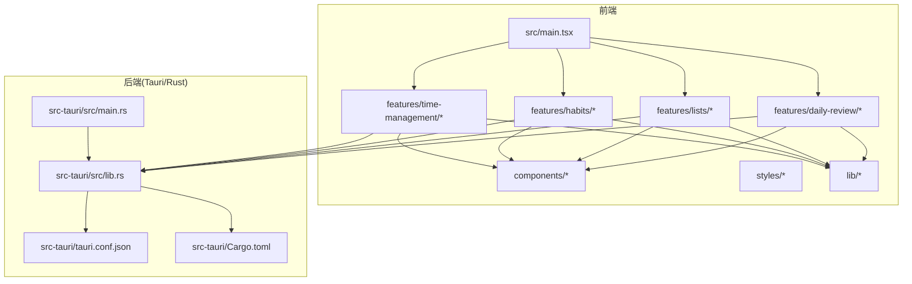
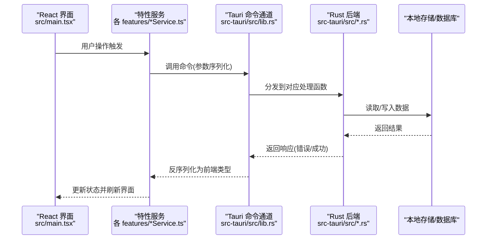
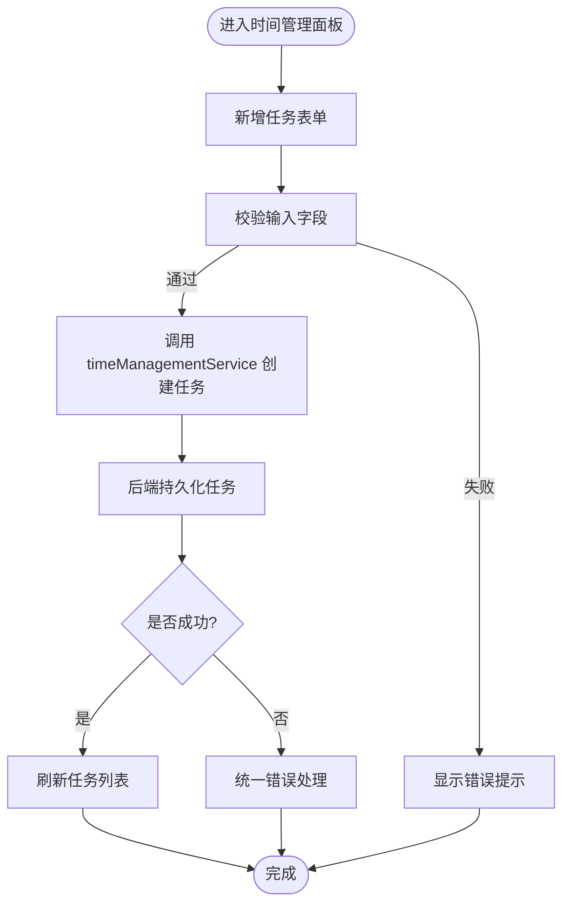
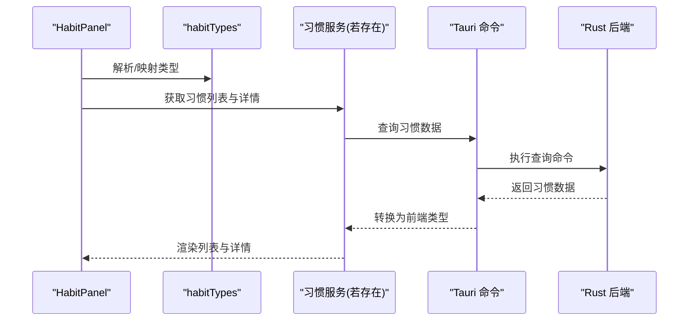
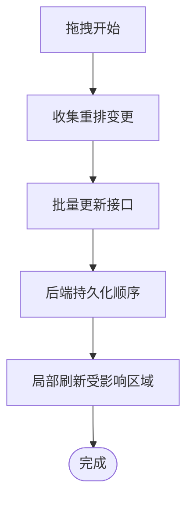
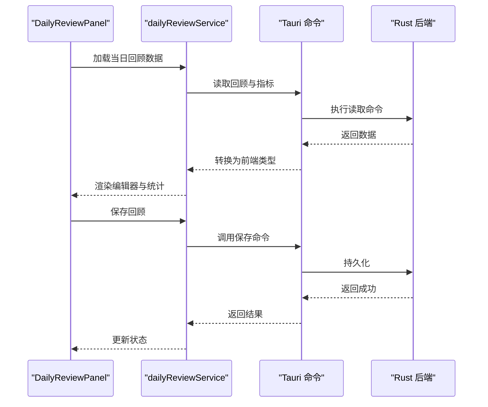
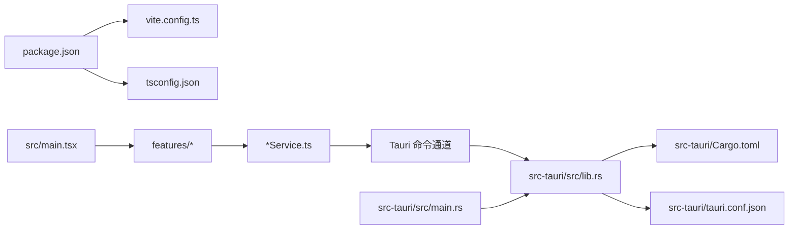

# 项目概述

<cite>
**本文引用的文件**   
- [README.md](file://README.md)
- [package.json](file://package.json)
- [vite.config.ts](file://vite.config.ts)
- [tsconfig.json](file://tsconfig.json)
- [src/main.tsx](file://src/main.tsx)
- [src/features/time-management/TimeManagementPanel.tsx](file://src/features/time-management/TimeManagementPanel.tsx)
- [src/features/habits/HabitPanel.tsx](file://src/features/habits/HabitPanel.tsx)
- [src/features/lists/ListsPanel.tsx](file://src/features/lists/ListsPanel.tsx)
- [src/features/daily-review/DailyReviewPanel.tsx](file://src/features/daily-review/DailyReviewPanel.tsx)
- [src/features/time-management/timeManagementService.ts](file://src/features/time-management/timeManagementService.ts)
- [src/features/habits/habitTypes.ts](file://src/features/habits/habitTypes.ts)
- [src/features/lists/listsService.ts](file://src/features/lists/listsService.ts)
- [src/features/daily-review/dailyReviewService.ts](file://src/features/daily-review/dailyReviewService.ts)
- [src-tauri/src/lib.rs](file://src-tauri/src/lib.rs)
- [src-tauri/src/main.rs](file://src-tauri/src/main.rs)
- [src-tauri/Cargo.toml](file://src-tauri/Cargo.toml)
- [src-tauri/tauri.conf.json](file://src-tauri/tauri.conf.json)
</cite>

## 更新摘要
**所做更改**   
- 移除了原桌面应用根工程中的概述文档，重构了文档结构
- 更新了项目架构描述以反映当前的模块化组织方式
- 增强了技术栈说明和性能优化策略
- 完善了快速开始指南和故障排查流程

## 目录
1. [简介](#简介)
2. [项目结构](#项目结构)
3. [核心组件](#核心组件)
4. [架构总览](#架构总览)
5. [详细组件分析](#详细组件分析)
6. [依赖关系分析](#依赖关系分析)
7. [性能与体积考量](#性能与体积考量)
8. [快速开始](#快速开始)
9. [故障排查指南](#故障排查指南)
10. [结论](#结论)

## 简介
FishWorker 是一款基于 Tauri + React + TypeScript 构建的现代化桌面应用，聚焦个人效率提升，提供时间管理、习惯追踪、清单管理与每日回顾四大核心功能模块。前端采用 React 18 与 Vite 进行开发与打包，后端使用 Rust（Tauri）实现本地数据持久化与系统能力调用，前后端通过 Tauri 命令通道进行通信。

技术选型要点：
- 选择 Tauri 而非 Electron：更小的安装包体积、更低内存占用、原生安全模型；Rust 后端具备高性能与强类型保障。
- 选择 React 18：并发渲染、更好的状态更新体验，配合 Vite 获得极快的开发启动与热更新。
- 选择 TypeScript：为大型前端工程提供稳定的类型约束与重构安全保障。
- 选择 Rust 作为后端：在 I/O 密集与计算密集型场景下具备显著性能优势，且与 Tauri 生态无缝集成。

本概述旨在帮助初学者快速理解项目目标与架构，同时为有经验的开发者提供足够的技术深度与落地指引。

## 项目结构
仓库采用"前端特性目录 + Rust 后端模块"的分层组织方式：
- 前端 src/features 按业务特性划分（time-management、habits、lists、daily-review），每个特性包含 UI 面板、服务层与类型定义。
- 前端公共组件位于 src/components，样式与工具位于 src/styles 与 src/lib。
- 入口文件 src/main.tsx 负责挂载应用根节点与路由初始化。
- 后端 src-tauri 使用 Cargo 管理，main.rs 启动 Tauri 应用，lib.rs 注册命令与模块。

图表来源
- [src/main.tsx](file://src/main.tsx)
- [src/features/time-management/TimeManagementPanel.tsx](file://src/features/time-management/TimeManagementPanel.tsx)
- [src/features/habits/HabitPanel.tsx](file://src/features/habits/HabitPanel.tsx)
- [src/features/lists/ListsPanel.tsx](file://src/features/lists/ListsPanel.tsx)
- [src/features/daily-review/DailyReviewPanel.tsx](file://src/features/daily-review/DailyReviewPanel.tsx)
- [src-tauri/src/main.rs](file://src-tauri/src/main.rs)
- [src-tauri/src/lib.rs](file://src-tauri/src/lib.rs)
- [src-tauri/tauri.conf.json](file://src-tauri/tauri.conf.json)
- [src-tauri/Cargo.toml](file://src-tauri/Cargo.toml)

章节来源
- [src/main.tsx](file://src/main.tsx)
- [src/features/time-management/TimeManagementPanel.tsx](file://src/features/time-management/TimeManagementPanel.tsx)
- [src/features/habits/HabitPanel.tsx](file://src/features/habits/HabitPanel.tsx)
- [src/features/lists/ListsPanel.tsx](file://src/features/lists/ListsPanel.tsx)
- [src/features/daily-review/DailyReviewPanel.tsx](file://src/features/daily-review/DailyReviewPanel.tsx)
- [src-tauri/src/main.rs](file://src-tauri/src/main.rs)
- [src-tauri/src/lib.rs](file://src-tauri/src/lib.rs)
- [src-tauri/tauri.conf.json](file://src-tauri/tauri.conf.json)
- [src-tauri/Cargo.toml](file://src-tauri/Cargo.toml)

## 核心组件
- 时间管理
  - 面板入口：[TimeManagementPanel.tsx](file://src/features/time-management/TimeManagementPanel.tsx)
  - 服务层：[timeManagementService.ts](file://src/features/time-management/timeManagementService.ts)
  - 职责：任务创建、分组、排序、周计划视图等，通过服务层调用 Tauri 命令读写数据。
- 习惯追踪
  - 面板入口：[HabitPanel.tsx](file://src/features/habits/HabitPanel.tsx)
  - 类型定义：[habitTypes.ts](file://src/features/habits/habitTypes.ts)
  - 职责：习惯项增删改查、打卡记录、统计展示。
- 清单管理
  - 面板入口：[ListsPanel.tsx](file://src/features/lists/ListsPanel.tsx)
  - 服务层：[listsService.ts](file://src/features/lists/listsService.ts)
  - 职责：清单列表、条目编辑、拖拽排序、批量导出等。
- 每日回顾
  - 面板入口：[DailyReviewPanel.tsx](file://src/features/daily-review/DailyReviewPanel.tsx)
  - 服务层：[dailyReviewService.ts](file://src/features/daily-review/dailyReviewService.ts)
  - 职责：每日总结撰写、结构化回顾、指标聚合。

章节来源
- [src/features/time-management/TimeManagementPanel.tsx](file://src/features/time-management/TimeManagementPanel.tsx)
- [src/features/time-management/timeManagementService.ts](file://src/features/time-management/timeManagementService.ts)
- [src/features/habits/HabitPanel.tsx](file://src/features/habits/HabitPanel.tsx)
- [src/features/habits/habitTypes.ts](file://src/features/habits/habitTypes.ts)
- [src/features/lists/ListsPanel.tsx](file://src/features/lists/ListsPanel.tsx)
- [src/features/lists/listsService.ts](file://src/features/lists/listsService.ts)
- [src/features/daily-review/DailyReviewPanel.tsx](file://src/features/daily-review/DailyReviewPanel.tsx)
- [src/features/daily-review/dailyReviewService.ts](file://src/features/daily-review/dailyReviewService.ts)

## 架构总览
FishWorker 采用"前端特性驱动 + 后端命令式 API"的架构模式：
- 前端以 React 组件为最小单元，按特性拆分，服务层封装对 Tauri 的命令调用。
- 后端以 Rust 模块承载领域逻辑与数据访问，通过 Tauri 暴露命令给前端。
- 配置集中在 tauri.conf.json，构建由 Vite 与 Cargo 协同完成。

图表来源
- [src/main.tsx](file://src/main.tsx)
- [src/features/time-management/timeManagementService.ts](file://src/features/time-management/timeManagementService.ts)
- [src/features/habits/habitTypes.ts](file://src/features/habits/habitTypes.ts)
- [src/features/lists/listsService.ts](file://src/features/lists/listsService.ts)
- [src/features/daily-review/dailyReviewService.ts](file://src/features/daily-review/dailyReviewService.ts)
- [src-tauri/src/lib.rs](file://src-tauri/src/lib.rs)
- [src-tauri/src/main.rs](file://src-tauri/src/main.rs)

## 详细组件分析

### 时间管理模块
- 关键文件
  - 面板：[TimeManagementPanel.tsx](file://src/features/time-management/TimeManagementPanel.tsx)
  - 服务：[timeManagementService.ts](file://src/features/time-management/timeManagementService.ts)
- 职责边界
  - 面板负责交互与展示，服务层负责与后端命令交互及数据转换。
- 典型流程
  - 用户在面板中新增任务 → 服务层构造请求 → 调用 Tauri 命令 → 后端持久化 → 返回新任务 ID → 前端更新列表。

图表来源
- [src/features/time-management/TimeManagementPanel.tsx](file://src/features/time-management/TimeManagementPanel.tsx)
- [src/features/time-management/timeManagementService.ts](file://src/features/time-management/timeManagementService.ts)

章节来源
- [src/features/time-management/TimeManagementPanel.tsx](file://src/features/time-management/TimeManagementPanel.tsx)
- [src/features/time-management/timeManagementService.ts](file://src/features/time-management/timeManagementService.ts)

### 习惯追踪模块
- 关键文件
  - 面板：[HabitPanel.tsx](file://src/features/habits/HabitPanel.tsx)
  - 类型：[habitTypes.ts](file://src/features/habits/habitTypes.ts)
- 职责边界
  - 面板负责习惯卡片、详情侧边栏与编辑弹窗；类型定义确保前后端数据结构一致。
- 典型流程
  - 打开习惯列表 → 点击某习惯 → 加载详情与历史记录 → 提交打卡 → 更新统计。

图表来源
- [src/features/habits/HabitPanel.tsx](file://src/features/habits/HabitPanel.tsx)
- [src/features/habits/habitTypes.ts](file://src/features/habits/habitTypes.ts)

章节来源
- [src/features/habits/HabitPanel.tsx](file://src/features/habits/HabitPanel.tsx)
- [src/features/habits/habitTypes.ts](file://src/features/habits/habitTypes.ts)

### 清单管理模块
- 关键文件
  - 面板：[ListsPanel.tsx](file://src/features/lists/ListsPanel.tsx)
  - 服务：[listsService.ts](file://src/features/lists/listsService.ts)
- 职责边界
  - 面板负责清单树、条目编辑与拖拽排序；服务层封装批量操作与导出。
- 典型流程
  - 拖拽条目重排 → 服务层收集变更 → 批量提交 → 后端顺序更新 → 前端局部刷新。

图表来源
- [src/features/lists/ListsPanel.tsx](file://src/features/lists/ListsPanel.tsx)
- [src/features/lists/listsService.ts](file://src/features/lists/listsService.ts)

章节来源
- [src/features/lists/ListsPanel.tsx](file://src/features/lists/ListsPanel.tsx)
- [src/features/lists/listsService.ts](file://src/features/lists/listsService.ts)

### 每日回顾模块
- 关键文件
  - 面板：[DailyReviewPanel.tsx](file://src/features/daily-review/DailyReviewPanel.tsx)
  - 服务：[dailyReviewService.ts](file://src/features/daily-review/dailyReviewService.ts)
- 职责边界
  - 面板提供编辑器与统计概览；服务层负责汇总数据与持久化。
- 典型流程
  - 打开回顾页 → 拉取当日数据 → 编辑回顾内容 → 保存并生成统计。

图表来源
- [src/features/daily-review/DailyReviewPanel.tsx](file://src/features/daily-review/DailyReviewPanel.tsx)
- [src/features/daily-review/dailyReviewService.ts](file://src/features/daily-review/dailyReviewService.ts)

章节来源
- [src/features/daily-review/DailyReviewPanel.tsx](file://src/features/daily-review/DailyReviewPanel.tsx)
- [src/features/daily-review/dailyReviewService.ts](file://src/features/daily-review/dailyReviewService.ts)

## 依赖关系分析
- 前端依赖
  - 构建与运行：Vite、TypeScript、React 18。
  - 包管理：pnpm（见 pnpm-workspace.yaml）。
  - 入口与配置：[src/main.tsx](file://src/main.tsx)、[vite.config.ts](file://vite.config.ts)、[tsconfig.json](file://tsconfig.json)。
- 后端依赖
  - 运行时：Tauri（Rust）。
  - 配置与元信息：[src-tauri/tauri.conf.json](file://src-tauri/tauri.conf.json)、[src-tauri/Cargo.toml](file://src-tauri/Cargo.toml)。
  - 应用生命周期：[src-tauri/src/main.rs](file://src-tauri/src/main.rs)、命令注册与模块：[src-tauri/src/lib.rs](file://src-tauri/src/lib.rs)。

图表来源
- [package.json](file://package.json)
- [vite.config.ts](file://vite.config.ts)
- [tsconfig.json](file://tsconfig.json)
- [src/main.tsx](file://src/main.tsx)
- [src-tauri/src/lib.rs](file://src-tauri/src/lib.rs)
- [src-tauri/src/main.rs](file://src-tauri/src/main.rs)
- [src-tauri/Cargo.toml](file://src-tauri/Cargo.toml)
- [src-tauri/tauri.conf.json](file://src-tauri/tauri.conf.json)

章节来源
- [package.json](file://package.json)
- [vite.config.ts](file://vite.config.ts)
- [tsconfig.json](file://tsconfig.json)
- [src/main.tsx](file://src/main.tsx)
- [src-tauri/src/lib.rs](file://src-tauri/src/lib.rs)
- [src-tauri/src/main.rs](file://src-tauri/src/main.rs)
- [src-tauri/Cargo.toml](file://src-tauri/Cargo.toml)
- [src-tauri/tauri.conf.json](file://src-tauri/tauri.conf.json)

## 性能与体积考量
- 体积与内存
  - Tauri 基于系统 Webview，相比 Electron 显著减少安装包体积与常驻内存占用。
- 启动与热更新
  - Vite 提供极速冷启动与 HMR，结合 React 18 的并发渲染优化用户体验。
- 后端性能
  - Rust 在 I/O 与 CPU 密集型任务上具备优势，适合本地数据处理与复杂计算。
- 建议
  - 合理拆分特性模块，按需加载资源。
  - 对频繁调用的命令进行批处理与去抖节流。
  - 避免在前端重复计算，尽量将可复用的聚合逻辑下沉至后端。

## 快速开始
- 环境准备
  - Node.js 与 pnpm 已安装。
  - Rust 工具链与 Tauri CLI 已安装（参考 Tauri 官方文档）。
- 安装依赖
  - 在项目根目录执行包管理器安装命令（例如 pnpm install）。
- 启动开发服务器
  - 执行开发命令（例如 pnpm dev），Vite 会启动前端并在 Tauri 窗口中加载。
- 构建与打包
  - 执行构建命令（例如 pnpm build），生成平台可执行文件。
- 常见问题
  - 若出现 Tauri 相关编译错误，请检查 Rust 工具链版本与 tauri.conf.json 配置。
  - 若端口被占用，可在 vite.config.ts 中调整开发服务器端口。

章节来源
- [README.md](file://README.md)
- [package.json](file://package.json)
- [vite.config.ts](file://vite.config.ts)
- [src-tauri/tauri.conf.json](file://src-tauri/tauri.conf.json)

## 故障排查指南
- 前端问题
  - 确认入口文件 [src/main.tsx](file://src/main.tsx) 正确挂载应用。
  - 检查 Vite 配置 [vite.config.ts](file://vite.config.ts) 与 TypeScript 配置 [tsconfig.json](file://tsconfig.json)。
- 后端问题
  - 查看 Tauri 命令注册与错误日志，定位 [src-tauri/src/lib.rs](file://src-tauri/src/lib.rs) 中的异常路径。
  - 核对应用生命周期与窗口配置，参考 [src-tauri/src/main.rs](file://src-tauri/src/main.rs) 与 [src-tauri/tauri.conf.json](file://src-tauri/tauri.conf.json)。
- 前后端通信
  - 确认服务层调用与后端命令签名一致，注意参数与返回类型的序列化/反序列化。
  - 对于批量操作，优先使用事务或幂等设计，避免部分成功导致的数据不一致。

章节来源
- [src/main.tsx](file://src/main.tsx)
- [vite.config.ts](file://vite.config.ts)
- [tsconfig.json](file://tsconfig.json)
- [src-tauri/src/lib.rs](file://src-tauri/src/lib.rs)
- [src-tauri/src/main.rs](file://src-tauri/src/main.rs)
- [src-tauri/tauri.conf.json](file://src-tauri/tauri.conf.json)

## 结论
FishWorker 以 Tauri + React + TypeScript 的技术栈实现了轻量、高性能的桌面效率工具。通过特性化的前端组织与 Rust 后端的命令式 API，项目在可扩展性、可维护性与性能之间取得良好平衡。建议在后续迭代中持续完善错误处理、测试覆盖与性能监控，进一步提升稳定性与用户体验。