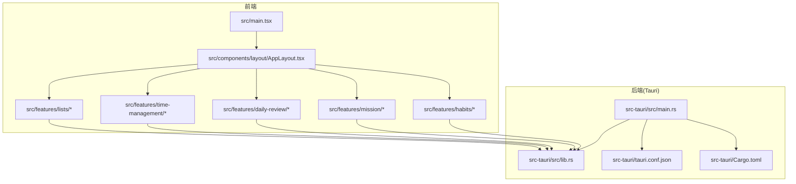
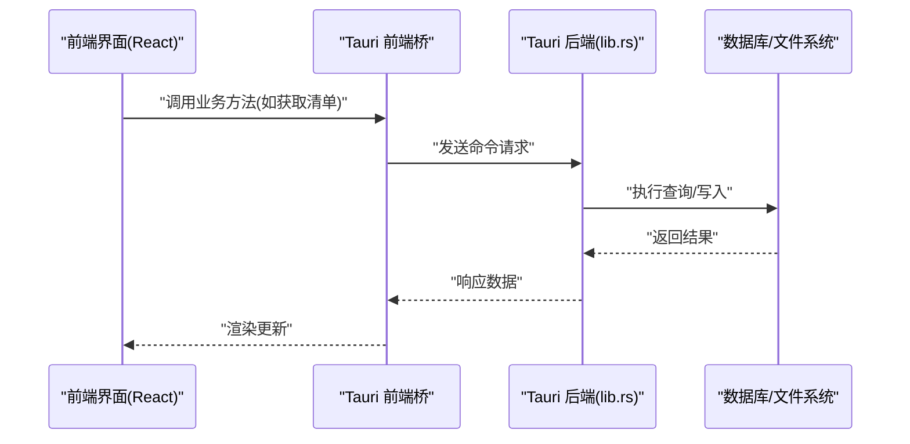
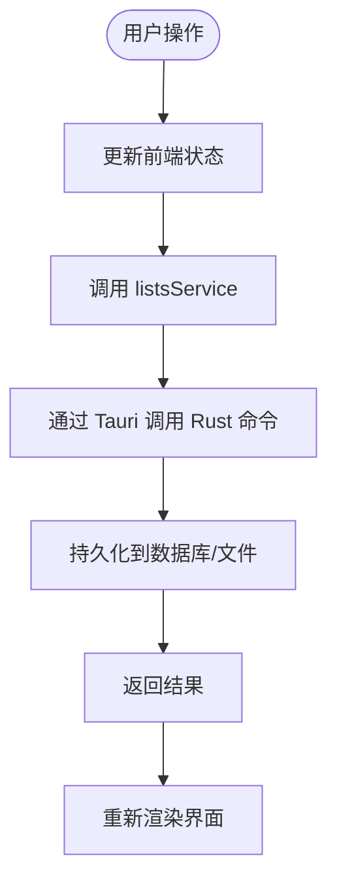
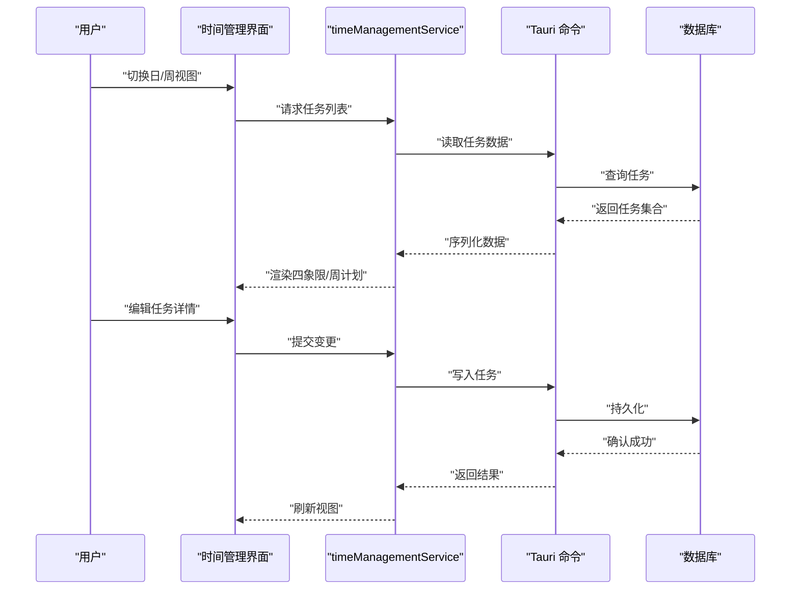
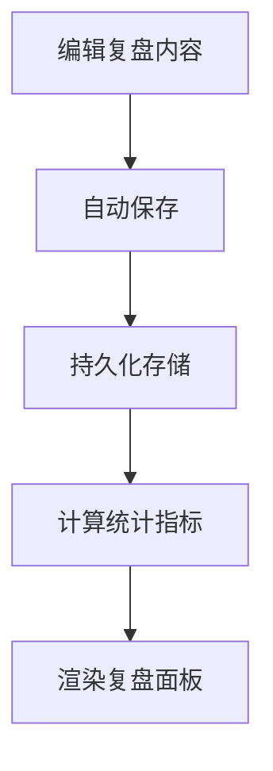
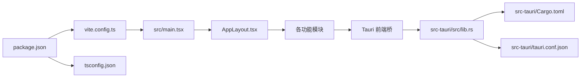

# 项目概述

<cite>
**本文引用的文件**   
- [README.md](file://README.md)
- [package.json](file://package.json)
- [vite.config.ts](file://vite.config.ts)
- [tsconfig.json](file://tsconfig.json)
- [src/main.tsx](file://src/main.tsx)
- [src-tauri/Cargo.toml](file://src-tauri/Cargo.toml)
- [src-tauri/tauri.conf.json](file://src-tauri/tauri.conf.json)
- [src-tauri/src/lib.rs](file://src-tauri/src/lib.rs)
- [src-tauri/src/main.rs](file://src-tauri/src/main.rs)
- [src/features/lists/listsService.ts](file://src/features/lists/listsService.ts)
- [src/features/time-management/timeManagementService.ts](file://src/features/time-management/timeManagementService.ts)
- [src/features/daily-review/dailyReviewService.ts](file://src/features/daily-review/dailyReviewService.ts)
- [src/features/mission/MissionService.ts](file://src/features/mission/MissionService.ts)
- [src/features/habits/HabitPanel.tsx](file://src/features/habits/HabitPanel.tsx)
- [src/components/layout/AppLayout.tsx](file://src/components/layout/AppLayout.tsx)
</cite>

## 目录
1. [简介](#简介)
2. [项目结构](#项目结构)
3. [核心组件](#核心组件)
4. [架构总览](#架构总览)
5. [详细组件分析](#详细组件分析)
6. [依赖分析](#依赖分析)
7. [性能考量](#性能考量)
8. [故障排查指南](#故障排查指南)
9. [结论](#结论)
10. [附录：快速开始与系统要求](#附录快速开始与系统要求)

## 简介
FishWorker 是一款面向个人效率与任务管理的桌面应用，围绕“清单、时间管理、每日复盘、使命目标、习惯追踪”等核心场景提供一体化体验。项目采用 Tauri + React + TypeScript + Rust 的混合技术栈，将前端交互与后端能力解耦：前端负责 UI 与状态管理，Rust 通过 Tauri 暴露安全、高性能的系统级能力（如本地数据库访问、持久化存储等），实现跨平台桌面端的高效运行。

核心价值
- 一站式个人工作流：从计划到执行再到复盘，形成闭环。
- 模块化与可扩展：功能按领域划分，便于独立演进与协作开发。
- 高性能与安全性：Rust 提供稳定可靠的底层能力，Tauri 保证最小体积与安全边界。
- 可移植性：基于 Web 标准的前端与轻量运行时，易于跨平台部署与维护。

目标用户群体
- 需要系统化进行任务与时间管理的个人用户。
- 追求高效、简洁且可定制化的知识工作者与学生。
- 希望以现代技术栈构建桌面应用的开发者与团队。

主要功能特性
- 清单管理：支持多列表、分组、排序、批量导出等。
- 时间管理：四象限视图、周计划、任务详情编辑与提醒辅助。
- 每日复盘：结构化回顾与自动保存，沉淀经验。
- 使命与目标：角色视角的目标拆解与跟踪。
- 习惯追踪：可视化打卡与统计，培养长期行为。
- 设置与数据源：数据库连接配置与偏好管理。

## 项目结构
仓库采用前后端分离的组织方式：
- 前端（React + TypeScript + Vite）：位于 src 目录，按 features 组织业务模块，components 提供通用 UI 与编辑器扩展，hooks 封装常用逻辑，styles 统一样式。
- 后端（Rust + Tauri）：位于 src-tauri 目录，包含 Cargo 工程、Tauri 配置、能力声明与 Rust 命令实现。

图表来源
- [src/main.tsx](file://src/main.tsx)
- [src/components/layout/AppLayout.tsx](file://src/components/layout/AppLayout.tsx)
- [src/features/lists/listsService.ts](file://src/features/lists/listsService.ts)
- [src/features/time-management/timeManagementService.ts](file://src/features/time-management/timeManagementService.ts)
- [src/features/daily-review/dailyReviewService.ts](file://src/features/daily-review/dailyReviewService.ts)
- [src/features/mission/MissionService.ts](file://src/features/mission/MissionService.ts)
- [src/features/habits/HabitPanel.tsx](file://src/features/habits/HabitPanel.tsx)
- [src-tauri/src/main.rs](file://src-tauri/src/main.rs)
- [src-tauri/src/lib.rs](file://src-tauri/src/lib.rs)
- [src-tauri/tauri.conf.json](file://src-tauri/tauri.conf.json)
- [src-tauri/Cargo.toml](file://src-tauri/Cargo.toml)

章节来源
- [README.md](file://README.md)
- [package.json](file://package.json)
- [vite.config.ts](file://vite.config.ts)
- [tsconfig.json](file://tsconfig.json)
- [src/main.tsx](file://src/main.tsx)
- [src-tauri/Cargo.toml](file://src-tauri/Cargo.toml)
- [src-tauri/tauri.conf.json](file://src-tauri/tauri.conf.json)
- [src-tauri/src/lib.rs](file://src-tauri/src/lib.rs)
- [src-tauri/src/main.rs](file://src-tauri/src/main.rs)

## 核心组件
- 应用入口与布局
  - 前端入口初始化应用并挂载根组件；布局组件承载导航与页面容器，为各功能模块提供统一的壳层。
- 功能模块（按领域划分）
  - 清单模块：列表增删改查、分组与排序、模板与批量操作。
  - 时间管理模块：四象限视图、周计划、任务详情弹窗与快捷添加。
  - 每日复盘模块：结构化回顾、自动保存与统计聚合。
  - 使命与目标模块：角色视角的目标卡片与详情面板。
  - 习惯追踪模块：习惯卡片、详情侧边栏、编辑弹窗与列表展示。
- 服务层与状态层
  - 每个模块通常包含 Service（与后端交互）、Store（前端状态）、Types（类型定义）与 UI 组件。
- 编辑器与工具
  - 基于 Tiptap 的富文本编辑器扩展与图标库，支撑文档与复盘内容的编辑体验。

章节来源
- [src/main.tsx](file://src/main.tsx)
- [src/components/layout/AppLayout.tsx](file://src/components/layout/AppLayout.tsx)
- [src/features/lists/listsService.ts](file://src/features/lists/listsService.ts)
- [src/features/time-management/timeManagementService.ts](file://src/features/time-management/timeManagementService.ts)
- [src/features/daily-review/dailyReviewService.ts](file://src/features/daily-review/dailyReviewService.ts)
- [src/features/mission/MissionService.ts](file://src/features/mission/MissionService.ts)
- [src/features/habits/HabitPanel.tsx](file://src/features/habits/HabitPanel.tsx)

## 架构总览
整体采用“前端 UI + Tauri 命令 + Rust 后端”的分层架构：
- 前端通过 Tauri 的命令通道调用 Rust 提供的能力（如数据库读写、文件 I/O）。
- Rust 侧集中处理数据模型、持久化与系统资源访问，确保性能与安全。
- 配置与能力在 Tauri 配置中声明，构建产物由 Vite 打包并嵌入 Tauri 运行时。

图表来源
- [src/features/lists/listsService.ts](file://src/features/lists/listsService.ts)
- [src/features/time-management/timeManagementService.ts](file://src/features/time-management/timeManagementService.ts)
- [src/features/daily-review/dailyReviewService.ts](file://src/features/daily-review/dailyReviewService.ts)
- [src/features/mission/MissionService.ts](file://src/features/mission/MissionService.ts)
- [src-tauri/src/lib.rs](file://src-tauri/src/lib.rs)

## 详细组件分析

### 清单模块（Lists）
- 职责：维护多个清单与条目，支持分组、排序、模板与批量导出。
- 关键文件：
  - 服务层：[listsService.ts](file://src/features/lists/listsService.ts)
  - 状态层：[listsStore.ts](file://src/features/lists/listsStore.ts)
  - 类型定义：[listsTypes.ts](file://src/features/lists/listsTypes.ts)
  - UI 组件：[ListsPanel.tsx](file://src/features/lists/ListsPanel.tsx)、[NoteItem.tsx](file://src/features/lists/NoteItem.tsx)、[SortableItem.tsx](file://src/features/lists/SortableItem.tsx)
- 数据流：
  - 组件触发操作 → Store 更新状态 → Service 调用 Tauri 命令 → Rust 持久化 → 返回结果 → 前端刷新。

图表来源
- [src/features/lists/listsService.ts](file://src/features/lists/listsService.ts)
- [src/features/lists/listsStore.ts](file://src/features/lists/listsStore.ts)
- [src/features/lists/ListsPanel.tsx](file://src/features/lists/ListsPanel.tsx)
- [src-tauri/src/lib.rs](file://src-tauri/src/lib.rs)

章节来源
- [src/features/lists/listsService.ts](file://src/features/lists/listsService.ts)
- [src/features/lists/listsStore.ts](file://src/features/lists/listsStore.ts)
- [src/features/lists/listsTypes.ts](file://src/features/lists/listsTypes.ts)
- [src/features/lists/ListsPanel.tsx](file://src/features/lists/ListsPanel.tsx)
- [src/features/lists/NoteItem.tsx](file://src/features/lists/NoteItem.tsx)
- [src/features/lists/SortableItem.tsx](file://src/features/lists/SortableItem.tsx)

### 时间管理模块（Time Management）
- 职责：提供四象限视图、周计划与任务详情编辑，帮助规划与聚焦。
- 关键文件：
  - 服务层：[timeManagementService.ts](file://src/features/time-management/timeManagementService.ts)
  - 状态层：[timeManagementStore.ts](file://src/features/time-management/timeManagementStore.ts)
  - 类型定义：[timeManagementTypes.ts](file://src/features/time-management/timeManagementTypes.ts)
  - UI 组件：[DailyQuadrants.tsx](file://src/features/time-management/DailyQuadrants.tsx)、[WeeklyPlanning.tsx](file://src/features/time-management/WeeklyPlanning.tsx)、[TaskDetailModal.tsx](file://src/features/time-management/TaskDetailModal.tsx)
- 数据流：
  - 选择日期/周 → 加载任务 → 拖拽或编辑 → 保存变更 → 同步视图。

图表来源
- [src/features/time-management/timeManagementService.ts](file://src/features/time-management/timeManagementService.ts)
- [src/features/time-management/DailyQuadrants.tsx](file://src/features/time-management/DailyQuadrants.tsx)
- [src/features/time-management/WeeklyPlanning.tsx](file://src/features/time-management/WeeklyPlanning.tsx)
- [src/features/time-management/TaskDetailModal.tsx](file://src/features/time-management/TaskDetailModal.tsx)
- [src-tauri/src/lib.rs](file://src-tauri/src/lib.rs)

章节来源
- [src/features/time-management/timeManagementService.ts](file://src/features/time-management/timeManagementService.ts)
- [src/features/time-management/timeManagementStore.ts](file://src/features/time-management/timeManagementStore.ts)
- [src/features/time-management/timeManagementTypes.ts](file://src/features/time-management/timeManagementTypes.ts)
- [src/features/time-management/DailyQuadrants.tsx](file://src/features/time-management/DailyQuadrants.tsx)
- [src/features/time-management/WeeklyPlanning.tsx](file://src/features/time-management/WeeklyPlanning.tsx)
- [src/features/time-management/TaskDetailModal.tsx](file://src/features/time-management/TaskDetailModal.tsx)

### 每日复盘模块（Daily Review）
- 职责：结构化复盘内容、自动保存与统计汇总。
- 关键文件：
  - 服务层：[dailyReviewService.ts](file://src/features/daily-review/dailyReviewService.ts)
  - 状态层：[dailyReviewStore.ts](file://src/features/daily-review/dailyReviewStore.ts)
  - 类型定义：[dailyReviewTypes.ts](file://src/features/daily-review/dailyReviewTypes.ts)
  - UI 组件：[DailyReviewPanel.tsx](file://src/features/daily-review/DailyReviewPanel.tsx)、[ReviewEditor.tsx](file://src/features/daily-review/ReviewEditor.tsx)
- 数据流：
  - 编辑内容 → 自动保存 → 生成统计 → 展示复盘面板。

图表来源
- [src/features/daily-review/dailyReviewService.ts](file://src/features/daily-review/dailyReviewService.ts)
- [src/features/daily-review/dailyReviewStore.ts](file://src/features/daily-review/dailyReviewStore.ts)
- [src/features/daily-review/DailyReviewPanel.tsx](file://src/features/daily-review/DailyReviewPanel.tsx)
- [src/features/daily-review/ReviewEditor.tsx](file://src/features/daily-review/ReviewEditor.tsx)
- [src-tauri/src/lib.rs](file://src-tauri/src/lib.rs)

章节来源
- [src/features/daily-review/dailyReviewService.ts](file://src/features/daily-review/dailyReviewService.ts)
- [src/features/daily-review/dailyReviewStore.ts](file://src/features/daily-review/dailyReviewStore.ts)
- [src/features/daily-review/dailyReviewTypes.ts](file://src/features/daily-review/dailyReviewTypes.ts)
- [src/features/daily-review/DailyReviewPanel.tsx](file://src/features/daily-review/DailyReviewPanel.tsx)
- [src/features/daily-review/ReviewEditor.tsx](file://src/features/daily-review/ReviewEditor.tsx)

### 使命与目标模块（Mission）
- 职责：以角色视角管理目标，支持目标卡片与详情面板。
- 关键文件：
  - 服务层：[MissionService.ts](file://src/features/mission/MissionService.ts)
  - 状态层：[MissionStore.ts](file://src/features/mission/MissionStore.ts)
  - 类型定义：[MissionTypes.ts](file://src/features/mission/MissionTypes.ts)
  - UI 组件：[GoalCard.tsx](file://src/features/mission/GoalCard.tsx)、[GoalDetailPanel.tsx](file://src/features/mission/GoalDetailPanel.tsx)、[MissionStatementEditor.tsx](file://src/features/mission/MissionStatementEditor.tsx)

章节来源
- [src/features/mission/MissionService.ts](file://src/features/mission/MissionService.ts)
- [src/features/mission/MissionStore.ts](file://src/features/mission/MissionStore.ts)
- [src/features/mission/MissionTypes.ts](file://src/features/mission/MissionTypes.ts)
- [src/features/mission/GoalCard.tsx](file://src/features/mission/GoalCard.tsx)
- [src/features/mission/GoalDetailPanel.tsx](file://src/features/mission/GoalDetailPanel.tsx)
- [src/features/mission/MissionStatementEditor.tsx](file://src/features/mission/MissionStatementEditor.tsx)

### 习惯追踪模块（Habits）
- 职责：习惯创建、打卡记录与统计展示。
- 关键文件：
  - UI 组件：[HabitPanel.tsx](file://src/features/habits/HabitPanel.tsx)、[HabitCard.tsx](file://src/features/habits/components/HabitCard.tsx)、[HabitList.tsx](file://src/features/habits/components/HabitList.tsx)
  - 类型定义：[habitTypes.ts](file://src/features/habits/habitTypes.ts)

章节来源
- [src/features/habits/HabitPanel.tsx](file://src/features/habits/HabitPanel.tsx)
- [src/features/habits/components/HabitCard.tsx](file://src/features/habits/components/HabitCard.tsx)
- [src/features/habits/components/HabitList.tsx](file://src/features/habits/components/HabitList.tsx)
- [src/features/habits/habitTypes.ts](file://src/features/habits/habitTypes.ts)

## 依赖分析
- 前端依赖
  - 包管理与脚本：[package.json](file://package.json)
  - 构建配置：Vite 配置 [vite.config.ts](file://vite.config.ts)，TypeScript 配置 [tsconfig.json](file://tsconfig.json)
- 后端依赖
  - Rust 工程与 Tauri 集成：[Cargo.toml](file://src-tauri/Cargo.toml)、[tauri.conf.json](file://src-tauri/tauri.conf.json)
  - 命令注册与能力暴露：[lib.rs](file://src-tauri/src/lib.rs)、[main.rs](file://src-tauri/src/main.rs)

图表来源
- [package.json](file://package.json)
- [vite.config.ts](file://vite.config.ts)
- [tsconfig.json](file://tsconfig.json)
- [src/main.tsx](file://src/main.tsx)
- [src/components/layout/AppLayout.tsx](file://src/components/layout/AppLayout.tsx)
- [src-tauri/src/lib.rs](file://src-tauri/src/lib.rs)
- [src-tauri/Cargo.toml](file://src-tauri/Cargo.toml)
- [src-tauri/tauri.conf.json](file://src-tauri/tauri.conf.json)

章节来源
- [package.json](file://package.json)
- [vite.config.ts](file://vite.config.ts)
- [tsconfig.json](file://tsconfig.json)
- [src-tauri/Cargo.toml](file://src-tauri/Cargo.toml)
- [src-tauri/tauri.conf.json](file://src-tauri/tauri.conf.json)
- [src-tauri/src/lib.rs](file://src-tauri/src/lib.rs)
- [src-tauri/src/main.rs](file://src-tauri/src/main.rs)

## 性能考量
- 前端渲染优化
  - 使用 Vite 进行快速开发与构建，按需加载与代码分割减少首屏体积。
  - 合理拆分组件与懒加载页面，避免不必要的重渲染。
- 状态管理
  - 局部状态与全局状态分层，减少不必要的全局更新。
- 后端能力
  - 通过 Tauri 命令调用 Rust 函数，避免在主线程阻塞，必要时异步处理耗时操作。
- 数据持久化
  - 批量写入与事务处理，减少频繁 IO 带来的开销。

## 故障排查指南
- 启动失败
  - 检查 Node.js 与 pnpm 版本是否符合要求；清理缓存后重试安装依赖。
  - 若 Tauri 构建失败，确认 Rust 工具链与 Tauri CLI 已正确安装。
- 数据库连接问题
  - 核对数据库配置参数（主机、端口、用户名、密码、数据库名）是否正确。
  - 检查防火墙与网络连通性，确认服务可达。
- 权限与路径
  - 确保应用对数据目录具有读写权限；Windows 下注意路径分隔符与大小写。
- 日志与调试
  - 启用开发模式查看控制台输出；在后端增加必要日志定位问题。

## 结论
FishWorker 以清晰的模块化设计与稳定的技术栈，为个人效率管理提供了可靠、可扩展的桌面解决方案。前端专注于用户体验与交互，Rust 提供高性能与安全的底层能力，二者通过 Tauri 无缝协作。随着功能迭代与生态完善，FishWorker 将持续提升易用性与生产力价值。

## 附录：快速开始与系统要求

### 系统要求与兼容性
- 操作系统
  - Windows 10 及以上
  - macOS 10.15 及以上
  - Linux（主流发行版，需具备桌面环境）
- 运行时与工具链
  - Node.js 18+（建议使用 LTS）
  - pnpm（推荐最新版本）
  - Rust 工具链（rustc、cargo）
  - Tauri CLI（用于构建与调试）
- 浏览器内核
  - 由于使用 Tauri，不依赖外部浏览器；但前端基于 Web 标准，建议保持最新稳定版本。

### 环境搭建
- 安装 Node.js 与 pnpm
  - 参考官方文档安装对应版本的 Node.js 与 pnpm。
- 安装 Rust 工具链
  - 使用 rustup 安装 Rust 与 cargo。
- 安装 Tauri CLI
  - 通过 cargo install tauri-cli 安装命令行工具。

### 依赖安装
- 进入项目根目录
  - 使用 pnpm 安装前端依赖：pnpm install
- 可选：安装 Rust 依赖
  - 首次构建会自动下载与编译 Rust 依赖，确保网络连接正常。

### 基本使用
- 开发模式
  - 运行前端开发服务器与 Tauri 窗口：pnpm dev
  - 该命令会同时启动 Vite 热重载与 Tauri 调试窗口。
- 构建生产版本
  - 构建桌面应用：pnpm build
  - 构建产物位于 dist 与 src-tauri/target 目录下。
- 运行已构建的应用
  - 在构建完成后，根据平台说明运行生成的可执行文件或安装包。

### 常见问题
- 端口占用
  - 若默认端口被占用，可在 Vite 配置中修改端口号。
- 权限不足
  - 在 Linux/macOS 上可能需要授予脚本执行权限；Windows 上以管理员身份运行终端。
- 数据库配置
  - 配置文件位于 src-tauri/mysql.config.json，请根据实际环境调整连接参数。

章节来源
- [README.md](file://README.md)
- [package.json](file://package.json)
- [vite.config.ts](file://vite.config.ts)
- [tsconfig.json](file://tsconfig.json)
- [src-tauri/Cargo.toml](file://src-tauri/Cargo.toml)
- [src-tauri/tauri.conf.json](file://src-tauri/tauri.conf.json)
- [src-tauri/mysql.config.json](file://src-tauri/mysql.config.json)