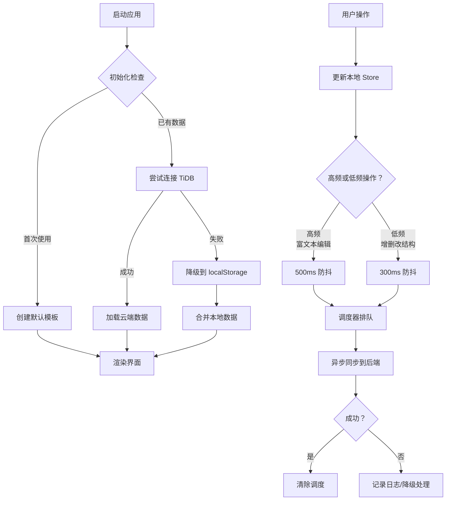
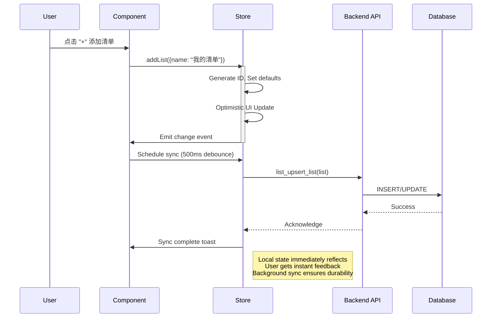

# 清单功能完整需求文档 (PRD) v3.0

## 1. 产品概述

### 包含:
- **背景与问题陈述：** 用户需要一个强大的个人知识管理和任务跟踪系统，能够以灵活的方式组织笔记、任务和想法。现有的简单待办列表无法满足复杂的分类、分组和管理需求。
- **产品目标：** 构建一个层次清晰、操作流畅、功能完善的清单管理系统，支持从简单的待办事项到复杂的知识管理等多种使用场景。
- **高层级描述:** 我们正在构建一个多层次的清单管理系统，采用"文件夹 -> 清单 -> 分组 -> 笔记"的四层架构，提供富文本编辑、模板化内容、批量操作和跨平台数据同步能力。
- **核心功能模块：** 
  - 多层级的组织和分类体系
  - 富文本笔记编辑（基于 TipTap）
  - 灵活的拖拽交互
  - 模板化和批量操作
  - 本地优先的持久化存储
  - Tauri 原生 API 集成

### 2. 用户角色与场景

#### 2.1 用户角色

| 角色 | 角色诉求 |
|------|----------|
| 学生/研究者 | 快速创建阅读笔记、文献整理、研究计划、学习进度跟踪 |
| 职场人士 | 会议纪要记录、周报总结、项目任务管理、行动计划制定 |
| 内容创作者 | 灵感收集、文章大纲、创作清单、素材整理 |
| 个人管理者 | 日常习惯打卡、购物清单、旅行规划、目标追踪 |

#### 2.2 核心场景

| 场景 | 触发 | 目标结果 |
|------|------|----------|
| 场景 1：创建新项目 | 点击侧边栏"+"按钮 | 弹出添加清单对话框，设置名称、颜色、图标和分类 |
| 场景 2：快速记录 | 在笔记输入框中输入并回车 | 立即创建新笔记并显示在笔记列表中 |
| 场景 3：编辑详细内容 | 点击列表中的笔记 | 右侧滑出抽屉面板，提供富文本编辑器 |
| 场景 4：分类整理 | 拖拽笔记到不同分组 | 自动更新笔记的分组归属，重新排序 |
| 场景 5：批量导入 | 点击"..."菜单选择批量导入 MD | 多选本地文件，按文件名创建笔记 |
| 场景 6：导出备份 | 选择批量导出 MD | 勾选笔记，保存到指定文件夹 |

### 3. 范围边界

#### 3.1 包含在本次范围内

**功能点 1：层级化组织架构**
- 文件夹层级管理（单层文件夹，支持拖拽排序和置顶）
- 清单实体管理（支持图标、颜色、视图类型配置）
- 清单内部分组（动态创建、折叠、删除）
- 四层数据结构：Folder → List → NoteGroup → Note

**功能点 2：富文本编辑能力**
- 集成 TipTap 编辑器作为统一编辑组件
- 基础格式化（加粗、斜体、下划线）
- Markdown 语法导入和导出
- 块级元素管理（标题、列表、引用、代码块）
- 响应式工具栏（自适应屏幕宽度）

**功能点 3：智能交互体验**
- 悬浮工具栏（Bubble Menu）- 选中文字时显示
- 块级拖拽手柄（Drag Handle）- 移动和调整块顺序
- 拖拽排序（文件夹、清单、分组、笔记均支持）
- 拖拽移动到（清单跨文件夹迁移、笔记跨分组迁移）
- 右键菜单和 Hover 菜单统一设计语言

**功能点 4：模板化生产**
- 预设模板库（会议纪要、阅读笔记、工作总结）
- 自定义模板创建和编辑
- 模板一键应用（保留标题，替换内容）
- 模板作为 HTML 字符串存储和管理

**功能点 5：批量操作能力**
- 批量导入 Markdown 文件
- 批量导出为 Markdown 文件
- 清单复制（包括所有子笔记和分组）
- 笔记创建副本

**功能点 6：数据持久化策略**
- TiDB 云端数据库直连
- localStorage 降级方案
- 自动数据迁移和兼容性处理
- 高频操作防抖（500ms/300ms 双策略）
- 乐观更新 + 后台异步同步引擎

**功能点 7：用户体验增强**
- 全局 Toast 提示系统（自动渐隐，不阻塞交互）
- 自定义确认气泡（替代原生 confirm）
- 默认首选清单加载规则和激活记忆
- 抽屉宽度可调节
- 暗色/亮色主题完美适配

#### 3.2 超出本次范围

- **多级嵌套文件夹** - 目前仅支持单层文件夹结构（未来可扩展）
- **看板视图** - 当前仅提供列表视图（board 类型预留但未实现）
- **实时协作编辑** - 单用户本地优先架构
- **标签系统** - 暂无跨清单标签功能
- **搜索功能** - 仅有基础的移动至搜索
- **附件上传** - 纯文本内容管理
- **API 开放** - 无外部 API 接口
- **移动端适配** - 仅限桌面端 Tauri 应用

#### 3.3 外部依赖

**技术栈依赖：**
- **状态管理库：** Zustand
- **富文本编辑器：** TipTap（@tiptap/core, @tiptap/starter-kit, @tiptap/typography）
- **前端 UI 框架：** React 18
- **构建工具：** Vite
- **桌面框架：** Tauri 1.x
- **后端运行时：** Rust + Tokio
- **数据库：** TiDB Cloud（MySQL 协议兼容）
- **SQLite 本地缓存：** better-sqlite3（Rust 侧）

**第三方服务：**
- 无（离线优先设计）

### 4. 业务规则与模型结论

#### 4.1 核心业务流程



#### 4.2 关键业务规则

**规则 1：数据持久化优先级**
1. 优先写入 TiDB 云端数据库
2. 云连接失败时降级到 localStorage
3. localStorage 数据在后续启动时自动迁移到 TiDB
4. 所有数据修改都通过 syncEngine 进行异步同步

**规则 2：排序字段维护**
- `sortOrder` 字段为连续整数型（0, 1, 2, 3...）
- 插入操作：新项排在最后（sortOrder = 当前最大序号）
- 移动操作：计算目标位置前后兄弟元素的平均值或直接赋值
- 删除操作：不重新调整序号（避免连锁更新），仅在拖拽重排时刷新

**规则 3：分组继承逻辑**
- 未分组（groupId = null）为特殊默认分组，不可删除和重命名
- 删除分组时，该组下所有笔记自动归入未分组
- 复制清单时，复制所有分组及对应笔记的完整关系链

**规则 4：置顶行为**
- 文件夹、清单、笔记三级均支持置顶
- 置顶项总是排在最前面
- 置顶内的排序按照 sortOrder 升序排列
- 置顶标识变更触发高频同步

**规则 5：模板应用规则**
- 应用模板只覆盖笔记 content 字段
- 不修改笔记 title 字段
- 保留原有的 createdAt、updatedAt、isPinned 等元数据
- 更新 updatedAt 时间戳

**规则 6：Markdown 导入导出规范**
- 导入：以文件名（去掉.md 后缀）作为笔记标题
- 导入：文件内容经过 Markdown 解析器转换为 HTML
- 导出：过滤非法字符生成安全文件名
- 导出：同名冲突时追加数字后缀（如 file(1).md）
- 导出：调用 rfd::pick_folder 让用户选择保存目录

#### 4.3 状态与异常处理

**异常类型及处理策略：**

| 异常场景 | 检测时机 | 处理策略 | 用户提示 |
|----------|---------|---------|----------|
| TiDB 连接超时 | 初始化阶段 | 捕获异常，降级到 localStorage | 静默降级，不中断启动 |
| 数据同步失败 | 后台异步 | catch 错误日志输出，不抛向上层 | 无提示（避免打扰），但保留错误日志 |
| localStorage 数据损坏 | JSON.parse | try-catch 捕获，清空并重置为初始态 | 无提示，自动恢复 |
| Markdown 导入解析失败 | 文件读取后 | 跳过损坏文件，继续处理其他文件 | Toast 提示"部分文件导入失败" |
| 批量导出磁盘空间不足 | 文件写入时 | 捕获 IO 错误，回滚已写入的文件 | Toast 提示"导出失败：磁盘空间不足" |
| 拖拽操作取消 | DropEvent | 不执行任何 State 更新 | 无提示 |
| Drawer 关闭回调报错 | onClickOutside | Promise.catch 包裹 | 无提示 |

**兜底机制：**
1. 所有 invoke 调用都用 try-catch 包裹，至少输出 console.error
2. SyncEngine 内部对每个 job 做隔离，单个失败不影响其他 job
3. Store 层更新前验证数据一致性（如防止负数序号、重复 ID）
4. localStorage 每次读写都做 JSON 格式校验

#### 4.4 业务数据口径

**计数统计口径：**

| 指标 | 计算公式 | 更新时机 |
|------|---------|----------|
| 清单条目数 (itemCount) | COUNT(notes WHERE listId == X AND deletedAt IS NULL) | 新增笔记 +1，删除笔记 -1，跨清单移动时源清单减目标清单加 |
| 分组笔记数 | COUNT(notes WHERE listId == X AND groupId == Y) | 笔记分组变更时实时更新 |
| 总笔记数 | SUM(itemCount for all lists) | 无需主动维护，按需计算 |
| 总分组数 | COUNT(noteGroups WHERE listId == X) | 分组创建/删除时更新 |

**时间戳口径：**

| 字段 | 语义 | 何时更新 |
|------|------|----------|
| createdAt | 创建时间 | 新建笔记时固定 |
| updatedAt | 更新时间 | 任何内容修改（title/content/groupId/sortOrder） |

### 5. 功能需求

#### 5.1 档案结构与管理

| ID | 需求描述 | 备注 |
|----|----------|------|
| FR-LIST-01 | **添加清单** - 用户可以通过侧边栏顶部"+"按钮或文件夹 Hover 菜单中的"添加清单"入口，创建新的清单。弹窗需包含：名称（必填）、图标选择、颜色选择、视图类型（列表/看板）、所属文件夹下拉框 | 名称必填且在同一文件夹下唯一；图标支持 Emoji 或 Iconify 图标；默认文件夹为"无" |
| FR-LIST-02 | **编辑清单** - 文件夹 Hover 的"..."菜单和清单 Hover 的"..."菜单均需支持"编辑"选项。编辑弹窗复用添加清单的 UI 结构，预填充现有值 | 允许修改所有字段；名称变更后需要同步校验唯一性 |
| FR-LIST-03 | **删除清单** - 清单 Hover 菜单提供删除选项，使用自定义气泡确认框二次确认。删除后清空该清单下的所有笔记和分组 | 确认后直接调用 backend delete API，同时清理本地 store；不支持撤销 |
| FR-LIST-04 | **复制清单** - 清单 Hover 菜单提供"创建副本"选项，深度复制整个清单及其所有分组、笔记、排序关系 | 副本名称自动附加"(副本)"后缀；new list id 独立，notes 也全部 new id；itemCount 重置为 0 |
| FR-LIST-05 | **置顶清单** - 清单 Hover 菜单提供"置顶"切换开关，置顶清单固定在列表顶部，非置顶清单在下面按 sortOrder 排序 | 置顶开关点击即切换，触发同步；排序优先级：置顶区按 sortOrder，普通区按 sortOrder |
| FR-LIST-06 | **拖拽排序** - 清单支持通过 Drag & Drop 在侧边栏自由拖拽排序，包括：同文件夹内排序、跨文件夹拖拽、拖出到"无文件夹"区域 | 拖拽时高亮目标文件夹边框；松手后计算目标位置 reorderLists() |
| FR-LIST-07 | **查看清单数量** - 每个清单右侧始终显示其内部笔记数量（itemCount），用于快速了解清单规模 | itemCount 实时更新，跟随笔记增减自动变化 |

#### 5.2 文件夹管理

| ID | 需求描述 | 备注 |
|----|----------|------|
| FR-FOLD-01 | **添加文件夹** - 在侧边栏顶部"清单"标签 Hover 时出现"+"按钮，点击弹出"添加文件夹"输入框 | 名称必填；输入后回车或 blur 时提交 |
| FR-FOLD-02 | **编辑文件夹** - 文件夹 Hover 菜单提供"编辑"选项，弹出重命名对话框 | 复用 folderModal 组件；改名后立即同步 |
| FR-FOLD-03 | **删除文件夹** - 文件夹 Hover 菜单提供删除选项 | 删除后文件夹内的所有清单的 folderId 清空（变为未分类）；无需二次确认 |
| FR-FOLD-04 | **置顶文件夹** - 文件夹 Hover 菜单提供"置顶"选项，置顶文件夹固定在顶部 | 与清单置顶逻辑一致 |
| FR-FOLD-05 | **拖拽排序** - 文件夹支持拖拽改变同级间的顺序 | 拖动时视觉反馈（高亮 target folder border）；后端同步 sortOrder |
| FR-FOLD-06 | **文件夹折叠/展开** - 点击文件夹左侧箭头图标可折叠/展开内部的清单列表 | 折叠状态保存在 UI 层面（不持久化） |
| FR-FOLD-07 | **快捷添加清单** - 文件夹 Hover 的"..."菜单有"添加清单"选项，点击后打开添加清单弹窗且自动选中该文件夹 | 提升在特定文件夹下快速新建清单的效率 |

#### 5.3 笔记管理

| ID | 需求描述 | 备注 |
|----|----------|------|
| FR-NOTE-01 | **快速新建笔记** - 清单主内容区顶部提供一个输入框，用户输入文字后按 Enter 键直接创建一条新笔记，内容为输入的文字 | 创建后输入框清空；新笔记位于列表底部；触发高频同步 500ms |
| FR-NOTE-02 | **编辑笔记标题和内容** - 点击列表中的任一笔记，从右侧滑出抽屉（Drawer）面板，提供富文本编辑器编辑标题和内容 | 抽屉外点击遮罩层关闭；抽屉最大高度自适应视口；初始高度 80% 视口高 |
| FR-NOTE-03 | **删除笔记** - 笔记 Hover 菜单提供"删除"选项，点击后直接从列表中移除（无二次确认） | 直接调用 delete API；本地 state 立即删除；不支持回收站 |
| FR-NOTE-04 | **创建笔记副本** - 笔记 Hover 菜单提供"创建副本"选项，复制当前笔记的 title 和 content | 副本名称：原标题+"(副本)"；副本创建时间为当前时间；复制到同一分组的末尾 |
| FR-NOTE-05 | **置顶笔记** - 笔记 Hover 菜单提供"置顶"开关，置顶笔记固定在分组顶部 | 与普通笔记混合展示，但置顶区按 sortOrder 排序；开关即时切换 |
| FR-NOTE-06 | **笔记排序** - 笔记列表支持拖拽重排，调整在当前分组内的相对顺序 | 拖拽时显示插入位置线；松手后计算目标索引 reorderNotes() |
| FR-NOTE-07 | **笔记移动到分组** - 笔记 Hover 菜单提供"移动到"二级菜单，展示当前清单下所有分组供选择 | 切换到目标分组后自动排在末尾；保持原 sortOrder 或使用新分组最大 sortOrder+1 |
| FR-NOTE-08 | **笔记跨清单移动** - "移动到"二级菜单进一步展开"清单"子菜单，显示所有其他清单 | 选择目标清单后，笔记被移动到该清单的"未分组"组末尾；itemCount 源减目标加 |
| FR-NOTE-09 | **查看笔记详情** - 点击笔记项展开抽屉，右侧提供完整编辑器和元信息显示 | 支持 Markdown 预览模式吗暂时无；支持历史版本吗暂时无 |
| FR-NOTE-10 | **笔记数量显示** - 分组标题右侧显示该分组内的笔记数量 | 笔记增删时实时更新数字 |
| FR-NOTE-11 | **空状态引导** - 当清单为空（无笔记）时，中间区域显示"记录你的想法，或使用模板"提示 | "使用模板"为可点击链接，点击打开模板选择弹窗 |

#### 5.4 分组管理

| ID | 需求描述 | 备注 |
|----|----------|------|
| FR-GROUP-01 | **创建分组** - 清单主内容区右上角"..."菜单提供"创建分组"选项，输入分组名称后创建 | 分组名在当前清单下唯一；创建后光标聚焦到第一个笔记 |
| FR-GROUP-02 | **重命名分组** - 鼠标 Hover 到分组标题上，右侧显示"..."按钮，菜单中包含"重命名"选项 | 弹出输入框预填原名；修改后立即同步 |
| FR-GROUP-03 | **删除分组** - 分组 Hover 菜单提供"删除"选项，点击后分组消失，其下所有笔记自动归入"未分组" | 删除不确认；笔记的 sortOrder 在移出后不变 |
| FR-GROUP-04 | **折叠/展开分组** - 分组标题左侧有折叠箭头，点击可收起/展开该分组的内容区 | 折叠时只显示分组标题和笔记数；不持久化折叠状态 |
| FR-GROUP-05 | **未分组保护** - 系统默认的"未分组"不允许被删除和重命名 | Unremovable & Readonly；只在 UI 上特殊处理 |
| FR-GROUP-06 | **拖拽笔记到分组** - 支持将笔记项拖拽到分组标题上，完成分组归属切换 | 拖拽时目标分组高亮；松手后 moveNoteAndReorder() |

#### 5.5 模板系统

| ID | 需求描述 | 备注 |
|----|----------|------|
| FR-TEMP-01 | **预设模板库** - 系统内置 3 个默认模板：会议纪要、阅读笔记、每周工作总结 | 模板内容为 HTML 格式，含占位符结构；存储在数据库中 |
| FR-TEMP-02 | **应用模板** - 空状态引导页或笔记抽屉内提供"使用模板"入口，弹出模板选择弹窗，点击某模板后将其 content 应用到当前笔记 | 仅覆盖 content，保留 title、createdAt、updatedAt 等字段不变 |
| FR-TEMP-03 | **创建自定义模板** - 模板弹窗中提供"新建模板"按钮，输入模板名称和内容（富文本编辑器），创建后添加到模板库 | 新建模板立即持久化 |
| FR-TEMP-04 | **编辑模板** - 鼠标 Hover 到模板卡片上，右上角浮现"✎"编辑按钮，点击后打开模板编辑抽屉，可修改名称和内容 | 与原模板共用 ID，仅更新 name 和 content |
| FR-TEMP-05 | **删除模板** - 模板 Hover 时右上角显示"×"删除按钮，点击后直接删除（无二次确认） | 仅删除自定义模板；删除后不清除应用了该模板的历史笔记 |
| FR-TEMP-06 | **模板内容预览** - 模板弹窗中以卡片形式平铺展示所有模板，每个卡片显示模板名称和一段内容预览（前 80 字符） | 卡片点击后应用；Hover 时显示编辑/删除按钮 |

#### 5.6 富文本编辑器能力

| ID | 需求描述 | 备注 |
|----|----------|------|
| FR-EDIT-01 | **TipTap 集成** - 笔记抽屉和模板弹窗统一使用 SimpleEditor 组件，封装 TipTap 的所有复杂逻辑 | SimpleEditor 对外暴露 onCreated 回调，获取 editor 实例 |
| FR-EDIT-02 | **基础格式化** - 选中文字时可触发的 Bubble Menu 仅保留三个按钮：加粗（Bold）、斜体（Italic）、下划线（Underline） | 极简主义设计；去除标题下拉框、列表、撤销重做等按钮 |
| FR-EDIT-03 | **块级拖拽手柄** - 每个块（段落、标题、列表等）左侧有拖拽手柄，点击弹出上下文菜单 | 菜单用 fixed 定位，自动检测视口边缘翻转方向；包含 Lock 机制 |
| FR-EDIT-04 | **块转换功能** - 通过 Drag Handle 菜单可将当前块转换为：正文/H1~H6/有序列表/无序列表/引用/代码块 | 使用 setNodeSelection(pos) 精准锁定块节点后再执行转换 |
| FR-EDIT-05 | **段落样式** - 块级菜单支持为段落设置文字颜色、背景高亮颜色 | setTextSelection(range) 精准应用样式；颜色选择器带预览 |
| FR-EDIT-06 | **块复制剪切删除** - 块级菜单提供 Copy/Cut/Delete 操作 | 复制时使用现代 Clipboard API（HTML + Plain Text 双格式）；Cut 先写剪贴板再 deleteSelection |
| FR-EDIT-07 | **响应式工具栏** - 编辑器顶部工具栏根据宽度自动隐藏次要按钮，收拢到"更多格式"下拉菜单 | ResizeObserver 监听容器宽度变化；优先级顺序预设（斜体 > 下划线 > 删除 > 高亮 > 行内代码 > 各类列表） |
| FR-EDIT-08 | **自适应高度** - 编辑器内容区高度自动伸缩，不出现双滚动条 | 内部滚动条隐藏（overflow:hidden）；外部滚动条由父容器控制 |
| FR-EDIT-09 | **Markdown 导入** - 笔记详情抽屉"..."菜单提供"导入 MD"选项，唤起系统文件选择对话框，单选.md 文件并解析为 HTML | 解析后的 HTML  setContent 到编辑器；修复之前直接存源码的 Bug |
| FR-EDIT-10 | **Markdown 导出** - 笔记详情抽屉"..."菜单提供"导出 MD"选项，调用后端 Tauri API 生成.md 文件并通过 rfd 保存 | 通过 getMarkdown() 序列化当前 Editor 状态 |

#### 5.7 批量操作

| ID | 需求描述 | 备注 |
|----|----------|------|
| FR-BATCH-01 | **批量导入 MD** - 清单主内容区右上角"..."菜单提供"批量导入 MD"选项，唤起多选文件对话框，多选本地.md 文件 | 每个文件作为一个笔记；文件名（去.md）作为标题；文件内容解析为 HTML |
| FR-BATCH-02 | **批量导出 MD** - "..."菜单提供"批量导出 MD"选项，弹出笔记多选窗口，平铺展示所有笔记（每项带 Checkbox） | 顶部全选按钮；支持反选；勾选完成后点击"确认导出" |
| FR-BATCH-03 | **导出文件夹选择** - 批量导出确认后，调用 rfd::pick_folder 让用户选择保存目录 | 不支持选择文件名，只能选目录 |
| FR-BATCH-04 | **导出文件生成** - 对每个勾选的笔记，以其标题为文件名（过滤非法字符），内容为纯 Markdown 文本 | 同名冲突处理：追加 (1),(2)...后缀；失败的文件跳过但记录日志 |
| FR-BATCH-05 | **导入容错机制** - 批量导入时若某个文件损坏或编码错误，跳过该文件继续处理其他文件 | 最终通过 Toast 提示"导入完成，X 个失败" |

#### 5.8 用户体验优化

| ID | 需求描述 | 备注 |
|----|----------|------|
| FR-UX-01 | **全局 Toast 提示** - 所有异步操作（导入/导出/保存模板等）完成后，屏幕顶部居中滑出 Toast 消息 | 成功用绿色系，失败用红色系；带图标（✓/✗）；3s 后自动渐隐；不阻塞其他交互 |
| FR-UX-02 | **自定义确认气泡** - 删除清单等危险操作使用自定义 ConfirmBubble 组件替代 window.confirm | 气泡样式与整体 UI 一致；位置在鼠标附近或居中 |
| FR-UX-03 | **拖拽视觉反馈** - 拖拽清单到文件夹上方、拖拽笔记到分组上方时，目标区域高亮（如蓝色背景） | 明确指示放置位置；松手后撤回高亮 |
| FR-UX-04 | **抽屉宽度调节** - 笔记抽屉左边缘支持鼠标拖拽，自由调整抽屉宽度 | Resize Cursor 悬停提示；最小宽度 300px；最大宽度 80vw |
| FR-UX-05 | **默认首选清单** - 初始化时默认加载第一个文件夹的第一个清单；但如果用户上次停留在其他清单，则记忆该状态 | 使用 session storage 或内存变量记录 lastActiveListId；刷新页面后恢复 |
| FR-UX-06 | **激活状态记忆** - 切换标签页再返回时，不重新执行默认规则，而是恢复上次激活的清单 | 每次点击清单时记录 activeListId 到内存；onUnmount 时不持久化（避免脏数据） |
| FR-UX-07 | **Hover 菜单统一性** - 文件夹、清单、分组、笔记的所有 Hover 操作菜单采用相同的设计语言和交互模式 | 图标 + 文字；右对齐下拉；点击外部关闭 |
| FR-UX-08 | **主题适配** - 所有组件（编辑器、抽屉、模态框、Toast、Confirm）完美适配暗色模式和亮色模式 | CSS Variable 统一管理颜色；tip tap.css 全局引入 |

#### 5.9 性能优化

| ID | 需求描述 | 备注 |
|----|----------|------|
| FR-PERF-01 | **高频操作防抖** - 富文本编辑器的每一 keystroke 或 selectionchange 事件，通过 500ms 防抖后调度器统一提交 | 避免高频 IPC 调用和数据库写入 |
| FR-PERF-02 | **低频操作即时** - 文件夹/清单的创建、删除、移动、排序等操作，通过 300ms 防抖 | 结构变更相对低頻，防抖时间更短 |
| FR-PERF-03 | **批量操作批量化写入** - 批量导入时逐个插入数据库（N 次写入），但前端一次性渲染 N 条笔记 | 考虑分页虚拟滚动 if >100 notes |
| FR-PERF-04 | **列表虚拟滚动** - 如果笔记数量超过 100 条，启用虚拟滚动，只渲染可见区域的 DOM | react-window 或类似库；提高渲染性能 |
| FR-PERF-05 | **懒加载抽屉** - 笔记抽屉仅在点击时创建，关闭时销毁（或不卸载但隐藏） | 权衡：不卸载可减少 re-render 开销，但占用更多内存 |
| FR-PERF-06 | **数据库连接池** - Rust 侧使用 connect_lazy 延迟连接，表结构检测异步执行，避免白屏 | TLS 加密 + acquire_timeout(10s) |
| FR-PERF-07 | **Store 选择性订阅** - UI 组件只订阅需要的字段（如 NoteItem 只订阅 note.title/note.content/isPinned） | 避免整个 store 重载导致的全局 re-render |

### 6. 数据模型与 API 接口

#### 6.1 数据实体定义

**Entity: Folder（文件夹）**

```typescript
export interface Folder {
  id: string;                    // UUID 格式，如 "folder-1234567890-abc"
  name: string;                  // 文件夹名称，必填
  isPinned?: boolean;            // 是否置顶，默认 false
  sortOrder?: number;            // 排序序号，连续整数，0, 1, 2...
  createdAt?: number;            // 创建时间戳（可选，后端自动生成）
  updatedAt?: number;            // 更新时间戳（可选，后端自动生成）
}
```

**Entity: List（清单）**

```typescript
export interface List {
  id: string;                    // UUID
  name: string;                  // 清单名称，必填
  icon: string;                  // Emoji 或图标类名，如 "📝" or "fas fa-check-square"
  color: string;                 // Hex 颜色，如 "#FF5733"
  viewType: 'list' | 'board';    // 视图类型，当前仅实现 list
  folderId: string | null;       // 所属文件夹 ID，null 表示未分类
  itemCount?: number;            // 笔记数量（冗余字段，用于快速展示）
  isPinned?: boolean;            // 是否置顶
  sortOrder?: number;            // 排序序号
  createdAt?: number;
  updatedAt?: number;
}
```

**Entity: NoteGroup（笔记分组）**

```typescript
export interface NoteGroup {
  id: string;                    // UUID
  listId: string;                // 所属清单 ID
  name: string;                  // 分组名称，如 "待办", "进行中", "已完成"
  sortOrder?: number;            // 分组序号
  createdAt?: number;
  updatedAt?: number;
}
```

**Entity: Note（笔记）**

```typescript
export interface Note {
  id: string;                    // UUID
  listId: string;                // 所属清单 ID
  groupId?: string | null;       // 所属分组 ID，null 表示"未分组"
  title: string;                 // 笔记标题，必填
  content: string;               // 笔记内容，HTML 格式，必填
  isPinned?: boolean;            // 是否置顶
  sortOrder?: number;            // 在分组内的排序序号
  createdAt: number;             // 创建时间戳（精确到毫秒）
  updatedAt: number;             // 最后更新时间戳
}
```

**Entity: Template（模板）**

```typescript
export interface Template {
  id: string;                    // UUID
  name: string;                  // 模板名称，如 "会议纪要"
  content: string;               // 模板内容，HTML 格式
  createdAt?: number;
  updatedAt?: number;
}
```

#### 6.2 数据库表结构

**表：list_folders**

| 字段 | 类型 | 约束 | 说明 |
|------|------|------|------|
| id | VARCHAR(64) | PRIMARY KEY | UUID 格式 |
| name | VARCHAR(255) | NOT NULL | 文件夹名称 |
| is_pinned | BOOLEAN | DEFAULT FALSE | 是否置顶 |
| sort_order | INT | NOT NULL | 排序序号 |
| created_at | DATETIME | DEFAULT CURRENT_TIMESTAMP | 创建时间 |
| updated_at | DATETIME | ON UPDATE CURRENT_TIMESTAMP | 更新时间 |

**表：list_lists**

| 字段 | 类型 | 约束 | 说明 |
|------|------|------|------|
| id | VARCHAR(64) | PRIMARY KEY | UUID 格式 |
| name | VARCHAR(255) | NOT NULL | 清单名称 |
| icon | VARCHAR(50) | NOT NULL | 图标 |
| color | VARCHAR(20) | NOT NULL | 颜色 |
| view_type | VARCHAR(20) | NOT NULL DEFAULT 'list' | 视图类型 |
| folder_id | VARCHAR(64) | FOREIGN KEY references list_folders(id), DEFAULT NULL | 所属文件夹 |
| item_count | INT | DEFAULT 0 | 笔记数量 |
| is_pinned | BOOLEAN | DEFAULT FALSE | 是否置顶 |
| sort_order | INT | NOT NULL | 排序序号 |
| created_at | DATETIME | DEFAULT CURRENT_TIMESTAMP | 创建时间 |
| updated_at | DATETIME | ON UPDATE CURRENT_TIMESTAMP | 更新时间 |

**表：list_note_groups**

| 字段 | 类型 | 约束 | 说明 |
|------|------|------|------|
| id | VARCHAR(64) | PRIMARY KEY | UUID 格式 |
| list_id | VARCHAR(64) | FOREIGN KEY references list_lists(id) | 所属清单 |
| name | VARCHAR(255) | NOT NULL | 分组名称 |
| sort_order | INT | NOT NULL | 排序序号 |
| created_at | DATETIME | DEFAULT CURRENT_TIMESTAMP | 创建时间 |
| updated_at | DATETIME | ON UPDATE CURRENT_TIMESTAMP | 更新时间 |

**表：list_notes**

| 字段 | 类型 | 约束 | 说明 |
|------|------|------|------|
| id | VARCHAR(64) | PRIMARY KEY | UUID 格式 |
| list_id | VARCHAR(64) | FOREIGN KEY references list_lists(id) | 所属清单 |
| group_id | VARCHAR(64) | FOREIGN KEY references list_note_groups(id), DEFAULT NULL | 所属分组 |
| title | VARCHAR(500) | NOT NULL | 笔记标题 |
| content | TEXT | NOT NULL | 笔记内容（HTML） |
| is_pinned | BOOLEAN | DEFAULT FALSE | 是否置顶 |
| sort_order | INT | NOT NULL | 排序序号 |
| created_at | DATETIME | NOT NULL | 创建时间 |
| updated_at | DATETIME | NOT NULL | 更新时间 |

**表：list_templates**

| 字段 | 类型 | 约束 | 说明 |
|------|------|------|------|
| id | VARCHAR(64) | PRIMARY KEY | UUID 格式 |
| name | VARCHAR(255) | NOT NULL | 模板名称 |
| content | TEXT | NOT NULL | 模板内容（HTML） |
| created_at | DATETIME | DEFAULT CURRENT_TIMESTAMP | 创建时间 |
| updated_at | DATETIME | ON UPDATE CURRENT_TIMESTAMP | 更新时间 |

#### 6.3 Tauri Backend API

**API 列表：**

| API 名称 | 功能 | HTTP Method | Request | Response |
|---------|------|-------------|---------|----------|
| list_load_all | 加载所有数据 | GET | 无 | ListLoadAllPayload |
| list_upsert_list | 创建或更新清单 | POST | List | void |
| list_delete_list | 删除清单 | DELETE | {id: string} | void |
| list_duplicate_list | 复制清单 | POST | {sourceId, newList} | void |
| list_reorder_lists | 重排清单 | POST | items: [id, order][] | void |
| list_move_list | 移动清单 | POST | {listId, folderId, sortOrder} | void |
| list_upsert_folder | 创建或更新文件夹 | POST | Folder | void |
| list_delete_folder | 删除文件夹 | DELETE | {id: string} | void |
| list_reorder_folders | 重排文件夹 | POST | items: [id, order][] | void |
| list_upsert_note | 创建或更新笔记 | POST | Note | void |
| list_delete_note | 删除笔记 | DELETE | {id: string} | void |
| list_move_note | 移动笔记 | POST | {noteId, listId, groupId, sortOrder} | void |
| list_reorder_notes | 重排笔记 | POST | items: [id, order][] | void |
| list_upsert_group | 创建或更新分组 | POST | NoteGroup | void |
| list_delete_group | 删除分组 | DELETE | {id: string} | void |
| list_upsert_template | 创建或更新模板 | POST | Template | void |
| list_delete_template | 删除模板 | DELETE | {id: string} | void |
| list_migrate_from_local | 从 localStorage 迁移数据 | POST | ListsData | void |
| pick_multiple_markdown_files | 多选 MD 文件 | GET | 无 | Array<{title, content}> |
| save_multiple_markdown_files | 批量保存 MD 文件 | POST | files[] | void |

**详细 API 定义：**

**1. list_load_all**
```rust
#[tauri::command]
async fn list_load_all() -> Result<ListLoadAllPayload, String> {
    // 从 list_folders, list_lists, list_note_groups, list_notes, list_templates 五张表联查
    // 返回结构体包含 5 个数组
}
```

**2. list_upsert_list / list_upsert_folder / list_upsert_note / ...**
```rust
#[tauri::command]
async fn list_upsert_list(list: ListDto) -> Result<(), String> {
    // INSERT INTO ... VALUES (...) ON DUPLICATE KEY UPDATE ...
    // 根据 id 是否存在判断是 insert 还是 update
}
```

**3. list_duplicate_list**
```rust
#[tauri::command]
async fn list_duplicate_list(sourceId: String, newList: ListDto) -> Result<(), String> {
    // BEGIN TRANSACTION
    // INSERT INTO list_lists SELECT * FROM list_lists WHERE id = sourceId REPLACE id, newItemCount
    // INSERT INTO list_note_groups SELECT * FROM list_note_groups WHERE list_id = sourceId REPLACE list_id
    // INSERT INTO list_notes SELECT * FROM list_notes WHERE list_id = sourceId REPLACE list_id
    // COMMIT
}
```

**4. list_reorder_lists / list_reorder_folders / list_reorder_notes**
```rust
#[tauri::command]
async fn list_reorder_lists(items: Vec<(String, i32)>) -> Result<(), String> {
    // FOR EACH (id, order) IN items:
    //   UPDATE list_lists SET sort_order = order WHERE id = id
}
```

**5. list_move_note**
```rust
#[tauri::command]
async fn list_move_note(noteId: String, listId: String, groupId: Option<String>, sortOrder: i32) -> Result<(), String> {
    // UPDATE list_notes SET list_id = listId, group_id = groupId, sort_order = sortOrder WHERE id = noteId
    // 同时更新源清单和目标清单的 item_count
}
```

**6. pick_multiple_markdown_files**
```rust
#[tauri::command]
async fn pick_multiple_markdown_files() -> Result<Vec<MarkdownFile>, String> {
    // use rfd::AsyncFileDialog::pick_multiple_files()
    // FOR EACH file:
    //   read contents
    //   parse markdown to html (comrak or pulldown-cmark)
    //   return [{title: filename_without_ext, content: html}]
}
```

**7. save_multiple_markdown_files**
```rust
#[tauri::command]
async fn save_multiple_markdown_files(files: Vec<MarkdownFile>) -> Result<(), String> {
    // use rfd::FileDialog::pick_folder()
    // FOR EACH file:
    //   sanitize_filename(title)
    //   write to folder/{title}.md with content as plain text
    //   handle conflicts: append (1), (2)...
}
```

#### 6.4 Frontend Service Layer

**listsService.ts 职责：**
- 封装所有 Tauri invoke 调用
- DTO 形状转换（驼峰命名转蛇形命名）
- 统一错误处理和日志输出
- 不直接暴露给 UI，仅通过 store 调用

**关键方法签名：**

```typescript
// Bootstrap
export async function loadAll(): Promise<ListLoadAllPayload>;
export async function migrateFromLocal(data: ListsData): Promise<void>;

// Lists
export async function upsertList(list: List): Promise<void>;
export async function deleteList(id: string): Promise<void>;
export async function duplicateList(sourceId: string, newList: List): Promise<void>;
export async function reorderLists(items: Array<[string, number]>): Promise<void>;
export async function moveList(listId: string, folderId: string | null, sortOrder: number): Promise<void>;

// Folders
export async function upsertFolder(folder: Folder): Promise<void>;
export async function deleteFolder(id: string): Promise<void>;
export async function reorderFolders(items: Array<[string, number]>): Promise<void>;

// Notes
export async function upsertNote(note: Note): Promise<void>;
export async function deleteNote(id: string): Promise<void>;
export async function moveNote(
  noteId: string,
  listId: string,
  groupId: string | null,
  sortOrder: number
): Promise<void>;
export async function reorderNotes(items: Array<[string, number]>): Promise<void>;

// Groups
export async function upsertGroup(group: NoteGroup): Promise<void>;
export async function deleteGroup(id: string): Promise<void>;

// Templates
export async function upsertTemplate(template: Template): Promise<void>;
export async function deleteTemplate(id: string): Promise<void>;

// Import/Export
export async function pickMultipleMarkdownFiles(): Promise<ImportedMarkdownFile[]>;
export async function saveMultipleMarkdownFiles(
  files: Array<{ title: string; content: string }>
): Promise<void>;
```

#### 6.5 State Management Architecture

**Zustand Store 分层：**

```typescript
interface ListsStoreState {
  // State
  data: ListsData;       // { lists, folders, noteGroups, notes, templates }
  initialized: boolean;
  initPromise: Promise<void> | null;
  
  // Init
  init: () => Promise<void>;
  
  // Lists CRUD
  getLists: () => List[];
  addList: (list: Omit<List, 'id'>) => List;
  updateList: (id: string, updates: Partial<List>) => void;
  deleteList: (id: string) => void;
  duplicateList: (list: List) => List;
  reorderLists: (orderedIds: string[]) => void;
  moveList: (listId: string, folderId: string | null, targetIndex?: number) => void;
  
  // Folders CRUD
  getFolders: () => Folder[];
  addFolder: (name: string) => Folder;
  updateFolder: (id: string, updates: Partial<Folder>) => void;
  reorderFolders: (orderedIds: string[]) => void;
  deleteFolder: (id: string) => void;
  
  // Notes CRUD
  getNotesByListId: (listId: string) => Note[];
  addNote: (note: Omit<Note, 'id' | 'createdAt' | 'updatedAt' | 'sortOrder'>) => Note;
  updateNote: (id: string, updates: Partial<Note>) => void;
  deleteNote: (id: string) => void;
  moveNoteAndReorder: (noteId: string, groupId: string | null, targetIndex?: number) => void;
  reorderNotes: (orderedIds: string[]) => void;
  
  // Groups CRUD
  getNoteGroups: (listId: string) => NoteGroup[];
  addGroup: (listId: string, name: string) => NoteGroup;
  updateGroup: (id: string, updates: Partial<NoteGroup>) => void;
  deleteGroup: (id: string) => void;
  
  // Templates CRUD
  getTemplates: () => Template[];
  addTemplate: (name: string, content: string) => Template;
  updateTemplate: (id: string, updates: Partial<Template>) => void;
  deleteTemplate: (id: string) => void;
}
```

**SyncEngine 机制：**
- 基于 zustand 的 subscribe 实现 change detection
- schedule(jobId, fn, debounceMs) 排队异步任务
- 高频操作（如富文本编辑）使用 500ms 防抖
- 低频操作（如结构调整）使用 300ms 防抖
- 取消调度：cancel(jobId)
- 并发限制：最多同时运行 N 个 job（避免 DB 连接池耗尽）

### 7. 组件架构

#### 7.1 组件树结构

```
ListsPanel (主容器)
├── Sidebar
│   ├── FolderSection
│   │   └── FolderItem (xN)
│   │       └── ListSection (nested, collapsible)
│   │           └── ListItem (xN)
│   ├── AddButton (top)
│   └── ContextMenu (popover)
├── MainContent
│   ├── NoteInput (inline input)
│   ├── Toolbar (group actions)
│   ├── NoteGroupView (xN)
│   │   ├── GroupHeader
│   │   └── NoteItemList
│   │       └── NoteItem (xN)
│   └── EmptyState (when no notes)
└── NoteDrawer (side panel, absolute/fixed)
    ├── DrawerHeader
    │   └── HeaderActions ("...")
    └── EditorContainer
        └── SimpleEditor
            ├── Toolbar (formatting buttons)
            ├── ProseMirror 渲染区
            ├── TipTapBubbleMenu (floating)
            └── BlockDragHandleMenu (fixed popover)
            
Modal Overlays:
├── AddListModal
├── FolderModal
├── TemplateModal
│   ├── TemplateList
│   └── TemplateEditor (SimpleEditor)
└── BatchExportModal
    ├── NoteChecklist
    └── ExportActions

Utility Components:
├── HoverContextMenu
├── ConfirmBubble
├── ToastContainer
│   └── ToastMessage
└── SortableItem (drag&drop handler)
```

#### 7.2 核心组件详细规格

**Component: ListsPanel（主容器）**

| Props | Type | Default | Description |
|-------|------|---------|-------------|
| None | - | - | 无 props，纯容器组件 |

| State | Source | Description |
|-------|--------|-------------|
| activeListId | internal | 当前激活的清单 ID（用于记忆） |
| isSidebarCollapsed | local state | 侧边栏折叠状态（可选） |

| Lifecycle Hooks | Trigger | Action |
|-----------------|---------|---------|
| useEffect(init) | mount | call useListsStore.init() |
| useEffect(load) | init complete | 如果有 lastActiveListId，激活它；否则激活第一个清单 |

| Responsibilities |
|------------------|
| 1. 布局容器（flex row） |
| 2. 订阅 store 初始化状态 |
| 3. 管理 activeListId 的记忆逻辑 |
| 4. 根元素提供 context（如 theme） |

---

**Component: Sidebar**

| Props | Type | Default | Description |
|-------|------|---------|-------------|
| folders: Folder[] | computed by selector | - |
| lists: List[] | computed by selector | - |
| onAddFolder: () => void | callback | - |
| onAddList: (folderId?) => void | callback | - |

| Sub-Components | Order | Condition |
|----------------|-------|-----------|
| AddButton | Top | Always |
| FolderSection | Body | If folders.length > 0 |
| UnassignedSection | Bottom | If there are lists with folderId === null |

| Event Handlers | Parameter | Action |
|----------------|-----------|---------|
| onToggleFolder | folder.id | toggle collapsed map |
| onMoveList | listId, targetFolderId, targetIndex | useListsStore.moveList() |
| onReorderFolders | newOrderIds | useListsStore.reorderFolders() |
| onReorderLists | newOrderIds | useListsStore.reorderLists() |

---

**Component: NoteDrawer（右侧抽屉）**

| Props | Type | Default | Description |
|-------|------|---------|-------------|
| note: Note \| null | derived from store | null |
| isOpen: boolean | state | false |
| onClose: () => void | callback | - |
| onWidthChange?: (width: number) => void | optional | - |

| Internal State | Type | Description |
|----------------|------|-------------|
| drawerWidth | number | 抽屉宽度（px），初始 400，可调范围 [300, 80vw] |
| isDragging | boolean | 是否正在拖拽宽度 |

| Slots | Content |
|-------|---------|
| Header | 标题输入框 + "..."菜单 |
| Content | SimpleEditor 实例 |

| Event Handlers | Callback |
|----------------|----------|
| onSave | (updates: Partial<Note>) => void |
| onTitleChange | (title: string) => void |
| onContentChange | (content: string) => void |
| onExportMD | () => void |
| onImportMD | () => void |
| onCreateTemplate | () => void |

| LifeCycle | Trigger | Action |
|-----------|---------|---------|
| OnOpen | isOpen becomes true | focus title input |
| OnClose | onClose called | clear editor selection |
| OnUnmount | drawer unmounts | cancel pending sync |

---

**Component: SimpleEditor（统一编辑器封装）**

| Props | Type | Default | Description |
|-------|------|---------|-------------|
| content: string | required | - | HTML content |
| placeholder?: string | optional | "记录你的想法..." | Placeholder 提示 |
| readOnly?: boolean | optional | false | 只读模式 |
| onUpdate?: (content: string) => void | optional | - | 内容变化回调 |
| onCreated?: (editor: Editor) => void | optional | - | 编辑器实例就绪回调 |
| extensions?: Extension[] | optional | - | 自定义 TipTap 扩展 |

| Internal State | Type | Description |
|----------------|------|-------------|
| editor: Editor \| null | ref | TipTap editor instance |
| toolbarVisible | boolean | 工具栏是否可见（响应式计算） |

| Public Methods | Return | Description |
|----------------|--------|-------------|
| getContent() | string | Get current HTML content |
| getMarkdown() | string | Get current Markdown content |
| setContent(html: string) | void | Set HTML content |
| setMarkdown(md: string) | void | Set Markdown content |
| focus() | void | Focus editor |
| selectAll() | void | Select all content |

| Extensions Bundled | Config |
|--------------------|--------|
| StarterKit | default |
| Typography | smart quotes, ellipsis |
| CodeBlockHighlight | syntax highlight (prism) |
| BubbleMenu | only bold/italic/underline |
| BlockDragHandle | fixed positioning, lock mechanism |
| KeyboardShortcuts | custom shortcuts |

---

**Component: TemplateModal**

| Props | Type | Default | Description |
|-------|------|---------|-------------|
| isOpen: boolean | state | false |
| onClose: () => void | callback | - |
| onSelectTemplate?: (template: Template) => void | optional | - |
| allowNew?: boolean | optional | true |

| Tabs | Description |
|------|-------------|
| Browse | Show template cards grid |
| Create | New template form |
| Edit | Edit existing template (if selected) |

| Card Component | Props | Behavior |
|----------------|-------|----------|
| TemplateCard | template, onEdit, onDelete, onSelect | hover shows edit/delete icons |

| Forms | Fields | Validation |
|-------|--------|------------|
| New/Edit Form | name (required), content (SimpleEditor) | name unique check |

---

**Component: BatchExportModal**

| Props | Type | Default | Description |
|-------|------|---------|-------------|
| isOpen: boolean | state | false |
| notes: Note[] | derived | current list's notes |
| onClose: () => void | callback | - |
| onExport: (selectedNoteIds: string[]) => void | callback | - |

| Sections | Content |
|----------|---------|
| Header | "批量导出" + 全选 Checkbox |
| NoteList | Grid of cards with checkboxes |
| Footer | Export button (disabled if none selected) |

| Selection Logic | Rule |
|-----------------|------|
| Select All | Check all unchecked |
| Toggle One | Update selected set |
| Deselect All | Clear selected set |

### 7.2 组件设计原则

**原则 1：单向数据流**
- 数据自上而下流动（Props drilling 通过 Context 或 Store 优化）
- 事件自下而上传递（Callback props）
- Store 为单一可信数据源

**原则 2：原子组件设计**
- 每个组件职责单一（如 NoteItem 只负责渲染单项）
- 组合大于继承（通过 Composition pattern）
- 受控与非受控分离（UI 状态 vs Application 状态）

**原则 3：性能意识**
- memoize 计算密集型 selectors（useMemo）
- 虚拟滚动大量列表（react-window）
- Lazy loading 重型组件（NoteDrawer, Modals）
- Debounce 高频事件输入

**原则 4：用户体验优先**
- Loading states 显式（骨架屏或 Spinner）
- Error states 友好（可重试的错误提示）
- Empty states 引导（缺省页）
- Success feedback 即时（Toast）

**原则 5：可访问性（A11Y）**
- Semantic HTML 标签（button, dialog, nav）
- Keyboard navigation 支持（Tab 顺序、Enter/Escape）
- ARIA labels 补充语义
- Color contrast 符合 WCAG AA

### 8. 原型与交互流程

#### 8.1 页面布局

```
+----------------------+--------------------------------------------------+------------------+
|   Sidebar (250px)    |                                              Main Content                             |  Drawer (400px)   |
|                      |                                                  (flex-1)                                |                   |
|  [+ 清单 ]           |  +--------------------------------------------+  |                  |
|                      |  | [输入笔记...]                               |  |  +----------------------------------+ |
|  📁 工作              |  +--------------------------------------------+  |  | 标题：___________          [...▼] | |
|  ├─ 📝 项目 A   [+]  |  | 📌 置顶笔记 1                         [x] |  |  +----------------------------------+ |
|  │  └─ 📋 任务 1 (5) |  |                                             |  |  [B][I][U] [...]                     |
|  └─ 📁 项目 B   [+]  |  | [未分组]                                    |  |  ┌──────────────────────────────┐   |
|      ├─ 📋 报告 (12)|  | │ • 笔记 1                            [·..] |  |  │                              |   |
|                      |  | │ • 笔记 2                  (3)        [·..] |  |  │  富文本编辑器区域              |   |
|  📁 个人              |  | │ • 笔记 3                            [·..] |  |  │  (自适应高度，隐藏内部滚动条)    |   |
|     └─ 📝 日记 (8)   |  |                                             |  |  │                              |   |
|                      |  | [无笔记]                                    |  |  │                              |   |
|  📁 归档              |  | "记录你的想法，或使用模板"                  |  |  │                              |   |
|     └─ 📋 旧项目 (25)|  |         ↑ Click opens Template Modal         |  |  │                              |   |
|                      |  +--------------------------------------------+  |  │                              |   |
|                      |                                                  |  │                              |   |
|                      |                                                  |  +------------------------------+   |
|                      |                                                  |  [← 拖拽把手                   ]   |
|                      |                                                  +----------------------------------+
+----------------------+--------------------------------------------------+------------------+
```

**尺寸规范：**
- 侧边栏宽度：固定 250px（可配置折叠为 60px 迷你版）
- 主内容区：flex-1，minWidth 400px
- 抽屉宽度：初始 400px，范围 [300px, 80vw]
- 间距：Grid 8px baseline
- 圆角：8px（按钮、卡片、抽屉）
- 阴影：Elevation 2 (Drawer), Elevation 4 (Modal)

#### 8.2 交互流程图



#### 8.3 交互细节规范

**Hover 菜单行为规范：**
1. 触发条件：鼠标进入元素 200ms 后延迟显示（避免误触）
2. 关闭条件：点击外部区域 / 按 Escape / 鼠标移出菜单包围盒
3. 动画：fade-in 150ms ease-out, fade-out 100ms ease-in
4. z-index：顶层（≥ 1000）
5. 焦点管理：关闭时返回触发元素的焦点

**拖拽交互规范：**
1. Cursor：hover 时变更为 grab，start drag 时变更为 grabbing
2. Ghost image：自定义拖拽半透明效果（opacity: 0.7）
3. Drop zone 高亮：target element background-color 临时改变（duration: 整个拖拽过程）
4. 碰撞检测：基于 getBoundingClientRect() 矩形相交
5. 撤销：Esc 键取消拖拽，恢复到原始位置

**抽屉展开/收起动画：**
- Slide animation：translateX from 100% to 0% (duration: 300ms cubic-bezier)
- Overlay fade-in：rgba(0,0,0,0.3) opacity 0 → 0.5 (duration: 250ms)
- Backdrop click：trigger close with 100ms delay（防止误触）

