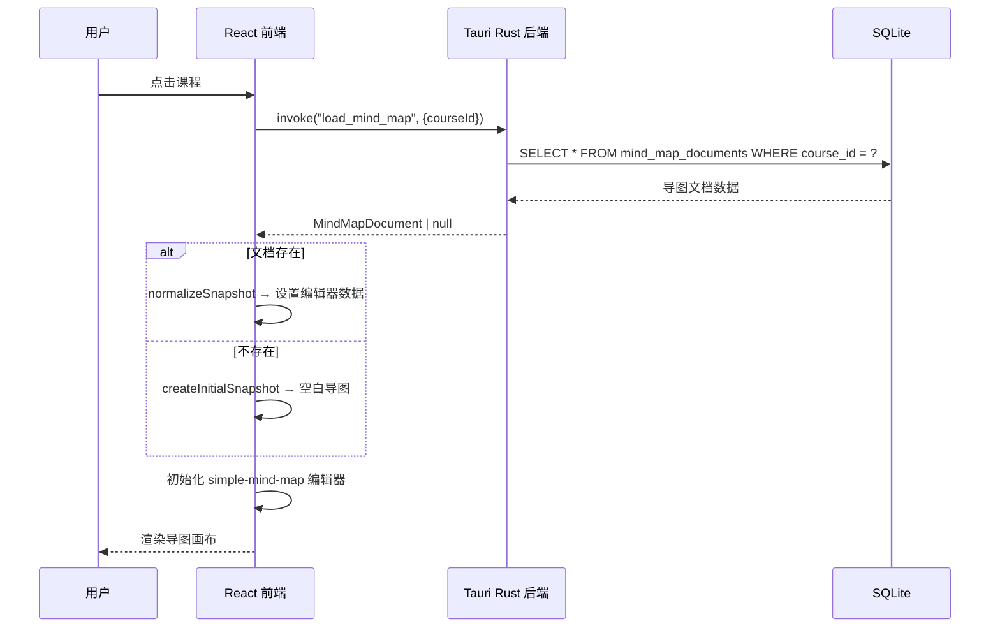
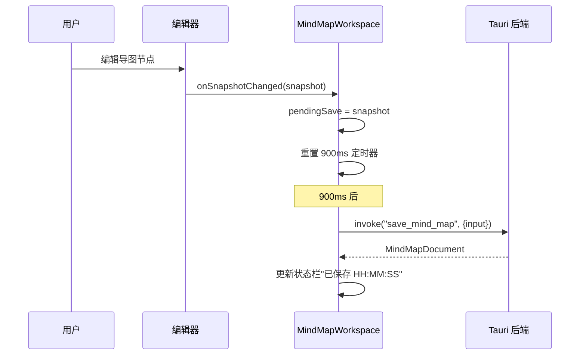
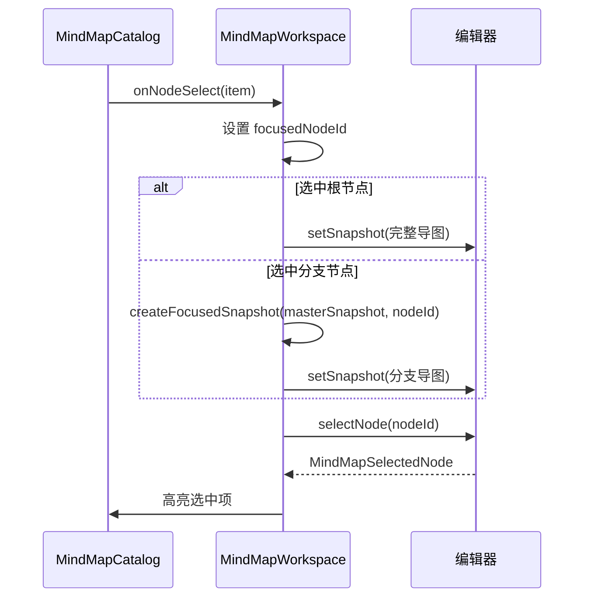

# FishWorker 思维导图功能 PRD

> **项目**：FishWorker（Tauri + React + TypeScript）  
> **参考来源**：AIstudy 项目 `src/renderer/features/mindmap/` 模块  
> **版本**：v1.0  
> **日期**：2026-07-12  

---

## 1. 项目概述

### 1.1 目标

在 FishWorker 项目中完整复刻 AIstudy 项目的思维导图功能和 UI/UX，采用 **Tauri（Rust 后端）+ React（前端）** 前后端分离架构，替代原有的 Electron + MySQL 架构。

### 1.2 技术栈

| 层级 | AIstudy 原方案 | FishWorker 新方案 |
|------|-------------|----------------|
| 桌面框架 | Electron | **Tauri v2** |
| 前端框架 | React 19 + Vite | **React 19 + Vite** |
| 思维导图引擎 | simple-mind-map 0.14.0-fix.3 | **simple-mind-map（同版本）** |
| 图标库 | lucide-react | **lucide-react** |
| 数据持久化 | MySQL + IndexedDB 降级 | **SQLite（Tauri 侧）+ IndexedDB 前端降级** |
| IPC 通信 | Electron preload/IPC | **Tauri invoke/commands** |
| 样式方案 | Vanilla CSS | **Vanilla CSS** |

### 1.3 架构原则

- **前后端分离**：前端（React）负责 UI 渲染和用户交互；后端（Rust/Tauri）负责数据持久化、文件 I/O、系统能力。
- **Renderer 不直接操作数据库**：所有持久化操作通过 Tauri Commands 收口。
- **思维导图由 `simple-mind-map` 承担**：不手写 Canvas 渲染。
- **适配器模式隔离第三方库**：仅在 `simpleMindMapAdapter.ts` 中访问 simple-mind-map 的私有 API。
- **模块化**：思维导图功能作为独立 Feature Module，维护清晰的边界。

---

## 2. 功能需求

### 2.1 功能总览

```
┌─────────────────────────────────────────────────────────────┐
│                    FishWorker 主窗口                         │
├──────────┬──────────────────────────────┬───────────────────┤
│          │                              │                   │
│  课程     │     思维导图画布               │   目录面板         │
│  侧边栏   │     (MindMapCanvas)          │  (MindMapCatalog) │
│          │                              │                   │
│          ├──────────────────────────────┤                   │
│          │  工具栏 (MindMapToolbar)       │                   │
│          ├──────────────────────────────┤                   │
│          │  状态栏 (MindMapStatusBar)     │                   │
└──────────┴──────────────────────────────┴───────────────────┘
```

### 2.2 核心功能模块

#### F1: 思维导图画布（MindMapCanvas）

| 功能点 | 说明 | 优先级 |
|--------|------|--------|
| 导图渲染 | 基于 simple-mind-map 引擎渲染 SVG 画布 | P0 |
| 节点编辑 | 双击节点进入内联编辑，支持富文本输入 | P0 |
| 节点操作 | 插入子节点（Tab）、同级节点（Enter）、父节点（Shift+Enter） | P0 |
| 节点删除 | 选中节点后删除（工具栏按钮或 Delete 键） | P0 |
| 展开/折叠 | 节点展开/折叠子分支 | P0 |
| 撤销/重做 | Undo / Redo 操作 | P0 |
| 画布缩放 | 放大、缩小、适应画布（Fit） | P0 |
| 画布拖拽 | 切换画布拖拽模式 / 框选模式 | P0 |
| 节点选中 | 点击选中节点，高亮显示，右侧面板联动 | P0 |
| 右键菜单 | 右键弹出文本格式工具栏 | P1 |
| 点阵网格背景 | SVG dot grid 背景图案 | P1 |
| 自定义滚动条 | 虚拟滚动条控件（ViewportScrollbars） | P1 |

#### F2: 布局系统

| 布局类型 | 标识符 | 说明 |
|---------|--------|------|
| 右向逻辑 | `logicalStructure` | **默认布局** |
| 左向逻辑 | `logicalStructureLeft` | |
| 思维导图 | `mindMap` | 双向展开 |
| 组织结构 | `organizationStructure` | 上下层级 |
| 目录组织 | `catalogOrganization` | |
| 时间轴 | `timeline` | |
| 竖向时间轴 | `verticalTimeline` | |
| 鱼骨图 | `fishbone` | |
| 右向鱼骨 | `rightFishbone` | |

#### F3: 节点主题元素（Topic Elements）

| 元素 | 命令 | 说明 |
|------|------|------|
| 备注 | `set-note` | 文本区域，最大 4000 字符 |
| 标签 | `set-tags` | 支持中英文分隔，最多 8 个，每个最长 24 字符 |
| 链接 | `set-hyperlink` | URL + 显示标题 |
| 图片 | `set-image` | 图片 URL + 标题 |
| 标记 | `set-marker` | 优先级（P1-P5）+ 进度（1/8 - 8/8） |

#### F4: 文本格式化（TextFormatToolbar）

| 格式 | 属性 | 可选值 |
|------|------|--------|
| 加粗 | `fontWeight` | `normal` / `bold` |
| 斜体 | `fontStyle` | `normal` / `italic` |
| 下划线 | `textDecoration` | `none` / `underline` |
| 删除线 | `textDecoration` | `none` / `line-through` |
| 字号 | `fontSize` | 12, 14, 16, 18, 20, 24, 28, 32 |
| 文字颜色 | `color` | 颜色选择器 + 6 个预设色 |
| 节点宽度 | `textAutoWrapWidth` | 自动 / 260 / 320 / 420 / 560 |
| 填充色 | `fillColor` | 颜色选择器 |
| 边框色 | `borderColor` | 颜色选择器 |
| 边框宽度 | `borderWidth` | 无(0) / 细(1) / 中(2) / 粗(3) |
| 清除格式 | — | 重置所有为默认 |

预设文字颜色：`#17466f`, `#1f6fd1`, `#0f766e`, `#b45309`, `#b91c1c`, `#7c3aed`

#### F5: 排版面板（Format Panel）

右侧浮动面板，包含以下区域：
- **结构**：布局选择 + "整理布局"按钮
- **主题**：填充色、边框色、边框宽度
- **文本**：字号、加粗、斜体、文字颜色、色板、宽度
- **分支**：边界按钮、概要按钮
- **画布**：画布拖拽开关

#### F6: 目录面板（MindMapCatalog）

| 功能点 | 说明 | 优先级 |
|--------|------|--------|
| 树形渲染 | 从导图树结构派生目录层级 | P0 |
| 折叠/展开 | 每个分支独立折叠/展开 | P0 |
| 节点选中 | 点击目录项选中对应导图节点 | P0 |
| 全部展开 | 工具栏按钮展开所有层级 | P0 |
| 全部收叠 | 工具栏按钮收叠所有层级 | P0 |
| 仅展开分支 | 右键展开按钮，只展示有子分支的节点，隐藏叶子节点 | P1 |
| 右键菜单 | 设为终极目录 / 复制文档路径 / 删除 | P1 |
| 目录边界 | `aistudyCatalogBoundary` 控制目录投射终止点 | P1 |
| 层级缩进 | `paddingLeft: 8 + level * 14` 的视觉层级 | P0 |
| 子节点计数 | 显示每个分支的子节点数量 | P1 |

#### F7: 快捷键系统

| 快捷键 | 命令 | 可自定义 |
|--------|------|---------|
| Tab | 插入子主题 | ✅ |
| Enter | 插入同级主题 | ✅ |
| Shift+Enter | 插入父主题 | ✅ |
| Ctrl+Alt+L | 整理布局 | ✅ |
| Ctrl+Alt+R | 关系线 | ✅ |
| Ctrl+Alt+B | 边界 | ✅ |
| Ctrl+Alt+S | 概要 | ✅ |

快捷键设置存储在 `localStorage`，支持运行时修改和重置为默认。

#### F8: 导出功能

| 格式 | 说明 |
|------|------|
| PNG | 位图导出 |
| SVG | 矢量图导出 |
| XMind | XMind 格式（延迟加载插件） |
| JSON | 原始数据导出 |
| Markdown | 文本大纲导出 |

#### F9: 保存系统

| 功能点 | 说明 |
|--------|------|
| 自动保存 | 编辑变更后 900ms 防抖自动保存 |
| 手动保存 | 工具栏"保存"按钮立即保存 |
| 本地降级 | 后端不可用时降级到 IndexedDB 本地存储 |
| 窗口关闭保存 | 应用关闭前 flush 所有待保存变更 |
| 保存时间戳 | 状态栏显示最后保存时间 |

#### F10: 聚焦视图（Focused View）

| 功能点 | 说明 |
|--------|------|
| 分支聚焦 | 从目录选择非根节点时，画布仅显示该分支 |
| 合并回写 | 编辑聚焦分支后，变更合并回主导图树 |
| 回退到全图 | 选择根节点时恢复完整导图 |

---

## 3. 数据模型

### 3.1 思维导图快照（MindMapSnapshot）

```typescript
type MindMapSnapshot = {
  schemaVersion: 1;
  editor: "simple-mind-map";
  editorVersion: string;
  root: SimpleMindMapNode;
  layout: MindMapLayoutType;
  theme?: {
    template?: string;
    config?: unknown;
  };
  view?: unknown;
  updatedAt: string;  // ISO 8601
};
```

### 3.2 导图节点（SimpleMindMapNode）

```typescript
type SimpleMindMapNode = {
  data: {
    uid?: string;       // 稳定节点 ID，前缀 "fishworker-node-"
    text: string;       // 节点文本
    note?: string;      // 备注
    expand?: boolean;   // 是否展开
    aistudyCatalogBoundary?: boolean;  // 目录边界标记
    // 文本格式属性
    fontWeight?: string;
    fontStyle?: string;
    textDecoration?: string;
    color?: string;
    fontSize?: number;
    fillColor?: string;
    borderColor?: string;
    borderWidth?: number;
    customTextWidth?: number;
    customBubbleWidth?: number;
    customBubbleHeight?: number;
    // 链接、图片、标记等
    hyperlink?: string;
    hyperlinkTitle?: string;
    image?: string;
    imageTitle?: string;
    icon?: string[];    // 优先级/进度标记
    tag?: string[];     // 标签
    [key: string]: unknown;
  };
  children?: SimpleMindMapNode[];
};
```

### 3.3 导图文档（MindMapDocument）

```typescript
type MindMapDocument = {
  courseId: string;
  mapId: string;        // "mindmap_" + UUID
  title: string;
  snapshot: MindMapSnapshot | null;
  updatedAt: string | null;
  nodeCount: number;
};
```

### 3.4 目录投射项（MindMapOutlineItem）

```typescript
type MindMapOutlineItem = {
  id: string;
  nodeId: string | null;
  parentNodeId: string | null;
  title: string;
  level: number;
  path: string;          // 如 "1.2.3"
  parentPath: string | null;
  order: number;
  source: "mindmap";
  childCount: number;
  hiddenChildCount: number;
  catalogBoundary: boolean;
  children: MindMapOutlineItem[];
};
```

### 3.5 后端数据库设计（SQLite）

```sql
-- 课程表
CREATE TABLE courses (
  id TEXT PRIMARY KEY,
  name TEXT NOT NULL,
  description TEXT DEFAULT '',
  section_id TEXT,
  sort_order INTEGER DEFAULT 0,
  last_workspace_mode TEXT DEFAULT 'mindmap',
  created_at TEXT NOT NULL,
  updated_at TEXT NOT NULL
);

-- 思维导图文档表
CREATE TABLE mind_map_documents (
  map_id TEXT PRIMARY KEY,
  course_id TEXT NOT NULL,
  title TEXT NOT NULL,
  snapshot_json TEXT,          -- MindMapSnapshot 的 JSON 序列化
  node_count INTEGER DEFAULT 0,
  created_at TEXT NOT NULL,
  updated_at TEXT NOT NULL,
  FOREIGN KEY (course_id) REFERENCES courses(id) ON DELETE CASCADE
);

-- 思维导图节点投射表（可选，用于快速查询）
CREATE TABLE mind_map_nodes (
  node_id TEXT NOT NULL,
  map_id TEXT NOT NULL,
  course_id TEXT NOT NULL,
  parent_node_id TEXT,
  title TEXT NOT NULL,
  level INTEGER DEFAULT 0,
  path TEXT NOT NULL,
  sort_order INTEGER DEFAULT 0,
  is_catalog_boundary INTEGER DEFAULT 0,
  PRIMARY KEY (map_id, node_id),
  FOREIGN KEY (map_id) REFERENCES mind_map_documents(map_id) ON DELETE CASCADE
);
```

---

## 4. 前后端接口设计（Tauri Commands）

### 4.1 课程管理

```rust
#[tauri::command]
async fn list_courses(db: State<DbPool>) -> Result<Vec<Course>, String>;

#[tauri::command]
async fn create_course(db: State<DbPool>, name: String, description: String) -> Result<Course, String>;

#[tauri::command]
async fn update_course(db: State<DbPool>, id: String, name: String, description: String) -> Result<Course, String>;

#[tauri::command]
async fn delete_course(db: State<DbPool>, id: String) -> Result<(), String>;
```

### 4.2 思维导图文档

```rust
#[tauri::command]
async fn load_mind_map(db: State<DbPool>, course_id: String) -> Result<Option<MindMapDocument>, String>;

#[tauri::command]
async fn save_mind_map(db: State<DbPool>, input: MindMapSaveInput) -> Result<MindMapDocument, String>;

#[tauri::command]
async fn delete_mind_map(db: State<DbPool>, map_id: String) -> Result<(), String>;
```

### 4.3 文件导出

```rust
#[tauri::command]
async fn export_file(
  app: AppHandle,
  file_name: String,
  file_type: String,
  data: Vec<u8>
) -> Result<String, String>;
```

### 4.4 前端调用方式

```typescript
import { invoke } from "@tauri-apps/api/core";

// 加载导图
const doc = await invoke<MindMapDocument | null>("load_mind_map", {
  courseId: "course_xxx"
});

// 保存导图
const saved = await invoke<MindMapDocument>("save_mind_map", {
  input: {
    courseId: "course_xxx",
    mapId: "mindmap_xxx",
    title: "课程名",
    snapshot: snapshotData
  }
});
```

---

## 5. UI/UX 设计规范

### 5.1 整体布局

```
┌────────────────────────────────────────────────────────────────┐
│ 应用窗口 (Tauri WebView)                                       │
├─────────┬──────────────────────────────────┬──────────────────┤
│ 课程     │ ┌──────────────────────────────┐ │ 目录面板          │
│ 侧边栏   │ │ 画布工具栏 (44px)              │ │ ┌──────────────┐ │
│          │ ├──────────────────────────────┤ │ │ 标题栏         │ │
│ • 课程列表│ │                              │ │ ├──────────────┤ │
│ • 搜索    │ │                              │ │ │ 展开/收叠按钮  │ │
│ • 分组    │ │     思维导图画布               │ │ ├──────────────┤ │
│           │ │     (SVG Canvas)             │ │ │              │ │
│ 宽度:     │ │                              │ │ │ 目录树         │ │
│ 240px     │ │     点阵网格背景               │ │ │ (可折叠)      │ │
│ 可拖拽    │ │                              │ │ │              │ │
│          │ │                              │ │ │              │ │
│          │ ├──────────────────────────────┤ │ └──────────────┘ │
│          │ │ 状态栏 (30px)                 │ │ 宽度: 260px     │
│          │ └──────────────────────────────┘ │ 可拖拽           │
└─────────┴──────────────────────────────────┴──────────────────┘
```

### 5.2 主题配色

沿用 AIstudy 的 XMind 风格主题：

| 元素 | 配色 |
|------|------|
| 画布背景 | `#fbfcfd` |
| 根节点填充 | `#ffffff` |
| 根节点边框 | `#2f80c0` (2px) |
| 根节点文字 | `#17466f` (bold) |
| 二级节点填充 | `#eaf6ff` |
| 二级节点边框 | `#91c8ef` (1px) |
| 三级+节点填充 | `#fff8ee` |
| 三级+节点边框 | `#f0c37c` (1px) |
| 三级+节点文字 | `#425466` |
| 连接线颜色 | `#72a9d8` (2px) |
| 选中高亮 | `#2f80c0` |
| 连接线样式 | 曲线 (curve), 圆角 14px |
| 字体 | `"Microsoft YaHei", "微软雅黑", Arial, sans-serif` |
| 默认字号 | 20px |
| 点阵背景 | `#c8d0da`, 16px 间距, 1.15px 半径 |

### 5.3 工具栏设计

上方水平工具栏，高度 44px，毛玻璃背景 `rgba(255, 255, 255, 0.88) + backdrop-filter: blur(8px)`：

**左侧操作区**：
备注 | 标签 | 链接 | 图片 | 标记 | 折叠/展开 | 删除 | ─ | 撤销 | 重做 | ─ | 缩小 | 适应 | 放大 | 画布拖拽

**右侧控制区**：
排版按钮 | 布局选择(下拉) | 导出格式(下拉) + 导出按钮 | 保存按钮

按钮规格：
- 尺寸：28px × 28px，图标 15px
- 圆角：7px
- 常态：透明背景，`var(--text-muted)` 文字
- 悬停：`rgba(240, 243, 246, 0.72)` 背景
- 选中/激活：`var(--accent-soft)` 背景，`var(--accent)` 文字
- 禁用：`#b0bac7` 文字

### 5.4 状态栏设计

底部状态栏，高度 30px：

```
就绪 | 12 个主题 | 已连接 | 框选模式 | 已选：节点名 | 已保存 14:30:22
```

### 5.5 浮动面板样式

通用浮动面板样式：
- 边框：`1px solid rgba(123, 145, 169, 0.22)`
- 圆角：8px
- 背景：`rgba(255, 255, 255, 0.98)`
- 阴影：`0 18px 40px rgba(15, 23, 42, 0.14)`
- 内边距：12px

### 5.6 目录面板样式

- 树形列表项圆角高亮显示
- 选中项蓝色高亮
- 层级颜色渐变：
  - level 0: 根节点样式（加粗）
  - level 1-5: 逐级缩进，圆形标记点颜色递进
- 折叠/展开使用 `ChevronRight` 箭头旋转
- 每项高度约 32px

---

## 6. 前端组件架构

### 6.1 组件树

```
src/
├── components/
│   ├── layout/
│   │   ├── AppLayout.tsx           # 整体布局框架
│   │   ├── Sidebar.tsx             # 左侧课程侧边栏
│   │   └── DetailPane.tsx          # 右侧目录/详情面板
│   └── common/
│       └── ViewportScrollbars.tsx  # 自定义滚动条
│
├── features/
│   ├── course/
│   │   ├── CourseSidebar.tsx       # 课程列表侧边栏
│   │   ├── courseService.ts        # 课程 CRUD API (invoke)
│   │   └── courseTypes.ts          # 课程类型定义
│   │
│   └── mindmap/
│       ├── MindMapWorkspace.tsx     # 工作区状态管理、加载/保存流程
│       ├── MindMapCanvas.tsx        # React 挂载边界（Canvas Host）
│       ├── MindMapCatalog.tsx       # 目录树组件
│       ├── MindMapTextFormatToolbar.tsx  # 文本格式化工具栏
│       ├── simpleMindMapAdapter.ts  # simple-mind-map 适配器（唯一接触第三方编辑器）
│       ├── mindMapSnapshot.ts       # 快照协议、树规范化、稳定 ID、目录生成
│       ├── mindMapTypes.ts          # 所有类型定义
│       └── mindMapShortcutSettings.ts  # 快捷键配置管理
│
├── lib/
│   ├── localSnapshotStore.ts       # IndexedDB 本地快照存储（降级层）
│   ├── saveDrain.ts                # 窗口关闭前保存排空
│   └── performanceWarmup.ts        # 预加载优化
│
├── domain/
│   └── coreContracts.ts            # 核心约定常量
│
├── styles/
│   ├── variables.css               # CSS 变量定义
│   ├── layout.css                  # 布局样式
│   ├── mindmap.css                 # 思维导图专用样式
│   ├── catalog.css                 # 目录面板样式
│   ├── toolbar.css                 # 工具栏样式
│   └── components.css              # 通用组件样式
│
├── main.tsx                        # 应用入口
└── App.tsx                         # 根组件
```

### 6.2 组件职责边界

| 组件 | 职责 | 禁止 |
|------|------|------|
| `MindMapWorkspace` | 工作区状态、加载/保存流程、编辑器模式切换 | 不直接操作 simple-mind-map |
| `MindMapCanvas` | React 挂载边界，转发 imperative 方法 | 不包含业务逻辑 |
| `simpleMindMapAdapter` | 唯一接触 simple-mind-map 实例的文件 | 不暴露 simple-mind-map 类型到外部 |
| `mindMapSnapshot` | 快照协议、树规范化、目录生成 | 不操作 DOM 或编辑器实例 |
| `MindMapCatalog` | 目录 UI 渲染和折叠状态 | 不修改导图数据 |
| `MindMapTextFormatToolbar` | 文本格式 UI 控件 | 只发出 patch，不直接修改编辑器 |

---

## 7. 后端架构（Tauri Rust）

### 7.1 模块结构

```
src-tauri/
├── src/
│   ├── main.rs                    # Tauri 入口
│   ├── lib.rs                     # 模块注册
│   ├── db/
│   │   ├── mod.rs                 # 数据库模块
│   │   ├── connection.rs          # SQLite 连接池管理
│   │   ├── migrations.rs          # 数据库迁移
│   │   └── schema.rs              # 表结构定义
│   ├── commands/
│   │   ├── mod.rs                 # 命令模块
│   │   ├── course_commands.rs     # 课程 CRUD 命令
│   │   ├── mindmap_commands.rs    # 导图 CRUD 命令
│   │   └── export_commands.rs     # 文件导出命令
│   └── models/
│       ├── mod.rs                 # 模型模块
│       ├── course.rs              # 课程模型
│       └── mindmap.rs             # 导图模型
├── Cargo.toml
└── tauri.conf.json
```

### 7.2 依赖

```toml
[dependencies]
tauri = { version = "2", features = ["dialog-save"] }
tauri-plugin-opener = "2"
serde = { version = "1", features = ["derive"] }
serde_json = "1"
rusqlite = { version = "0.31", features = ["bundled"] }
uuid = { version = "1", features = ["v4"] }
chrono = { version = "0.4", features = ["serde"] }
```

### 7.3 数据库生命周期

1. **应用启动时**：自动创建 SQLite 数据库文件（`$APP_DATA/fishworker.db`）
2. **自动建表**：通过 migration 脚本检测并创建必要表
3. **连接池**：使用 `r2d2` 或直接 `Mutex<Connection>` 管理连接
4. **关闭时**：保证所有待写入数据刷盘

---

## 8. 交互流程

### 8.1 打开课程导图



### 8.2 自动保存流程



### 8.3 目录与画布联动



---

## 9. 状态管理

### 9.1 核心状态

```typescript
// MindMapWorkspace 内部状态
{
  snapshot: MindMapSnapshot | null,     // 当前导图快照
  mapId: string | null,                // 导图文档 ID
  focusedNodeId: string | null,        // 聚焦分支节点 ID
  selectedNode: MindMapSelectedNode,   // 当前选中节点
  isReady: boolean,                    // 编辑器就绪
  isLoading: boolean,                  // 加载中
  isSaving: boolean,                   // 保存中
  isExporting: boolean,                // 导出中
  canvasDragEnabled: boolean,          // 画布拖拽模式
  exportType: MindMapExportType,       // 导出格式
  storageMode: "sqlite" | "local" | "none",  // 存储模式
  error: string,                       // 错误信息
  savedAt: string | null,             // 最后保存时间
  topicPanel: TopicElementPanel | null, // 打开的主题元素面板
  textFormatMenu: { x, y } | null,    // 右键格式菜单位置
  shortcutSettings: MindMapShortcutSettings, // 快捷键配置
  isFormatPanelOpen: boolean           // 排版面板开关
}
```

### 9.2 Ref 管理

```typescript
{
  canvasRef: MindMapCanvasHandle,       // 编辑器操作句柄
  saveTimerRef: number,                 // 自动保存定时器
  pendingSaveRef: PendingSave,          // 待保存数据
  activeSaveRef: Promise,              // 活跃保存 Promise
  loadSequenceRef: number,             // 加载序列号（防竞争）
  snapshotRef: MindMapSnapshot,        // 最新快照引用（跳过 setState 延迟）
}
```

---

## 10. 性能优化

### 10.1 编辑器初始化优化

- **延迟加载**：simple-mind-map 及其插件采用动态 `import()` 按需加载
- **预热**：应用启动时后台预加载编辑器构造函数
- **XMind 导出插件**：仅在用户首次选择 XMind 格式时加载

### 10.2 渲染优化

- **结构签名比对**：`createMindMapStructureSignature` 生成树结构签名，仅签名变化时触发 React re-render
- **`React.startTransition`**：非强制更新通过 Transition 延迟，避免阻塞用户交互
- **目录 Memo**：`buildMindMapOutline` 结果通过 `useMemo` 缓存

### 10.3 保存优化

- **900ms 防抖**：编辑变更后延迟保存，避免频繁数据库写入
- **串行保存队列**：通过 `activeSaveRef` Promise 链保证保存顺序
- **静默保存**：切换课程时的 flush 操作不更新 UI 状态

---

## 11. 与 AIstudy 原版的差异

| 方面 | AIstudy 原版 | FishWorker 新版 |
|------|-------------|----------------|
| 桌面框架 | Electron | Tauri v2 |
| 数据库 | MySQL (远程/本地) | SQLite (本地嵌入) |
| IPC | `window.aistudyMindMaps` preload | `@tauri-apps/api invoke` |
| 节点 ID 前缀 | `aistudy-node-` | `fishworker-node-` |
| 存储 key 前缀 | `aistudy:mindmap-*` | `fishworker:mindmap-*` |
| Word 编辑器 | `@hufe921/canvas-editor` | **不复刻**（仅保留导图模式） |
| 教材功能 | `TextbookWorkspace` | **不复刻** |
| MySQL 配置 | 运行时可配置 | 不需要 |
| MCP 服务 | 支持 | **不复刻** |
| 词汇采集 | Android APK + WebSocket | **不复刻** |
| 课程分组 | Section 机制 | 简化版分组 |
| 应用更新 | GitHub Release 自动更新 | 后续版本实现 |

---

## 12. 开发计划

### Phase 1: 基础架构（预计 3 天）

- [ ] Tauri 后端 SQLite 数据库初始化和 Migration
- [ ] 课程 CRUD 的 Tauri Commands
- [ ] 导图文档加载/保存的 Tauri Commands
- [ ] 前端 Tauri invoke 封装层
- [ ] 基础布局框架（三栏布局）

### Phase 2: 思维导图核心（预计 5 天）

- [ ] 安装和配置 simple-mind-map 及依赖
- [ ] `simpleMindMapAdapter.ts` 适配器
- [ ] `mindMapSnapshot.ts` 快照协议和树规范化
- [ ] `mindMapTypes.ts` 类型定义
- [ ] `MindMapCanvas.tsx` 画布挂载组件
- [ ] `MindMapWorkspace.tsx` 工作区状态管理
- [ ] 自动保存和手动保存流程
- [ ] 本地 IndexedDB 降级存储

### Phase 3: 工具栏和面板（预计 3 天）

- [ ] 思维导图工具栏（所有按钮和控件）
- [ ] 主题元素弹窗（备注、标签、链接、图片、标记）
- [ ] 文本格式化右键菜单
- [ ] 排版面板
- [ ] 导出功能

### Phase 4: 目录面板（预计 2 天）

- [ ] 目录树形渲染
- [ ] 折叠/展开控制
- [ ] 目录与画布联动
- [ ] 目录右键菜单（删除、目录边界）
- [ ] 聚焦视图（分支聚焦/回退）

### Phase 5: 课程管理侧边栏（预计 2 天）

- [ ] 课程列表展示
- [ ] 课程创建/编辑/删除对话框
- [ ] 课程选中和导图切换

### Phase 6: 快捷键和设置（预计 1 天）

- [ ] 快捷键设置面板
- [ ] 快捷键捕获和自定义
- [ ] 设置对话框

### Phase 7: 样式和打磨（预计 2 天）

- [ ] 完整 CSS 样式（对标 AIstudy 原版）
- [ ] 动画和过渡效果
- [ ] 响应式布局调整
- [ ] 状态栏完善
- [ ] 错误处理和用户提示

---

## 13. 验收标准

### 功能验收

- [ ] 可创建/选择课程，加载对应的思维导图
- [ ] 导图编辑器正常渲染，支持所有 9 种布局
- [ ] 节点 CRUD（增删改查）操作流畅
- [ ] 所有 5 种主题元素（备注/标签/链接/图片/标记）可正常设置
- [ ] 文本格式化（加粗/斜体/颜色/字号等）可正常应用
- [ ] 目录面板正确派生自导图结构，支持折叠/展开/联动
- [ ] 自动保存（900ms 防抖）和手动保存正常工作
- [ ] 5 种格式导出（PNG/SVG/XMind/JSON/Markdown）全部可用
- [ ] 7 个快捷键全部可用且支持自定义
- [ ] 聚焦视图正常工作（分支聚焦/合并回写/回退全图）

### UI/UX 验收

- [ ] 整体布局与 AIstudy 原版视觉一致
- [ ] XMind 风格主题配色正确
- [ ] 工具栏按钮状态（常态/悬停/选中/禁用）表现正确
- [ ] 浮动面板（弹窗/右键菜单/排版面板）样式正确
- [ ] 状态栏信息完整准确
- [ ] 目录树层级缩进和颜色正确
- [ ] 点阵网格背景显示正常

### 性能验收

- [ ] 100 个节点的导图加载和渲染在 1 秒内完成
- [ ] 编辑操作（增删改）无感知延迟
- [ ] 自动保存不阻塞 UI 交互
- [ ] 应用冷启动到可编辑状态在 3 秒内

---

## 附录 A: CSS 变量参考

```css
:root {
  --accent: #1f6fd1;
  --accent-soft: rgba(31, 111, 209, 0.08);
  --line-accent: rgba(31, 111, 209, 0.32);
  --line-soft: rgba(123, 145, 169, 0.18);
  --line-strong: rgba(123, 145, 169, 0.32);
  --text-primary: #1e293b;
  --text-muted: #64748b;
  --text-faint: #94a3b8;
  --canvas-dot-grid: radial-gradient(circle, #c8d0da 1.15px, transparent 1.15px);
}
```

## 附录 B: simple-mind-map 插件清单

| 插件 | 用途 |
|------|------|
| Drag | 节点拖拽 |
| Select | 框选 |
| KeyboardNavigation | 键盘导航 |
| AssociativeLine | 关系线 |
| OuterFrame | 外框/边界 |
| Export | 导出（PNG/SVG/JSON/MD） |
| Scrollbar | 虚拟滚动条 |
| ExportXMind | XMind 导出（延迟加载） |
