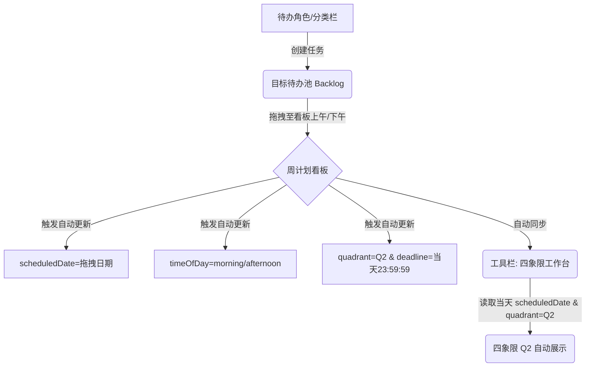

# 【时间管理-周计划】产品需求文档 (PRD)

## 1. 概述
### 问题陈述
在快节奏的日常工作与学习中，用户极易陷入紧急但不重要的琐事（如突发干扰、无意义的会议），而忽视了真正对长期发展有深远影响的重要不紧急事件（如自我提升、系统重构、健康管理）。现有的任务清单工具通常仅支持单一的扁平化列表或即时的每日待办，缺乏从个人“人生角色”与“每周要事”维度出发的宏观规划工具，导致用户难以将个人长期价值目标落地到每日执行中。

### 建议的解决方案
本方案基于经典时间管理著作《高效能人士的七个习惯》中的“要事第一”原则，设计并实现了**「周计划」**独立功能模块。在应用的主工具栏（Toolbar）中，**「周计划」被拆分为一个独立的工具入口**，与「四象限工作台」并列。通过“待办分类/角色”机制引导用户识别自己扮演的不同角色并为之设定本周要事（Q2目标），结合直观的“七天周看板”进行上午/下午维度的拖拽排期。核心设计在于，**在周计划中安排任务时，其数据依然会动态联动并同步显现在「四象限工作台」当天的 Q2（重要不紧急）象限中**，实现业务流的深度绑定。

---

## 2. 核心理念
- **角色驱动 (Role-Driven)**: 引导用户不仅从“事”的角度出发，更从“人生角色”（如：个人成长、工作任务、家庭成员等）出发去思考。每个角色每周应专注于 1-2 项核心要事。
- **要事第一 (First Things First)**: 角色所对应的新增目标默认归属于“第二象限 (Q2: 重要不紧急)”。在周计划中安排这些目标，以确保用户的时间优先分配给真正高价值的任务。
- **周计划与日执行联动 (Weekly-to-Daily Connection)**: 周末/周初进行宏观的“周计划看板”排期；周中在“四象限工作台”中自动同步当天的周计划任务，实现“以周为单位进行规划，以天为单位进行执行”的高效闭环。

---

## 3. 解决方案概述

### 3.1 建议的解决方案
- **高层级描述**:
  「周计划」是工具栏中的一个独立的一级工具（与「四象限工作台」拆分为两个平行的工具）。页面左侧是“本周计划看板”的角色待办管理面板，用户可维护自身扮演的角色及未排期的目标池（Backlog）；右侧是自适应拉伸的日程排期网格，支持上下午分区，通过拖拽即可完成排期。
- **核心能力**:
  - **工具栏独立化入口**：在主侧边栏中作为独立工具导航，拥有独立的视图空间，不再作为时间管理的子 Tab。
  - **左侧统一标题**：左侧面板头部标题重命名为“本周计划看板”，作为目标池入口。
  - **右侧日程排期网格自适应拉伸**：移除右侧原有的“本周计划看板”标题与已完成过滤开关，使日程网格容器在纵向上完全占满剩下的全部高度，最大化空间利用。
  - **跨工具联动（核心特性）**：支持从左侧角色栏拖拽任务目标至周计划看板，自动设置截止日期为当天 23:59:59，并且其 `quadrant` 强制设定为 `Q2`。当用户切换到主工具栏的「四象限工作台」时，该日期对应的任务会自动展示在 Q2（重要不紧急）列表中。
  - **数据本地及云端实时同步**：更新数据时自动触发防抖云端同步与本地缓存更新。

### 3.2 包含在本次范围内
- **功能点 1：角色管理与目标池（左侧边栏）**
  - 支持创建新角色（自动赋予预设主题色，如蓝色、绿色、橙色等）。
  - 支持删除角色。
  - 角色内支持快速添加未排期的周目标/任务（输入框按下 Enter 键创建）。
  - 未排期任务卡片左侧包含拖拽手柄（Grip Handle），点击可直接打开任务详情弹窗，右侧有快速删除按钮。
- **功能点 2：本周计划看板（主工作区）**
  - 展示当周周一至周日的 7 列布局，并显示当天的日期（如 07-14）。
  - 当天列高亮标记（`is-today` 样式）。
  - 每天的列容器拆分为“上午”与“下午”两个独立接收拖放的区域。
  - 支持拖拽排序和位置调整：用户可从左侧拖入，或在看板的各列各时间段之间相互拖动调整。
- **功能点 3：自动属性联动与数据流**
  - 拖拽目标到某一天时：
    - 自动设定该任务的 `scheduledDate` 为目标日期。
    - 自动计算 `deadline` 为当日的 23:59:59。
    - 自动将任务的四象限属性 `quadrant` 设为 `Q2`。
    - 记录时间段属性 `timeOfDay` 为 `'morning'` 或 `'afternoon'`。
- **功能点 4：界面精简与自适应高度**
  - 移除周计划页面顶部的 Menu Bar 标题栏（包含“周计划”标题与“隐藏已完成任务”开关）。
  - 移除右侧排期工作区上方的原有“本周计划看板”标题与副标题元素，使日程网格容器在纵向上完全占满 100% 的高度。
  - 将左侧侧边栏标题由“待办分类 / 角色”正式更改为“本周计划看板”，移除其下方的描述文字，并使其高度与背景色与整体排期网格取得视觉一致性。
  - 页面简化为极简的左右分栏：左侧“本周计划看板”目标池与右侧“自适应日程排期网格”。
  - 点击看板或角色池中的任务，可唤起“任务详情弹窗”，进行标题、详细内容（Description）、截止时间等细节编辑。

### 3.3 超出本次范围
- 跨周排期（目前仅支持当周规划，周日过后自动过渡到新的一周）。
- 多人协同规划与角色共享。
- 任务的历史归档与回顾报表页面。

---

## 4. 用户故事与需求

### 4.1 用户故事
```text
作为一名 [注重个人成长的职场人士]
我希望 [在周一早上通过“待办分类/角色”思考本周的重要目标，并把它们拖放到本周的各天日程中]
以便于 [规划好每周的“要事第一”，避免每天被动应付紧急打杂事务]

验收标准：
[x] 在左侧分类栏中输入角色并 Enter，能创建出带专属颜色的角色卡片。
[x] 在角色下添加任务，在未指定日期前，它存在于该角色的待办池中。
[x] 将待办池中的任务拖入周三下午，任务的截止时间自动关联为周三 23:59:59，且被划分至 Q2。
[x] 拖拽后的任务在周看板的周三“下午”栏位中展示，左侧带该角色的颜色条。
[x] 勾选“隐藏已完成任务”后，看板上已完成的周计划卡片被隐藏。
```

### 4.2 功能需求
| ID | 需求描述 | 优先级 | 备注 |
|----|------------|---|-------|
| FR1 | 角色创建与删除 | P0 | 自定义角色池，提供专属颜色标记 |
| FR2 | 目标池快速录入 | P0 | 在特定角色下快速添加任务（Enter触发） |
| FR3 | 双向拖拽排期交互 | P0 | 待办池 -> 看板列，以及看板列内上午/下午互相拖拽移动 |
| FR4 | 看板上下午分区与展示 | P0 | 每列区分上下午卡槽，界面展示更具条理 |
| FR5 | 拖期属性自动计算与重置 | P1 | 拖拽入看板自动补全 `scheduledDate`, `timeOfDay`, `quadrant='Q2'` 和 `deadline` |
| FR6 | 任务删除与详情编辑 | P1 | 看板和待办池均提供直接删除和点击弹窗编辑功能 |
| FR7 | 同步状态移至看板标题右侧 | P1 | 移动“已保存/保存中”指示器至看板 Sub-Header 右边，提升界面整合度 |
| FR8 | 移除顶栏与隐藏已完成开关 | P1 | 移除顶部 `tm-top-menubar`，使看板纵向占满整个容器高度 |

### 4.3 非功能需求
- **易用性与交互性**: 拖拽操作响应需平滑，拖拽目标区域（Drop Zone）需有清晰的虚线边框或背景变化提示。
- **数据一致性 (Data Sync)**: 更新操作（如拖拽、新增、删除）需在 500ms 内触发自动防抖保存，同步至本地 `localStorage` 以及后端 TiDB。
- **响应式排版 (Layout)**: 周看板需支持横向滚动，确保在窄屏设备上 7 列布局不会挤压变形。

---

## 5. 设计与用户体验

### 5.1 设计原则
- **要事聚焦**：通过左侧角色分类与右侧周日程的清晰对比，强调从“角色愿景”到“具体排期”的推演。
- **色块指引**：任务卡片左侧自带角色的颜色条（如个人成长为蓝色，工作为绿色），帮助用户一眼识别当前任务归属的角色。
- **分区专注**：将一天的看板分为“上午”和“下午”两个黄金时段，替代传统精确到分钟的冗长日程，给予用户微调弹性的同时也保持了规划清晰度。

### 5.2 页面结构与交互流程


- **主入口**：主侧边工具栏独立图标进入。无顶部标题菜单栏。
- **页面布局**：直接划分为左侧“本周计划看板”（宽度 240px，高 58px 并以 `#ffffff` 填充背景）与右侧“自适应日程排期网格”（占满剩余高度与宽度）。
- **左侧边栏 (Width: 240px)**：展示角色卡片列表。列表底部包含新增角色的快捷输入框。
- **主看板区 (Flex 1, Overflow-X: Auto)**：7 列卡片代表周一至周日，卡片高度 100% 占满。
  - **上午区域 (Morning Column)**：高度自适应，下底边使用虚线与下午区域分隔。
  - **下午区域 (Afternoon Column)**：高度自适应。
- **任务卡片样式**：去除了冗余的时间戳文本和标签，仅保留标题、左侧角色主题色边线和右侧的删除按钮，点击卡片直接触发编辑。

---

## 6. 技术规格说明

### 6.1 API 与数据流设计
所有操作通过前端内存、`localStorage` 和云端 API 交互。
数据更新流采用防抖同步策略：
1. **添加/更新/删除任务**: 触发 `timeManagementStore` 相关方法。
2. **防抖同步 (`triggerTaskSync`)**:
   - 延时 500ms（高频修改）或 300ms 将任务 upsert 提交至数据库 API: `timeManagementApi.upsertTask(task)`。
   - 同步状态显示在 Menu Bar 右侧（“正在保存...”、“已保存”、“部分内容暂时没同步”）。

### 6.2 数据库与核心数据结构 (TypeScript)
周计划相关的核心模型：
```typescript
export interface Role {
  id: string;
  name: string;
  color?: string; // 角色代表色，十六进制
  createdAt: number;
}

export interface Task {
  id: string;
  title: string;
  roleId?: string; // 关联的角色ID
  quadrant: 'Q1' | 'Q2' | 'Q3' | 'Q4'; // 拖拽入周看板后自动重置为 'Q2'
  scheduledDate?: string; // 格式: YYYY-MM-DD，标志是否已排期
  timeOfDay?: 'morning' | 'afternoon'; // 标志上午或下午
  completed: boolean;
  createdAt: number;
  completedAt?: number;
  description?: string; // 任务描述详情
  deadline?: number; // 截止时间戳
}
```
